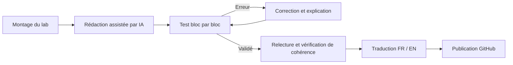

<p align="right">
  🇫🇷 <b>Français</b> · 🇬🇧 <a href="./README_EN.md">English</a>
</p>

# 🖧 Infrastructure Labs — Guides de déploiement documentés

> Recueil de guides de déploiement pas à pas, issus des infrastructures montées pendant ma formation en systèmes et réseaux, puis approfondies au-delà.
> Chaque lab a été monté, cassé, remonté et documenté plusieurs fois pour aboutir à un guide complet, précis et reproductible.


---

## 📑 Sommaire

1. [Présentation du projet](#-présentation-du-projet)
2. [La démarche : pourquoi ces labs ont été montés plusieurs fois](#-la-démarche--pourquoi-ces-labs-ont-été-montés-plusieurs-fois)
3. [Documentation assistée par IA : ma méthode de travail](#-documentation-assistée-par-ia--ma-méthode-de-travail)
4. [Catalogue des infrastructures](#-catalogue-des-infrastructures)
5. [Organisation du dépôt](#%EF%B8%8F-organisation-du-dépôt)
6. [Structure type d'un guide](#-structure-type-dun-guide)
7. [Environnement technique](#%EF%B8%8F-environnement-technique)
8. [Conventions de rédaction](#%EF%B8%8F-conventions-de-rédaction)
9. [Comment utiliser ces guides](#-comment-utiliser-ces-guides)
10. [Avertissement](#%EF%B8%8F-avertissement)
11. [Auteur](#-auteur)

---

## 🎯 Présentation du projet

Ce dépôt regroupe l'ensemble des **infrastructures systèmes et réseaux** que j'ai conçues et déployées en environnement de laboratoire. Chaque infrastructure dispose de son propre dossier, contenant un guide de déploiement complet ainsi qu'un README de présentation, disponibles en **français** et en **anglais**.

L'objectif est triple :

- **Consolider mes compétences** : réexpliquer chaque configuration m'oblige à en comprendre chaque paramètre, et pas seulement à savoir les appliquer.
- **Constituer une base de référence** : disposer de procédures fiables, réutilisables en entreprise ou en lab personnel.
- **Partager** : proposer à d'autres apprenants et techniciens des guides clairs, où chaque étape est expliquée et justifiée.

Ces guides ne se limitent pas à une suite de commandes : ils expliquent **le pourquoi** de chaque choix technique, définissent les notions abordées et décrivent comment vérifier que chaque étape a bien fonctionné.

---

## 🔁 La démarche : pourquoi ces labs ont été montés plusieurs fois

Une infrastructure qui fonctionne une fois ne suffit pas à produire une bonne documentation. Chaque lab présenté ici est passé par plusieurs cycles :

| Cycle | Objectif |
|-------|----------|
| **1. Premier montage** | Déploiement initial, découverte des technologies et des contraintes. |
| **2. Remontage à froid** | Reconstruction complète depuis zéro pour identifier les étapes oubliées, les prérequis implicites et les pièges. |
| **3. Rédaction** | Écriture du guide bloc par bloc, en testant chaque étape au fur et à mesure de la rédaction. |
| **4. Validation** | Déploiement intégral en suivant **uniquement** le guide, sans connaissance préalable, pour vérifier qu'il est autosuffisant. |
| **5. Correction** | Intégration des problèmes rencontrés, des messages d'erreur réels et de leurs solutions dans une section de dépannage. |

Ce processus garantit que chaque guide a été **éprouvé en conditions réelles** : si une étape figure dans un guide, c'est qu'elle a été exécutée et vérifiée.

### Une infrastructure à la fois, terminée à 100 %

Je ne travaille que sur **une seule infrastructure à la fois**. Elle n'est publiée dans ce dépôt qu'une fois **entièrement terminée et validée** : guide complet, tests réussis, dépannage documenté et traduction anglaise effectuée. Ce dépôt ne contient donc **aucun guide inachevé** : tout ce qui y figure est exploitable de bout en bout.

---

## 🤖 Documentation assistée par IA : ma méthode de travail

Par souci de transparence : ces guides ont été **rédigés avec l'assistance d'une intelligence artificielle**. L'IA m'a servi d'outil de structuration et de rédaction, au même titre qu'une documentation officielle ou qu'un forum technique.

En revanche, **rien n'a été publié sans vérification**. Mon travail sur chaque guide consiste à :

- ✅ **Tester chaque commande et chaque configuration** sur mon propre lab avant de la valider.
- ✅ **Corriger les erreurs** : versions obsolètes, chemins de menus modifiés, paramètres inadaptés au contexte.
- ✅ **Vérifier la cohérence globale** : plan d'adressage, noms de machines, interfaces et règles de filtrage doivent concorder d'un bout à l'autre du guide.
- ✅ **Étudier et comprendre** chaque étape, pour être capable de l'expliquer et de la défendre sans support.
- ✅ **Enrichir les explications** : ajout de définitions, de schémas, de justifications techniques et de points d'attention issus de ma propre expérience.



> 💡 **En résumé :** l'IA m'a aidé à rédiger, mais la compréhension, les tests, les corrections et la validation sont les miens. Ce n'est pas du copier-coller : c'est une documentation construite, éprouvée et maîtrisée.

---

## 📚 Catalogue des infrastructures

Les infrastructures sont listées dans leur **ordre de publication**. Le catalogue s'enrichit à chaque nouvelle infrastructure terminée et validée à 100 %.

| # | Infrastructure | Domaine | Thèmes abordés | Validée le |
|---|----------------|---------|----------------|------------|
| — | *Première infrastructure en cours de finalisation* | — | — | — |

<!--
Modèle de ligne à copier pour chaque nouvelle infrastructure validée :
| 01 | [Nom de l'infrastructure](<./Nom du dossier/>) | Domaine | Thème 1, thème 2, thème 3 | JJ/MM/AAAA |
-->

---

## 🗂️ Organisation du dépôt

Chaque infrastructure est isolée dans son propre dossier et suit toujours la même structure interne :

```
Infrastructure-labs/
│
├── README.md                          ← Ce fichier (présentation globale)
├── README_EN.md                       ← Version anglaise
├── .gitignore                         ← Fichiers exclus de la publication
│
└── Nom de l'infrastructure/
    ├── README.md                      ← Présentation de l'infrastructure (FR)
    ├── README_EN.md                   ← Présentation de l'infrastructure (EN)
    ├── GUIDE_DEPLOIEMENT.md           ← Guide pas à pas complet (FR)
    ├── GUIDE_DEPLOIEMENT_EN.md        ← Guide pas à pas complet (EN)
    └── images/                        ← Schémas et captures d'écran
```

> Chaque nouvelle infrastructure ajoutée au dépôt reprend exactement cette structure.

---

## 🧱 Structure type d'un guide

Tous les guides de déploiement respectent le même squelette, pour qu'un lecteur retrouve ses repères d'un lab à l'autre :

1. **Titre et utilité** : ce que fait l'infrastructure et à quel besoin réel elle répond.
2. **Schéma** : topologie réseau complète (machines, interfaces, réseaux, flux).
3. **Plan de déploiement** : les grandes phases, dans l'ordre d'exécution.
4. **Sommaire** : navigation rapide dans le guide.
5. **Prérequis** : matériel, ISO, ressources et connaissances nécessaires.
6. **Plan d'adressage** : IP, masques, passerelles, DNS, noms d'hôtes.
7. **Étapes de déploiement** : bloc par bloc, chaque étape accompagnée de :
   - l'**objectif** de l'étape ;
   - les **actions** à réaliser (commandes ou manipulations graphiques) ;
   - l'**explication** de ce qui est fait et pourquoi ;
   - la **vérification** permettant de confirmer que l'étape a réussi.
8. **Tests de validation finale** : scénarios prouvant que l'infrastructure fonctionne dans son ensemble.
9. **Dépannage** : erreurs rencontrées, causes et solutions.
10. **Glossaire** : définition des termes techniques utilisés.

---

## 🛠️ Environnement technique

Technologies et outils couverts par l'ensemble des guides :

| Domaine | Technologies |
|---------|--------------|
| **Virtualisation** | VMware Workstation, Proxmox VE (VM et conteneurs LXC) |
| **Pare-feu / routage** | OPNsense |
| **Systèmes** | Windows Server, Windows 10/11, Debian |
| **Annuaire & identité** | Active Directory (AD DS), DNS, DHCP, GPO |
| **Services** | Serveur de fichiers, proxy Squid, GLPI |
| **Réseau** | VLAN, routage, NAT, DMZ, filtrage |
| **Disponibilité** | Redondance, répartition de charge |
| **Supervision** | Monitoring des hôtes et services, alertes |

> Chaque guide précise les **versions exactes** utilisées lors de sa validation. Des écarts de version peuvent entraîner des différences d'interface ou de syntaxe.

---

## ✍️ Conventions de rédaction

Pour faciliter la lecture, les guides utilisent des conventions communes :

| Élément | Signification |
|---------|---------------|
| `commande` | Commande à saisir dans un terminal |
| **Gras** | Élément d'interface (menu, bouton, onglet) |
| `Menu > Sous-menu > Option` | Chemin de navigation dans une interface graphique |
| `<VALEUR>` | Valeur à adapter à ton environnement |
| `#` en début de ligne | Commande exécutée en **root** |
| `$` en début de ligne | Commande exécutée en utilisateur standard |

Encadrés utilisés dans les guides :

> 💡 **Astuce** : conseil pratique pour gagner du temps ou mieux comprendre.

> ⚠️ **Attention** : point critique, source d'erreur fréquente.

> 📖 **Définition** : explication d'une notion technique.

> ✅ **Vérification** : contrôle à effectuer avant de passer à l'étape suivante.

---

## 🚀 Comment utiliser ces guides

1. **Choisis une infrastructure** dans le [catalogue](#-catalogue-des-infrastructures).
2. **Lis son README** pour comprendre son utilité et sa topologie avant de commencer.
3. **Vérifie les prérequis** : ressources de ta machine hôte, ISO, versions.
4. **Suis le guide dans l'ordre**, sans sauter d'étape : chaque bloc s'appuie sur le précédent.
5. **Valide chaque vérification** avant de continuer : une erreur non corrigée se répercute sur toute la suite.
6. En cas de blocage, consulte la section **Dépannage** en fin de guide.

> 💡 Prends le temps de lire les explications, pas seulement les commandes. L'objectif est de comprendre l'infrastructure, pas seulement de la faire fonctionner.

---

## ⚠️ Avertissement

Ces infrastructures ont été conçues **à des fins pédagogiques**, en environnement de laboratoire isolé.

- Les mots de passe, adresses IP et noms de domaine utilisés sont **fictifs** ou propres au lab.
- Les configurations privilégient la **clarté pédagogique** : certaines mesures de durcissement nécessaires en production peuvent être simplifiées ou absentes.
- Avant toute transposition en environnement de production, une **analyse de sécurité** et une adaptation au contexte sont indispensables.

Je ne pourrai être tenu responsable d'une mauvaise utilisation de ces guides hors d'un cadre de laboratoire.

---

## 👤 Auteur

**Vedis** — Administrateur systèmes et réseaux en formation

Passionné par l'administration systèmes et réseaux, je documente mes labs pour ancrer mes connaissances et les partager.

- 💼 LinkedIn : `<lien>`
- 🐙 GitHub : `<lien>`

---

<p align="center">
  <i>« Une infrastructure n'est vraiment maîtrisée que lorsqu'on est capable de l'expliquer. »</i>
</p>