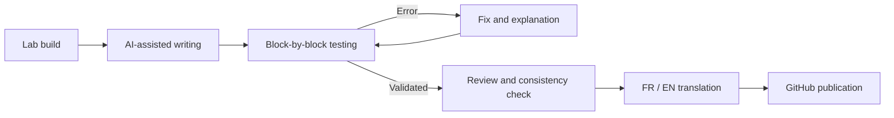

<p align="right">
  🇫🇷 <a href="./README.md">Français</a> · 🇬🇧 <b>English</b>
</p>

# 🖧 Infrastructure Labs — Documented Deployment Guides

> A collection of step-by-step deployment guides, based on infrastructures built during my systems and networks training, then taken further.
> Each lab was built, broken, rebuilt and documented several times to produce a complete, accurate and reproducible guide.


---

## 📑 Table of Contents

1. [Project Overview](#-project-overview)
2. [The Approach: Why These Labs Were Built Several Times](#-the-approach-why-these-labs-were-built-several-times)
3. [AI-Assisted Documentation: My Workflow](#-ai-assisted-documentation-my-workflow)
4. [Infrastructure Catalog](#-infrastructure-catalog)
5. [Repository Structure](#%EF%B8%8F-repository-structure)
6. [Guide Structure](#-guide-structure)
7. [Technical Environment](#%EF%B8%8F-technical-environment)
8. [Writing Conventions](#%EF%B8%8F-writing-conventions)
9. [How to Use These Guides](#-how-to-use-these-guides)
10. [Disclaimer](#%EF%B8%8F-disclaimer)
11. [Author](#-author)

---

## 🎯 Project Overview

This repository gathers all the **systems and network infrastructures** I designed and deployed in a lab environment. Each infrastructure has its own folder, containing a complete deployment guide and an overview README, available in both **French** and **English**.

The goal is threefold:

- **Strengthen my skills**: explaining each configuration forces me to understand every parameter, not just to know how to apply it.
- **Build a reference base**: have reliable procedures that can be reused in a company or a personal lab.
- **Share**: offer other learners and technicians clear guides where every step is explained and justified.

These guides are not just a list of commands: they explain **the why** behind each technical choice, define the concepts involved and describe how to check that each step worked.

---

## 🔁 The Approach: Why These Labs Were Built Several Times

An infrastructure that works once is not enough to produce good documentation. Each lab presented here went through several cycles:

| Cycle | Purpose |
|-------|---------|
| **1. First build** | Initial deployment, discovering the technologies and their constraints. |
| **2. Cold rebuild** | Full rebuild from scratch to identify forgotten steps, implicit prerequisites and pitfalls. |
| **3. Writing** | Writing the guide block by block, testing each step as it is written. |
| **4. Validation** | Full deployment following **only** the guide, with no prior knowledge, to make sure it is self-sufficient. |
| **5. Correction** | Adding the issues encountered directly into the guide's steps, as warnings and checks, and into a troubleshooting section when useful. |

This process ensures that every guide has been **tested under real conditions**: if a step appears in a guide, it has been executed and verified.

### One infrastructure at a time, 100% complete

I work on **only one infrastructure at a time**. It is published in this repository only once it is **fully completed and validated**: complete guide, successful tests and English translation done. This repository therefore contains **no unfinished guide**: everything in it can be used from start to finish.

---

## 🤖 AI-Assisted Documentation: My Workflow

For the sake of transparency: these guides were **written with the assistance of artificial intelligence**. AI served as a structuring and writing tool, just like official documentation or a technical forum.

However, **nothing was published without verification**. My work on each guide consists of:

- ✅ **Testing every command and configuration** on my own lab before validating it.
- ✅ **Fixing errors**: outdated versions, changed menu paths, settings unsuited to the context.
- ✅ **Checking overall consistency**: addressing plan, hostnames, interfaces and filtering rules must match from start to finish.
- ✅ **Studying and understanding** each step, to be able to explain and justify it without any support.
- ✅ **Enriching explanations**: adding definitions, diagrams, technical justifications and points of attention drawn from my own experience.



> 💡 **In short:** AI helped me write, but the understanding, testing, fixing and validation are my own. This is not copy-paste: it is documentation that has been built, tested and mastered.

---

## 📚 Infrastructure Catalog

Infrastructures are listed in **order of publication**. The catalog grows with each new infrastructure completed and 100% validated.

| # | Infrastructure | Field | Topics covered | Hypervisor | Validated on |
|---|----------------|-------|----------------|------------|--------------|
| 01 | [LAN / DMZ Network Segmentation with OPNsense](<./infrastructures/Segmentation réseau LAN-DMZ avec OPNsense/README_EN.md>) | Networking & security | OPNsense firewall, DMZ, NAT, DHCP, DNS, filtering | VMware Workstation Pro | 01/10/2026 |

<!--
Row template to copy for each new validated infrastructure:
| 02 | [Infrastructure name](<./infrastructures/Folder name/>) | Field | Topic 1, topic 2, topic 3 | Hypervisor | DD/MM/YYYY |
-->

---

## 🗂️ Repository Structure

All validated infrastructures are grouped in the `infrastructures/` folder. Each one has its own folder there, always with the same internal structure:

```
infrastructure-labs/
│
├── README.md                          ← French version (global overview)
├── README_EN.md                       ← This file
├── .gitignore                         ← Files excluded from publication
│
└── infrastructures/                   ← All validated infrastructures
    │
    └── Infrastructure name/
        ├── README.md                  ← Infrastructure overview (FR)
        ├── README_EN.md               ← Infrastructure overview (EN)
        ├── GUIDE_DEPLOIEMENT.md       ← Complete step-by-step guide (FR)
        ├── GUIDE_DEPLOIEMENT_EN.md    ← Complete step-by-step guide (EN)
        └── images/                    ← Diagrams and screenshots
```

> Every new infrastructure added to the repository follows exactly this structure.

---

## 🧱 Guide Structure

All deployment guides follow the same skeleton, so readers can find their way from one lab to another:

1. **Title and purpose**: what the infrastructure does and which real need it addresses.
2. **Diagram**: complete network topology (machines, interfaces, networks, flows).
3. **Deployment plan**: the main phases, in order of execution.
4. **Table of contents**: quick navigation through the guide.
5. **Prerequisites**: build environment (host machine, operating system, hypervisor and exact versions), hardware, ISO files and required knowledge.
6. **Addressing plan**: IP addresses, masks, gateways, DNS, hostnames.
7. **Deployment steps**: block by block, each step including:
   - the **goal** of the step;
   - the **actions** to perform (commands or GUI operations);
   - an **explanation** of what is done and why;
   - the **check** that confirms the step succeeded.
8. **Final validation tests**: scenarios proving the infrastructure works as a whole.
9. **Troubleshooting** *(optional)*: included only when an infrastructure has recurring issues worth documenting (errors, causes and solutions).
10. **Glossary**: definitions of the technical terms used.

---

## 🛠️ Technical Environment

### Host machines

The labs are built on two physical machines, each with its own hypervisors:

| Host machine | Operating system | Hypervisors used |
|--------------|------------------|------------------|
| **PC 1** | Windows 11 Pro | VMware Workstation Pro, Hyper-V |
| **PC 2** | CachyOS (Linux distribution based on Arch Linux) | KVM / QEMU, managed with virt-manager |

> 💡 The hypervisor depends on the infrastructure. Each guide states in its prerequisites the host machine used, the exact software versions and any specific host settings (for example the Hyper-V state on Windows), so that the lab can be reproduced exactly.

### Technologies covered

| Field | Technologies |
|-------|--------------|
| **Virtualization** | VMware Workstation Pro, Hyper-V, KVM / QEMU (virt-manager), Proxmox VE (VMs and LXC containers) |
| **Firewall / routing** | OPNsense |
| **Operating systems** | Windows Server, Windows 10/11, Debian |
| **Directory & identity** | Active Directory (AD DS), DNS, DHCP, GPO |
| **Services** | File server, Squid proxy, GLPI |
| **Networking** | VLAN, routing, NAT, DMZ, filtering |
| **Availability** | Redundancy, load balancing |
| **Monitoring** | Host and service monitoring, alerting |

> Each guide specifies the **exact versions** used during its validation. Version differences may lead to changes in interface or syntax.

---

## ✍️ Writing Conventions

To make reading easier, the guides use common conventions:

| Element | Meaning |
|---------|---------|
| `command` | Command to type in a terminal |
| **Bold** | Interface element (menu, button, tab) |
| `Menu > Submenu > Option` | Navigation path in a graphical interface |
| `<VALUE>` | Value to adapt to your environment |
| "as root" before a block | The commands in the block run with the **root** account |

Callouts used in the guides:

> 🎯 **Goal**: what the phase achieves.

> 💡 **Tip**: practical advice to save time or understand better.

> ⚠️ **Warning**: critical point, common source of errors.

> 📖 **Definition**: explanation of a technical concept.

> ✅ **Check**: verification to perform before moving on to the next step.

---

## 🚀 How to Use These Guides

1. **Pick an infrastructure** from the [catalog](#-infrastructure-catalog).
2. **Read its README** to understand its purpose and topology before starting.
3. **Check the prerequisites**: host machine, hypervisor, ISO files, versions.
4. **Follow the guide in order**, without skipping any step: each block builds on the previous one.
5. **Complete every check** before moving on: an uncorrected error carries over to everything that follows.
6. If you get stuck, reread the ⚠️ **Warning** callouts of the step in question and, if there is one, the **Troubleshooting** section at the end of the guide.

> 💡 Take the time to read the explanations, not just the commands. The goal is to understand the infrastructure, not just to make it work.

---

## ⚠️ Disclaimer

These infrastructures were designed **for educational purposes**, in an isolated lab environment.

- Passwords, IP addresses and domain names used are **fictitious** or specific to the lab.
- Configurations favor **educational clarity**: some hardening measures required in production may be simplified or missing.
- Before any transfer to a production environment, a **security review** and adaptation to the context are essential.

I cannot be held responsible for any misuse of these guides outside a lab context.

---

## 👤 Author

**Vedis** — Systems and network administrator in training

Passionate about systems and network administration, I document my labs to consolidate my knowledge and share it.

- 💼 LinkedIn: `<link>`
- 🐙 GitHub: [Vedis44](https://github.com/Vedis44)

---

<p align="center">
  <i>"You only truly master an infrastructure once you can explain it."</i>
</p>
