<p align="right">
  🇫🇷 <b>Français</b> · 🇬🇧 <a href="./GUIDE_DEPLOIEMENT_EN.md">English</a>
</p>

# 🛡️ Segmentation réseau LAN / DMZ avec OPNsense — Guide de déploiement

> Guide pas à pas pour déployer sous VMware Workstation une infrastructure segmentée : un pare-feu OPNsense, un réseau interne (LAN) avec un poste client Windows 10, et une zone démilitarisée (DMZ) hébergeant un serveur Web Debian publié via NAT.

**⏱️ Durée estimée :** 2 à 3 heures · **📶 Niveau :** intermédiaire · **🧪 Environnement :** VMware Workstation Pro

[⬅️ Présentation de l'infrastructure](./README.md) · [🏠 Retour au dépôt](../../README.md)

---

## 🎯 Utilité de l'infrastructure

Toute entreprise qui publie un service sur Internet (site Web, messagerie, extranet) fait face au même risque : si ce service est compromis, l'attaquant ne doit pas pouvoir rebondir vers le réseau interne, où se trouvent les postes de travail et les données sensibles.

Cette infrastructure répond à ce besoin en découpant le réseau en trois zones de confiance, toutes contrôlées par un pare-feu central :

| Zone | Rôle | Niveau de confiance |
|------|------|---------------------|
| **WAN** | Accès Internet, simulé par le NAT de VMware | Aucun |
| **DMZ** | Héberge le serveur Web exposé | Faible |
| **LAN** | Réseau interne des utilisateurs et de l'administration | Élevé |

> 📖 **Définition** : le terme **DMZ** (*demilitarized zone*, zone démilitarisée) vient du vocabulaire militaire, où il désigne une bande de territoire neutre entre deux camps. En réseau, c'est une zone tampon entre Internet et le réseau interne. Elle est considérée comme exposée, voire sacrifiable : on part du principe qu'un serveur de la DMZ peut être compromis, et l'architecture doit garantir que cette compromission reste contenue dans la DMZ.

### Du lab à l'entreprise

Chaque élément de ce lab simule un équipement que vous retrouverez en production :

| Dans ce lab | Dans une entreprise |
|-------------|---------------------|
| NAT de VMware (`VMnet8`) | Box ou routeur de l'opérateur, avec une adresse IP publique |
| Commutateurs virtuels `VMnet10` et `VMnet11` | Switchs physiques ou VLAN dédiés à chaque zone |
| VM OPNsense | Pare-feu matériel (appliance) ou virtuel |
| Serveur Web Nginx en DMZ | Site Web, relais de messagerie, reverse proxy, passerelle VPN |
| Client Windows 10 | Postes de travail des collaborateurs |

### Ce que vous allez apprendre

À l'issue de ce guide, vous saurez :

- isoler des réseaux virtuels dans VMware Workstation ;
- installer OPNsense et le configurer en console puis via son interface Web ;
- distribuer des adresses IP par DHCP et résoudre les noms avec Unbound ;
- écrire des règles de pare-feu et maîtriser leur ordre d'évaluation ;
- publier un service interne grâce à une redirection de port (NAT) ;
- prouver par des tests que la segmentation fonctionne.

**🔗 Pour aller plus loin :**

- [ANSSI — Recommandations relatives à l'interconnexion d'un SI à Internet](https://messervices.cyber.gouv.fr/guides/recommandations-relatives-linterconnexion-dun-si-internet)
- [CNIL — Sécurité : protéger le réseau informatique](https://www.cnil.fr/fr/securite-proteger-le-reseau-informatique)
- [Documentation officielle d'OPNsense](https://docs.opnsense.org/)

---

## 📐 Schéma de l'architecture

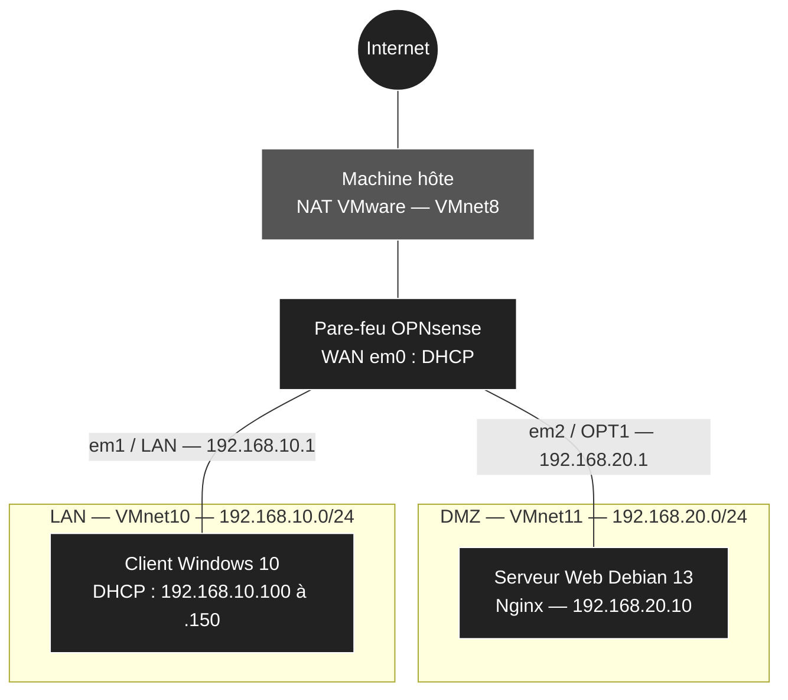
```mermaid
flowchart TD
    classDef greyNode fill:#555,stroke:#fff,stroke-width:1px,color:#fff;
    classDef darkNode fill:#222,stroke:#fff,stroke-width:1px,color:#fff;

    Internet((Internet)):::darkNode
    NAT["Machine hôte<br/>NAT VMware — VMnet8"]:::greyNode
    FW["Pare-feu OPNsense<br/>WAN em0 : DHCP"]:::darkNode

    subgraph DMZ["DMZ — VMnet11 — 192.168.20.0/24"]
        Web["Serveur Web Debian 13<br/>Nginx — 192.168.20.10"]:::darkNode
    end

    subgraph LAN["LAN — VMnet10 — 192.168.10.0/24"]
        Client["Client Windows 10<br/>DHCP : 192.168.10.100 à .150"]:::darkNode
    end

    Internet --- NAT
    NAT --- FW
    FW -- "em2 / OPT1 — 192.168.20.1" --- Web
    FW -- "em1 / LAN — 192.168.10.1" --- Client
```

### Matrice des flux

Ce tableau résume la politique de sécurité appliquée par le pare-feu. Chaque flux est prouvé par le ou les tests indiqués dans la dernière colonne, réalisés en Phase 7.

| Source | Destination | Autorisé | Mise en œuvre | Test |
|--------|-------------|:--------:|---------------|:----:|
| LAN | Internet | ✅ | Règle LAN par défaut d'OPNsense | 1 |
| LAN | DMZ | ✅ | Règle LAN par défaut d'OPNsense | 2 |
| DMZ | Internet | ✅ | Règle *Pass* sur OPT1 (Phase 5) | 3 |
| DMZ | LAN | ❌ | Règle *Block* sur OPT1 (Phase 6) | 4 et 6 |
| DMZ | Pare-feu (WebGUI et services) | ❌ | Règle *Block* sur OPT1 (Phase 6) | 5 et 6 |
| WAN | Serveur Web (port 80) | ✅ | Redirection de port, *Destination NAT* (Phase 6) | 7 |
| WAN | Toute autre destination, dont la WebGUI d'OPNsense | ❌ | Blocage par défaut d'OPNsense | 8 |

### Aperçu du résultat final

Une fois l'infrastructure terminée, le serveur Web de la DMZ est accessible depuis la machine hôte via l'adresse WAN du pare-feu :

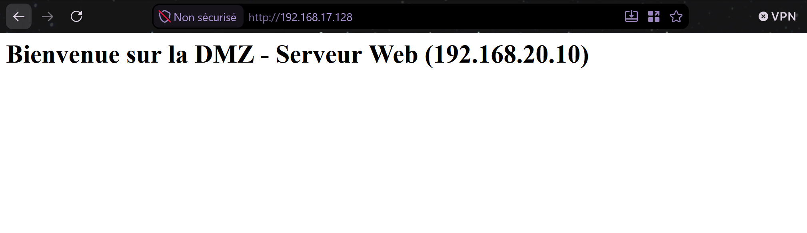

Et le pare-feu s'administre depuis le poste client du LAN :

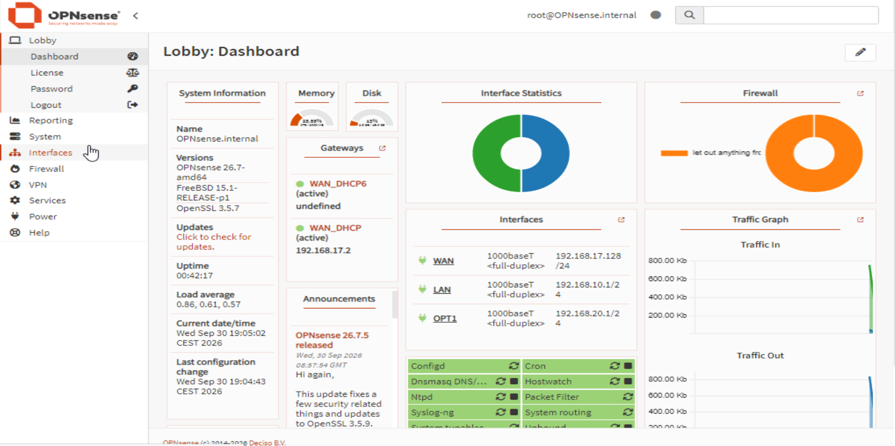

---

## 🧭 Plan de déploiement

Les phases s'enchaînent dans cet ordre : chacune s'appuie sur la précédente. Les durées sont indicatives.

1. **Phase 1 — Préparation des réseaux virtuels** *(≈ 10 min)* : vérification du réseau WAN (VMnet8) et création des commutateurs isolés du LAN (VMnet10) et de la DMZ (VMnet11), sans DHCP VMware.
2. **Phase 2 — Création des machines virtuelles** *(≈ 15 min)* : création des trois VM et raccordement de leurs cartes réseau aux bons commutateurs.
3. **Phase 3 — Installation et configuration initiale d'OPNsense** *(≈ 20 min)* : installation du système, assignation des interfaces, adressage du LAN et de la DMZ, activation du DHCP sur le LAN.
4. **Phase 4 — Déploiement du client Windows 10 et accès à la WebGUI** *(≈ 45 min)* : installation du poste, vérification du DHCP, assistant de configuration initiale d'OPNsense.
5. **Phase 5 — Déploiement du serveur Web Debian 13** *(≈ 30 min)* : ouverture de l'accès Internet de la DMZ, installation de Debian en IP statique, installation de Nginx.
6. **Phase 6 — Règles de pare-feu et redirection de port** *(≈ 20 min)* : isolation de la DMZ vis-à-vis du LAN et du pare-feu, libération du port 80, publication du serveur Web via NAT.
7. **Phase 7 — Tests de validation finale** *(≈ 15 min)* : vérification de chaque flux de la matrice.

> 💡 **Astuce** : prenez un **snapshot** des VM à la fin des phases 3 à 7 (**VM > Snapshot > Take Snapshot...**). Si une erreur survient plus tard, vous revenez à un état fonctionnel en quelques secondes au lieu de tout réinstaller.

> 📖 **Définition** : un **snapshot** (instantané) enregistre l'état complet d'une VM à un instant donné : disque, mémoire et configuration. Il permet de revenir à cet état à tout moment. Ce n'est pas une sauvegarde : il dépend du disque d'origine et disparaît avec lui.

---

## 📑 Sommaire

1. [Utilité de l'infrastructure](#-utilité-de-linfrastructure)
2. [Schéma de l'architecture](#-schéma-de-larchitecture)
3. [Plan de déploiement](#-plan-de-déploiement)
4. [Prérequis](#-prérequis)
5. [Plan d'adressage et dimensionnement](#-plan-dadressage-et-dimensionnement)
6. [Phase 1 : Préparation des réseaux virtuels](#-phase-1--préparation-des-réseaux-virtuels)
7. [Phase 2 : Création des machines virtuelles](#-phase-2--création-des-machines-virtuelles)
8. [Phase 3 : Installation et configuration initiale d'OPNsense](#-phase-3--installation-et-configuration-initiale-dopnsense)
9. [Phase 4 : Déploiement du client Windows 10 et accès à la WebGUI](#-phase-4--déploiement-du-client-windows-10-et-accès-à-la-webgui)
10. [Phase 5 : Déploiement du serveur Web Debian 13](#-phase-5--déploiement-du-serveur-web-debian-13)
11. [Phase 6 : Règles de pare-feu et redirection de port (NAT)](#-phase-6--règles-de-pare-feu-et-redirection-de-port-nat)
12. [Phase 7 : Tests de validation finale](#-phase-7--tests-de-validation-finale)
13. [Limites et pistes d'amélioration](#-limites-et-pistes-damélioration)
14. [Glossaire](#-glossaire)

---

## 🧰 Prérequis

### Environnement de réalisation

Ce lab a été réalisé et validé dans l'environnement suivant :

| Élément | Valeur |
|---------|--------|
| **Machine hôte** | PC 1 |
| **Système hôte** | Windows 11 Pro `26H2` (build 26300.9550) |
| **Hyperviseur** | VMware Workstation Pro (version indiquée dans le tableau des logiciels ci-dessous) |
| **Hyper-V** | Désactivé |
| **Processeur** | Intel Core i7-13650HX (13e génération, 2,60 GHz) |
| **Mémoire vive** | 32 Go |

> 📖 **Définition** : quand **Hyper-V** est activé sous Windows, ou une fonction qui s'appuie sur lui (WSL 2, Bac à sable Windows, Intégrité de la mémoire), Windows s'exécute lui-même au-dessus de l'hyperviseur de Microsoft. VMware Workstation doit alors passer par la **Plateforme de l'hyperviseur Windows** au lieu d'accéder directement aux fonctions de virtualisation du processeur : les VM fonctionnent, mais plus lentement, et certaines fonctions comme la virtualisation imbriquée sont limitées. Avec Hyper-V désactivé, VMware exploite directement le processeur.

> ✅ **Vérification** : pour connaître votre version de Windows, appuyez sur **Windows + R** et lancez `winver`. Pour savoir si un hyperviseur Microsoft est actif, lancez dans **Windows PowerShell** :
>
> ```powershell
> (Get-CimInstance Win32_ComputerSystem).HypervisorPresent
> ```
>
> La commande renvoie `False` quand Hyper-V est désactivé, `True` quand il est actif.

### Machine hôte : configuration minimale

| Ressource | Minimum recommandé | Justification |
|-----------|--------------------|---------------|
| **Processeur** | 64 bits, 4 cœurs, virtualisation matérielle (Intel VT-x ou AMD-V) activée dans le BIOS | 6 cœurs alloués au total |
| **Mémoire vive** | 16 Go | 10 Go alloués aux VM, le reste pour le système hôte |
| **Espace disque** | 110 Go libres | 20 + 25 + 60 Go de disques virtuels |
| **Système** | Windows 10 ou 11, 64 bits | Système hôte de VMware Workstation |

> ✅ **Vérification** : pour savoir si la virtualisation matérielle est active, ouvrez le **Gestionnaire des tâches** (**Ctrl + Maj + Échap**), onglet **Performances > Processeur**. La ligne **Virtualisation** doit indiquer **Activé**. Sinon, activez l'option **Intel VT-x** ou **AMD-V / SVM** dans le BIOS de votre machine.

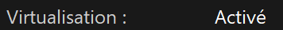

*La ligne **Virtualisation : Activé** confirme que le processeur peut exécuter des machines virtuelles.*

### Logiciels et images ISO

| Élément | Version utilisée | Téléchargement |
|---------|------------------|----------------|
| VMware Workstation Pro | `17.6.1` (build 24319023) | [Site de VMware (Broadcom)](https://www.vmware.com/products/desktop-hypervisor/workstation-and-fusion) |
| OPNsense, image DVD amd64 | `26.7` (basé sur FreeBSD 15.1) | [opnsense.org](https://opnsense.org/download/) |
| Debian 13, image netinst amd64 | `13.6.0` | [debian.org](https://www.debian.org/download) |
| Windows 10 Pro | `22H2` (build 19045) | [microsoft.com](https://www.microsoft.com/fr-fr/software-download/windows10) |

> ⚠️ **Attention** : les menus et libellés décrits dans ce guide correspondent aux versions indiquées ci-dessus. Avec une autre version, certains écrans peuvent différer légèrement. C'est notamment le cas d'OPNsense, dont l'interface évolue souvent : plusieurs menus ont changé de nom dans les versions récentes, et le guide le signale à chaque fois.

> ⚠️ **Attention** : Windows 10 n'est plus pris en charge par Microsoft depuis le 14 octobre 2025 et ne reçoit plus de mises à jour de sécurité. Il est utilisé ici uniquement dans un lab isolé. En production, utilisez un système maintenu, comme Windows 11.

### Vérifier l'intégrité des images ISO

Avant d'utiliser une image téléchargée, vérifiez qu'elle n'a été ni corrompue pendant le téléchargement, ni modifiée par un tiers.

1. Ouvrez **Windows PowerShell** sur votre machine hôte.
2. Calculez l'empreinte SHA-256 du fichier téléchargé :

```powershell
Get-FileHash -Algorithm SHA256 "<CHEMIN_VERS_LE_FICHIER>"
```

3. Comparez le résultat avec l'empreinte publiée par l'éditeur :
   - **OPNsense** : sur la page de téléchargement, à côté du miroir choisi ;
   - **Debian** : dans le fichier `SHA256SUMS`, situé dans le même dossier que l'image ;
   - **Windows 10** : sur la page de téléchargement de Microsoft, dans la section de vérification du téléchargement.

> 📖 **Définition** : une **empreinte** (*hash*) est une suite de caractères calculée à partir du contenu d'un fichier. La moindre modification du fichier donne une empreinte totalement différente. Si votre empreinte est identique à celle publiée par l'éditeur, le fichier est authentique et intact.

> ⚠️ **Attention** : l'image d'OPNsense est téléchargée compressée, au format `.iso.bz2`. Vérifiez l'empreinte sur ce fichier `.bz2`, puis décompressez-le (avec [7-Zip](https://www.7-zip.org/) par exemple) pour obtenir le fichier `.iso` utilisable par VMware.

### Connaissances

- Adressage IPv4 : adresse, masque, passerelle, notation CIDR (`/24`).
- Utilisation de base de VMware Workstation.
- Commandes Linux de base (connexion, saisie de commandes, lecture d'une sortie).

---

## 📊 Plan d'adressage et dimensionnement

### Machines virtuelles

| Nom de la VM | Rôle | Système | Processeurs | RAM | Disque |
|--------------|------|---------|:-----------:|:---:|:------:|
| `OPNsense-Firewall` | Pare-feu et routeur | OPNsense 26.7 | 1 × 1 cœur | 2 Go | 20 Go |
| `Serveur-Web-Debian` | Serveur Web | Debian 13 | 1 × 1 cœur | 2 Go | 25 Go |
| `Client-Windows10` | Poste client et d'administration | Windows 10 Pro | 1 × 4 cœurs | 6 Go | 60 Go |

### Réseaux virtuels

| Réseau VMware | Type | Zone | Sous-réseau | DHCP VMware | Adaptateur hôte |
|---------------|------|------|-------------|:-----------:|:---------------:|
| `VMnet8` | NAT | WAN | Défini par VMware | Activé | Connecté |
| `VMnet10` | Host-only | LAN | `192.168.10.0/24` | Désactivé | Déconnecté |
| `VMnet11` | Host-only | DMZ | `192.168.20.0/24` | Désactivé | Déconnecté |

### Adressage IP

| Machine | Interface | Réseau | Adresse IP | Passerelle | DNS |
|---------|-----------|--------|------------|------------|-----|
| `OPNsense-Firewall` | `em0` (WAN) | VMnet8 | DHCP (VMware) | DHCP (VMware) | DHCP (VMware) |
| `OPNsense-Firewall` | `em1` (LAN) | VMnet10 | `192.168.10.1/24` | — | — |
| `OPNsense-Firewall` | `em2` (OPT1 / DMZ) | VMnet11 | `192.168.20.1/24` | — | — |
| `Serveur-Web-Debian` | `ens33` | VMnet11 | `192.168.20.10/24` (statique) | `192.168.20.1` | `8.8.8.8` |
| `Client-Windows10` | `Ethernet0` | VMnet10 | DHCP : `192.168.10.100` à `.150` | `192.168.10.1` | `192.168.10.1` |

> 💡 **Logique du plan d'adressage** :
> - le troisième octet porte le numéro de la zone (`10` pour le LAN, `20` pour la DMZ) : une adresse suffit à savoir dans quelle zone se trouve une machine ;
> - la passerelle de chaque zone est toujours en `.1`, ce qui est la convention la plus répandue ;
> - la plage DHCP du LAN commence à `.100` : les adresses `.2` à `.99` restent libres pour de futurs équipements à adresse fixe (imprimante, serveur...).

### Comptes utilisés

| Machine | Compte | Usage | Mot de passe |
|---------|--------|-------|--------------|
| `OPNsense-Firewall` | `installer` | Installation depuis l'ISO | `opnsense` (par défaut) |
| `OPNsense-Firewall` | `root` | Console et WebGUI | `opnsense` par défaut, puis modifié en Phase 4 |
| `Serveur-Web-Debian` | `root` | Administration du serveur | Défini en Phase 5 |
| `Serveur-Web-Debian` | Utilisateur standard | Usage courant et connexion SSH | Défini en Phase 5 |
| `Client-Windows10` | Compte local | Session utilisateur | Défini en Phase 4 |

> ⚠️ **Attention** : ne publiez jamais vos vrais mots de passe dans une documentation. Utilisez des mots de passe propres au lab, que vous ne réutilisez nulle part ailleurs.

---

## 🔌 Phase 1 : Préparation des réseaux virtuels

> 🎯 **Objectif** : créer le câblage virtuel de l'infrastructure avant de créer les machines. Chaque zone dispose de son propre commutateur virtuel : aucune machine ne peut communiquer avec une autre zone sans passer par le pare-feu.

### 1.1 Ouvrir le Virtual Network Editor

1. Lancez **VMware Workstation**.
2. Dans le menu, cliquez sur **Edit > Virtual Network Editor...**.
3. Si les paramètres sont grisés, cliquez sur **Change Settings** en bas à droite (icône de bouclier) et validez l'invite du Contrôle de compte d'utilisateur. Seul un administrateur peut modifier la configuration réseau de VMware.

> 📖 **Définition** : le **Virtual Network Editor** gère les commutateurs virtuels de VMware, appelés **VMnet**. Chaque VMnet se comporte comme un switch physique : les VM branchées sur le même VMnet communiquent entre elles et sont isolées des autres VMnet. Sous Windows, VMware Workstation propose 20 VMnet, numérotés de `VMnet0` à `VMnet19`.

VMware propose trois types de réseaux. Ce lab en utilise deux :

| Type | Fonctionnement | Accès Internet | Utilisation dans ce lab |
|------|----------------|:--------------:|-------------------------|
| **Bridged** | La VM est branchée directement sur le réseau physique de l'hôte, comme un PC de plus sur votre box | ✅ | Non utilisé |
| **NAT** | La VM est dans un réseau privé et sort sur Internet en partageant l'adresse IP de l'hôte | ✅ | WAN d'OPNsense (`VMnet8`) |
| **Host-only** | Réseau privé entièrement contenu dans l'hôte, sans accès vers l'extérieur | ❌ | LAN (`VMnet10`) et DMZ (`VMnet11`) |

> ⚠️ **Attention** : ne cliquez jamais sur **Restore Defaults** dans le Virtual Network Editor. Ce bouton supprime tous les réseaux personnalisés (`VMnet10` et `VMnet11` compris) et déconnecte les VM qui les utilisent.

### 1.2 Vérifier le réseau WAN (VMnet8)

Le réseau VMnet8 existe par défaut. Il donnera au pare-feu un accès Internet en passant par la connexion de votre machine hôte.

1. Repérez **VMnet8** dans la liste des réseaux.
2. Vérifiez que la colonne **Type** indique **NAT**.
3. Vérifiez que les cases **Connect a host virtual adapter to this network** et **Use local DHCP service to distribute IP address to VMs** sont **cochées**.
4. Laissez le **Subnet IP** par défaut : il varie selon les installations et n'a pas d'incidence sur le lab.

> 💡 **Astuce** : notez le sous-réseau affiché pour VMnet8 (par exemple `192.168.17.0`). La passerelle NAT de VMware y porte l'adresse en `.2` (ici `192.168.17.2`) : elle vous sera utile pour diagnostiquer un problème d'accès Internet.

### 1.3 Créer le réseau LAN (VMnet10)

1. Cliquez sur **Add Network...**.
2. Dans la liste déroulante, choisissez **VMnet10**, puis cliquez sur **OK**.
3. Sélectionnez **VMnet10** dans la liste et configurez-le :

| Paramètre | Valeur |
|-----------|--------|
| **Type** | Host-only |
| **Connect a host virtual adapter to this network** | ❌ Décoché |
| **Use local DHCP service to distribute IP address to VMs** | ❌ Décoché |
| **Subnet IP** | `192.168.10.0` |
| **Subnet mask** | `255.255.255.0` |

> 📖 **Définition** : le DHCP de VMware est désactivé car c'est OPNsense qui distribuera les adresses IP du LAN. Deux serveurs DHCP sur un même réseau entrent en concurrence : chaque client accepte la première offre reçue, et peut donc se retrouver avec une passerelle ou un DNS incorrect.

> ⚠️ **Attention** : si l'adaptateur hôte reste connecté, VMware attribue à votre machine physique l'adresse `192.168.10.1`, qui est aussi celle d'OPNsense sur le LAN : conflit d'adresses garanti. De plus, votre PC serait branché directement dans le LAN, sans passer par le pare-feu, ce qui contourne la segmentation.

### 1.4 Créer le réseau DMZ (VMnet11)

1. Cliquez à nouveau sur **Add Network...**.
2. Choisissez **VMnet11**, puis cliquez sur **OK**.
3. Sélectionnez **VMnet11** et configurez-le :

| Paramètre | Valeur |
|-----------|--------|
| **Type** | Host-only |
| **Connect a host virtual adapter to this network** | ❌ Décoché |
| **Use local DHCP service to distribute IP address to VMs** | ❌ Décoché |
| **Subnet IP** | `192.168.20.0` |
| **Subnet mask** | `255.255.255.0` |

> 💡 **Astuce** : le LAN et la DMZ utilisent deux VMnet consécutifs, `VMnet10` et `VMnet11`, faciles à retenir et à distinguer des réseaux créés par défaut par VMware (`VMnet0`, `VMnet1` et `VMnet8`).

> 💡 **Astuce** : aucun serveur DHCP n'est prévu dans la DMZ. Les serveurs exposés reçoivent une adresse statique, pour que leur adresse ne change jamais et que les règles de NAT qui les ciblent restent valides.

### 1.5 Appliquer la configuration

1. Cliquez sur **Apply** : VMware redémarre ses services réseau, ce qui prend quelques secondes.
2. Cliquez sur **OK** pour fermer la fenêtre.

> ✅ **Vérification dans VMware** : rouvrez le Virtual Network Editor. La liste doit contenir ces trois réseaux :
>
> | Réseau | Type | Host Connection | DHCP | Subnet Address |
> |--------|------|:---------------:|:----:|----------------|
> | VMnet8 | NAT | Connected | Enabled | Sous-réseau défini par VMware |
> | VMnet10 | Custom | - | - | `192.168.10.0` |
> | VMnet11 | Custom | - | - | `192.168.20.0` |

> 📖 **Définition** : VMware affiche le type **Custom** pour un réseau host-only dont l'adaptateur hôte est déconnecté et le DHCP désactivé. C'est exactement le résultat attendu : un commutateur totalement isolé, auquel seules les VM peuvent se brancher.

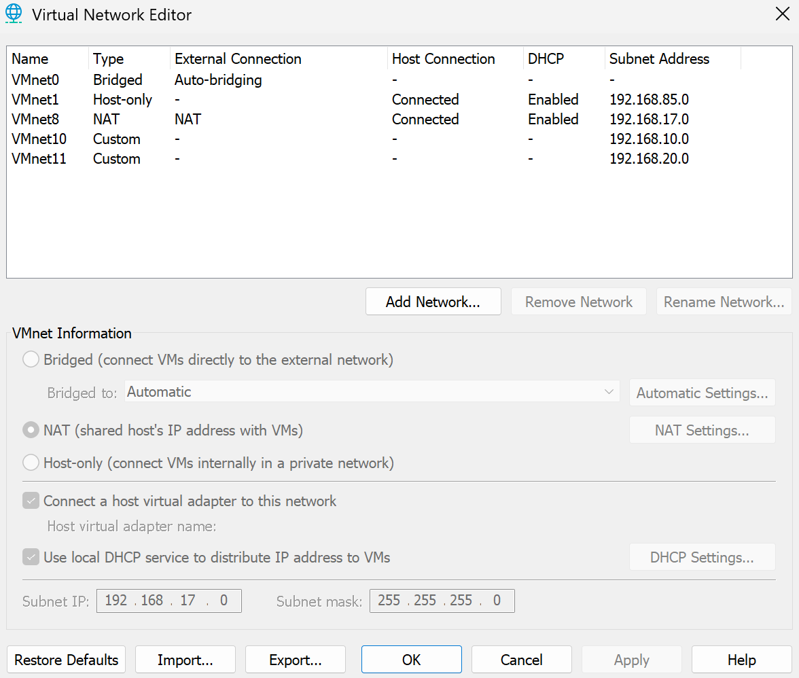

*VMnet10 et VMnet11 apparaissent en type Custom, sans connexion à l'hôte ni DHCP, avec leurs sous-réseaux `192.168.10.0` et `192.168.20.0`.*

> ✅ **Vérification sur l'hôte** : dans **Windows PowerShell**, listez les cartes réseau virtuelles de VMware présentes sur votre machine :
>
> ```powershell
> Get-NetAdapter | Where-Object Name -like "*VMnet*" | Format-Table Name, Status
> ```
>
> Vous devez voir **VMware Network Adapter VMnet1** et **VMware Network Adapter VMnet8**, mais **aucune carte VMnet10 ni VMnet11** : la preuve que votre PC n'est pas raccordé au LAN ni à la DMZ. VMnet1 est le réseau host-only créé par défaut par VMware, il n'est pas utilisé dans ce lab.

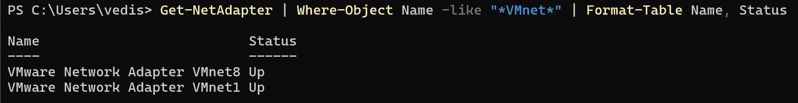

*Seules les cartes VMnet1 et VMnet8 existent sur l'hôte : aucune carte pour le LAN ni pour la DMZ.*

**🔗 Pour aller plus loin :**

- [VMware Workstation Pro — Configuring Network Connections](https://techdocs.broadcom.com/us/en/vmware-cis/desktop-hypervisors/workstation-pro/17-0/using-vmware-workstation-pro/configuring-network-connections.html)
- [VMware Workstation Pro — Understanding Common Networking Configurations](https://techdocs.broadcom.com/us/en/vmware-cis/desktop-hypervisors/workstation-pro/17-0/using-vmware-workstation-pro/configuring-network-connections/understanding-common-networking-configurations.html)
- [VMware Workstation Pro — Add a Host-Only Virtual Network](https://techdocs.broadcom.com/us/en/vmware-cis/desktop-hypervisors/workstation-pro/17-0/using-vmware-workstation-pro/using-the-virtual-network-editor/add-a-host-only-virtual-network.html)

---

## 💽 Phase 2 : Création des machines virtuelles

> 🎯 **Objectif** : créer les trois machines virtuelles et raccorder leurs cartes réseau aux bons commutateurs, sans encore installer les systèmes.

> ⚠️ **Attention** : à la fin de chaque assistant, **ne démarrez pas la VM**. Le matériel et les cartes réseau doivent d'abord être ajustés.

Les ressources sont dimensionnées selon le rôle de chaque machine :

| VM | Processeurs | Cœurs par processeur | RAM | Justification |
|----|:-----------:|:--------------------:|:---:|---------------|
| `OPNsense-Firewall` | 1 | 1 | 2 Go | Un pare-feu de lab traite peu de trafic : 2 Go suffisent pour le système et ses services (DHCP, DNS, filtrage) |
| `Serveur-Web-Debian` | 1 | 1 | 2 Go | Debian sans interface graphique et Nginx sont très légers |
| `Client-Windows10` | 1 | 4 | 6 Go | Windows 10 et son navigateur sont bien plus gourmands, surtout pendant l'installation et les mises à jour |

> 📖 **Définition** : dans VMware, **Number of processors** correspond au nombre de processeurs physiques (sockets) vus par la VM, et **Number of cores per processor** au nombre de cœurs de chacun. Le total de cœurs est le produit des deux. Windows 10 Pro ne prend en charge que 2 sockets au maximum : il faut donc lui attribuer 1 processeur de 4 cœurs, et non 4 processeurs de 1 cœur, sinon Windows n'utilise que 2 des 4 cœurs alloués.

> 💡 **Astuce** : le matériel de chaque VM se règle dans la même fenêtre, accessible de deux façons : via le bouton **Customize Hardware...** sur l'écran **Ready to Create** de l'assistant, ou après la création via **clic droit sur la VM > Settings...**.

> 💡 **Astuce** : rangez les trois VM dans un même dossier dédié au lab (par exemple `Documents\Virtual Machines\Lab-Segmentation-DMZ\`), en modifiant le champ **Location** de chaque assistant. Vous retrouverez et sauvegarderez votre lab plus facilement.

### 2.1 Créer la VM OPNsense-Firewall

1. Cliquez sur **File > New Virtual Machine... > Typical (recommended)**.
2. Choisissez **Installer disc image file (iso)** et sélectionnez l'ISO d'OPNsense. VMware doit afficher sous le champ : **FreeBSD version 10 and earlier 64-bit detected**.
3. **Name** : `OPNsense-Firewall`.
4. **Disk** : **20 GB**, avec l'option **Store virtual disk as a single file**.
5. Sur l'écran **Ready to Create**, décochez **Power on this virtual machine after creation**, puis cliquez sur **Finish**.

> ⚠️ **Attention** : pour OPNsense, utilisez obligatoirement l'option **Installer disc image file (iso)** et laissez VMware détecter le système. Avec l'option **I will install the operating system later**, la VM peut se retrouver mal dimensionnée et le démarrage de l'ISO échoue : écran noir, ou messages `was killed: failed to reclaim memory` dans la console.

> 📖 **Définition** : le type de système détecté détermine le modèle de carte réseau émulé par VMware. Pour FreeBSD, VMware émule une carte Intel e1000, que OPNsense nomme `em0`, `em1`, `em2`. C'est ce nommage qu'utilise la Phase 3.

> 📖 **Définition** : l'option **Store virtual disk as a single file** stocke le disque virtuel dans un seul fichier `.vmdk`, plus performant. L'option **Split into multiple files** le découpe en fragments de 2 Go, utile seulement pour copier la VM sur un support limité en taille de fichier (clé USB en FAT32).

> 📖 **Définition** : par défaut, VMware crée des disques à **allocation dynamique** : le fichier `.vmdk` grossit au fur et à mesure que la VM écrit des données, jusqu'à la taille maximale indiquée. Un disque de 60 Go n'occupe donc que quelques Go sur votre PC juste après sa création.

Ajustez ensuite le matériel : clic droit sur la VM **> Settings...**

| Composant | Réglage |
|-----------|---------|
| **Memory** | `2048` MB |
| **Processors** | **Number of processors** : `1`, **Number of cores per processor** : `1` |
| **Network Adapter** (1re carte, WAN) | Carte existante : vérifiez qu'elle est sur **NAT: Used to share the host's IP address** (VMnet8) |
| **Network Adapter 2** (LAN) | **Add... > Network Adapter > Finish**, puis **Custom: Specific virtual network** > `VMnet10` |
| **Network Adapter 3** (DMZ) | **Add... > Network Adapter > Finish**, puis **Custom: Specific virtual network** > `VMnet11` |

Cliquez sur **OK**.

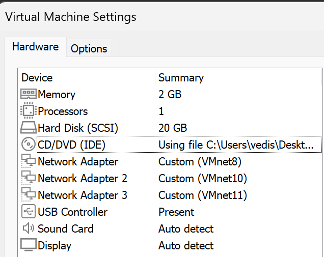

*Les trois cartes réseau dans l'ordre : VMnet8 (WAN), VMnet10 (LAN), VMnet11 (DMZ).*

> ⚠️ **Attention** : respectez cet ordre d'ajout. OPNsense nomme les cartes `em0`, `em1` et `em2` dans l'ordre où elles ont été ajoutées : c'est ce qui permet d'associer sans erreur `em0` au WAN, `em1` au LAN et `em2` à la DMZ en Phase 3.

> ⚠️ **Attention** : la mémoire doit être d'au moins `2048` MB. En mode Live, l'ISO d'OPNsense fonctionne entièrement en mémoire : avec moins, le système tue des processus au démarrage (`was killed: failed to reclaim memory`). Si ce message apparaît malgré 2 Go, passez la VM à `4096` MB le temps de l'installation.

### 2.2 Créer la VM Serveur-Web-Debian

L'assistant de VMware ne reconnaît pas toujours l'ISO de Debian 13 : la VM est donc créée vide, puis l'ISO est reliée ensuite.

1. Cliquez sur **File > New Virtual Machine... > Typical (recommended)**.
2. Choisissez **I will install the operating system later**, puis **Next**.
3. **Guest Operating System** : **Linux**, version **Debian 13.x 64-bit** (ou **Debian 12.x 64-bit** si la version 13 n'apparaît pas dans la liste).
4. **Name** : `Serveur-Web-Debian`.
5. **Disk** : **25 GB**, avec l'option **Store virtual disk as a single file**. Cliquez sur **Next**, puis **Finish**.

Ajustez ensuite le matériel : clic droit sur la VM **> Settings...**

| Composant | Réglage |
|-----------|---------|
| **Memory** | `2048` MB |
| **Processors** | **Number of processors** : `1`, **Number of cores per processor** : `1` |
| **Network Adapter** (DMZ) | **Custom: Specific virtual network** > `VMnet11` |
| **CD/DVD (SATA)** | **Use ISO image file** > **Browse...** > ISO de Debian 13 |

Cliquez sur **OK**.

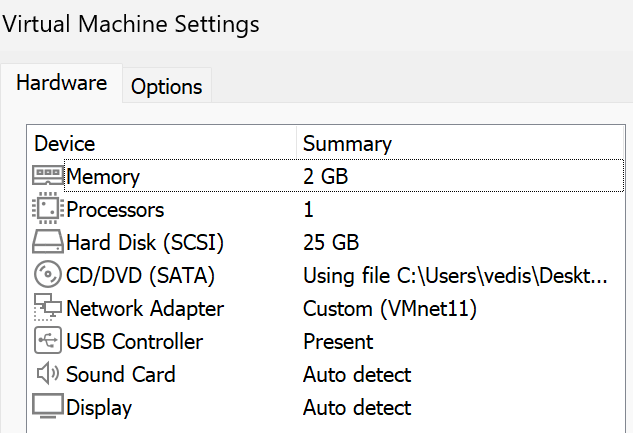

*Une seule carte réseau, raccordée à VMnet11 (DMZ), et l'ISO de Debian reliée au lecteur CD/DVD.*

### 2.3 Créer la VM Client-Windows10

La VM Windows est elle aussi créée vide. Si l'ISO Windows est fournie directement à l'assistant, VMware peut lancer une installation automatique (*Easy Install*) qui court-circuite l'installation manuelle décrite en Phase 4.

1. Cliquez sur **File > New Virtual Machine... > Typical (recommended)**.
2. Choisissez **I will install the operating system later**, puis **Next**.
3. **Guest Operating System** : **Microsoft Windows**, version **Windows 10 x64**.
4. **Name** : `Client-Windows10`.
5. **Disk** : **60 GB**, avec l'option **Store virtual disk as a single file**. Cliquez sur **Next**, puis **Finish**.

Ajustez ensuite le matériel : clic droit sur la VM **> Settings...**

| Composant | Réglage |
|-----------|---------|
| **Memory** | `6144` MB |
| **Processors** | **Number of processors** : `1`, **Number of cores per processor** : `4` |
| **Network Adapter** (LAN) | **Custom: Specific virtual network** > `VMnet10` |
| **CD/DVD (SATA)** | **Use ISO image file** > **Browse...** > ISO de Windows 10 |

Cliquez sur **OK**.

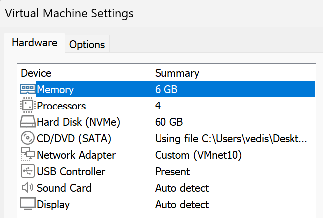

*6 GB de mémoire, 4 cœurs, une carte réseau sur VMnet10 (LAN) et l'ISO de Windows 10 reliée.*

> 💡 **Astuce** : sur les deux serveurs (`OPNsense-Firewall` et `Serveur-Web-Debian`), vous pouvez retirer les composants inutiles dans **Settings** : **Sound Card**, **Printer** et **USB Controller** (sélectionnez-les puis cliquez sur **Remove**). Un serveur n'en a pas besoin, et chaque composant retiré est un élément de moins à gérer et à sécuriser.

> ✅ **Vérification** : les trois VM apparaissent dans la bibliothèque de VMware. Ouvrez les paramètres de chacune et contrôlez :
>
> | VM | Mémoire | Processeurs | Disque | Cartes réseau | CD/DVD |
> |----|:-------:|:-----------:|:------:|---------------|--------|
> | `OPNsense-Firewall` | 2 GB | 1 × 1 cœur | 20 GB (SCSI) | VMnet8, VMnet10, VMnet11, dans cet ordre | ISO d'OPNsense (IDE) |
> | `Serveur-Web-Debian` | 2 GB | 1 × 1 cœur | 25 GB (SCSI) | VMnet11 | ISO de Debian 13 (SATA) |
> | `Client-Windows10` | 6 GB | 1 × 4 cœurs | 60 GB (NVMe) | VMnet10 | ISO de Windows 10 (SATA) |

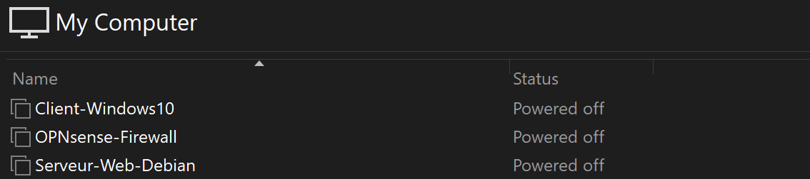

*Les trois VM du lab sont créées et éteintes, prêtes pour l'installation des systèmes.*

**🔗 Pour aller plus loin :**

- [OPNsense — Configuration matérielle requise](https://docs.opnsense.org/manual/hardware.html)
- [Debian — Manuel d'installation](https://www.debian.org/releases/stable/installmanual)

---

## 🔥 Phase 3 : Installation et configuration initiale d'OPNsense

> 🎯 **Objectif** : installer OPNsense, associer ses cartes réseau aux zones WAN, LAN et DMZ, puis appliquer le plan d'adressage depuis la console.

### 3.1 Installer OPNsense

1. Sélectionnez la VM `OPNsense-Firewall` et cliquez sur **Power on this virtual machine**.
2. Laissez le système démarrer jusqu'à l'invite `login:`.

> 💡 **Astuce** : quand vous cliquez dans la console d'une VM, VMware capture votre souris et votre clavier. Pour les libérer et revenir sur Windows, appuyez sur **Ctrl + Alt**.

> 📖 **Définition** : l'ISO d'OPNsense démarre en **mode Live** : un système complet et fonctionnel, chargé en mémoire, sans rien écrire sur le disque. Deux comptes y sont disponibles : `root` pour tester OPNsense sans l'installer, et `installer` pour lancer directement l'installation sur le disque.

3. Connectez-vous avec le compte d'installation :
   - **Login** : `installer`
   - **Password** : `opnsense`

> 💡 **Astuce** : la console est en disposition QWERTY. `opnsense` se tape normalement sur un clavier AZERTY, mais pour `installer`, le `a` s'obtient avec la touche **Q**.

4. L'installateur s'ouvre sur l'écran **Keymap Selection**. Naviguez avec les flèches, la touche **Tab** et **Entrée** :
   - **Keymap Selection** : laissez **Continue with default keymap** et validez avec **Select**.
   - **Task** : choisissez **Install (UFS)**.
   - **UFS Configuration** : l'écran *Please select a disk to continue* liste deux périphériques. Sélectionnez **`da0`**, le disque virtuel de 20 GB, puis validez avec **OK** et confirmez l'effacement.
   - Laissez l'installation se terminer (2 à 3 minutes).

> 💡 **Astuce** : l'écran **Keymap Selection** propose aussi des dispositions françaises (**French**). Si vous en choisissez une, le clavier de la console correspondra à votre clavier AZERTY. Le guide garde la disposition par défaut pour rester valable quel que soit le clavier du lecteur.

> 📖 **Définition** : **UFS** et **ZFS** sont deux systèmes de fichiers proposés par l'installateur. **ZFS** apporte des fonctions avancées (instantanés, contrôle d'intégrité, redondance entre plusieurs disques) mais consomme davantage de mémoire. **UFS** est plus simple et plus léger : c'est le choix adapté à une VM de lab avec un seul disque et 2 Go de RAM.

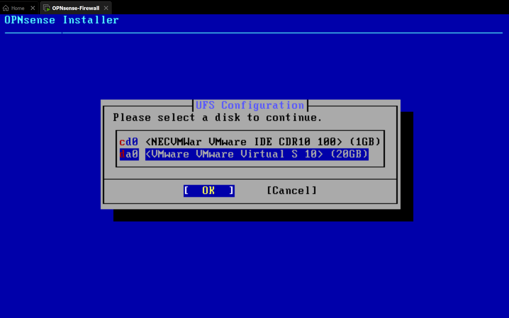

*Choisissez `da0`, le disque virtuel de 20 GB. `cd0` est le lecteur CD qui contient l'ISO d'installation.*

> ⚠️ **Attention** : ne sélectionnez pas `cd0`. Ce périphérique est le lecteur CD virtuel sur lequel l'ISO est montée, pas un disque d'installation.

5. L'assistant propose ensuite de redémarrer. **Avant de valider**, déconnectez l'ISO : clic droit sur l'onglet de la VM **> Settings... > CD/DVD**, décochez **Connected** et **Connect at power on**, puis cliquez sur **OK**.
6. Validez ensuite le redémarrage dans la console.

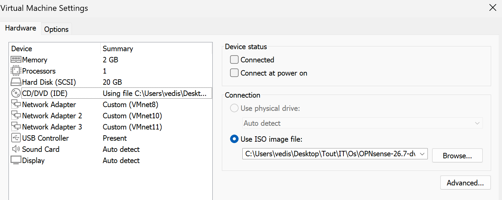

*Les deux cases **Connected** et **Connect at power on** sont décochées : la VM démarrera sur son disque.*

> ⚠️ **Attention** : si l'ISO reste connectée, la VM redémarre sur le support d'installation au lieu du disque, et l'installation recommence. Décocher seulement **Connect at power on** ne suffit pas pour un redémarrage : la case **Connected** doit aussi être décochée.

### 3.2 Assigner les cartes réseau

Après le redémarrage, OPNsense affiche son menu console et l'assignation actuelle des interfaces.

1. Connectez-vous :
   - **Login** : `root`
   - **Password** : `opnsense`

Le menu console regroupe les opérations d'administration de base. Les plus utiles :

| Option | Fonction | Usage |
|:------:|----------|-------|
| **1** | Assign interfaces | Associer les cartes réseau aux rôles WAN, LAN, OPT |
| **2** | Set interface IP address | Configurer l'adressage d'une interface |
| **5** | Power off system | Éteindre proprement le pare-feu |
| **6** | Reboot system | Redémarrer le pare-feu |
| **7** | Ping host | Tester la connectivité depuis le pare-feu |
| **8** | Shell | Ouvrir un terminal pour des commandes avancées |

2. Tapez **1** (*Assign interfaces*), validez avec **Entrée**, puis répondez aux questions :

| Question | Réponse |
|----------|---------|
| Do you want to configure LAGGs now? | `N` |
| Do you want to configure VLANs now? | `N` |
| Enter the WAN interface name | `em0` |
| Enter the LAN interface name | `em1` |
| Enter the Optional interface 1 name | `em2` |
| Enter the Optional interface 2 name *(si la question apparaît)* | Laissez vide, appuyez sur **Entrée** |
| Do you want to proceed? | `y` |

> 📖 **Définition** : OPNsense repose sur **FreeBSD** (FreeBSD 15.1 pour la version 26.7), qui nomme les cartes réseau d'après leur pilote : `em` correspond au pilote Intel e1000 émulé par VMware. Au-delà du WAN et du LAN, les interfaces supplémentaires sont appelées **OPT1**, **OPT2**, etc. Ici, **OPT1** est la DMZ.

> ✅ **Vérification de l'assignation** : l'en-tête du menu console doit maintenant afficher les trois interfaces avec leur carte :
> - **WAN** (`em0`) : une adresse du sous-réseau VMnet8, attribuée par le DHCP de VMware ;
> - **LAN** (`em1`) : `192.168.1.1/24`, l'adresse par défaut d'OPNsense, remplacée à l'étape suivante ;
> - **OPT1** (`em2`) : aucune adresse pour l'instant, c'est normal.

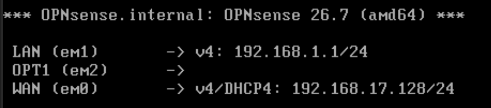

*Le WAN a reçu une adresse de VMware, le LAN garde l'adresse par défaut `192.168.1.1` et OPT1 n'a pas encore d'adresse.*

### 3.3 Configurer l'adresse IP du LAN

> 📖 **Définition** : dans les questions de la console, les réponses possibles sont indiquées entre crochets. La lettre en **majuscule** est la réponse par défaut, appliquée si vous appuyez simplement sur **Entrée** : `[y/N]` signifie « Non par défaut », `[Y/n]` signifie « Oui par défaut ». Tapez toujours votre réponse explicitement pour éviter les surprises.

Dans le menu principal, tapez **2** (*Set interface IP address*), sélectionnez l'interface **LAN** (généralement `2`), puis répondez :

| Question | Réponse |
|----------|---------|
| Configure IPv4 address LAN interface via DHCP? `[y/N]` | `n` |
| Enter the new LAN IPv4 address. Press `<ENTER>` for none: | `192.168.10.1` |
| Enter the new LAN IPv4 subnet bit count (1 to 32): | `24` |
| For a WAN, enter the new LAN IPv4 upstream gateway address. For a LAN, press `<ENTER>` for none: | Laissez vide, appuyez sur **Entrée** |
| Configure IPv6 address LAN interface via WAN tracking? `[Y/n]` | `n` |
| Configure IPv6 address LAN interface via DHCP6? `[y/N]` | `n` |
| Enter the new LAN IPv6 address. Press `<ENTER>` for none: | Laissez vide, appuyez sur **Entrée** |
| Do you want to enable the DHCP server on LAN? `[y/N]` | `y` |
| Enter the start address of the IPv4 client address range: | `192.168.10.100` |
| Enter the end address of the IPv4 client address range: | `192.168.10.150` |
| Do you want to change the web GUI protocol from HTTPS to HTTP? `[y/N]` | `n` |
| Do you want to generate a new self-signed web GUI certificate? `[y/N]` | `n` |
| Restore web GUI access defaults? `[y/N]` | `n` |

> ⚠️ **Attention** : pour la question *via WAN tracking*, la réponse par défaut est **Oui** (`[Y/n]`). Si vous appuyez sur **Entrée** sans taper `n`, OPNsense tentera de configurer l'IPv6 du LAN à partir du WAN.

> 💡 **Astuce** : la passerelle est laissée vide car une interface interne n'a pas de passerelle : c'est OPNsense lui-même qui sert de passerelle aux machines du LAN.

> 📖 **Définition** : ce lab fonctionne uniquement en **IPv4**. Toutes les questions liées à IPv6 reçoivent donc une réponse négative ou vide.

Les trois dernières questions concernent l'interface Web d'administration (WebGUI) :

| Question | Pourquoi répondre `n` |
|----------|-----------------------|
| **Change the web GUI protocol from HTTPS to HTTP** | Le HTTPS chiffre les échanges avec l'interface d'administration, identifiants compris. Passer en HTTP les ferait circuler en clair sur le réseau. |
| **Generate a new self-signed web GUI certificate** | OPNsense a déjà généré un certificat lors de l'installation. En créer un nouveau n'est utile que si l'ancien a expiré ou si le nom du pare-feu a changé. |
| **Restore web GUI access defaults** | Cette option remet à zéro les paramètres d'accès à la WebGUI (protocole, port, règle anti-verrouillage). C'est une option de secours, utile quand un administrateur s'est bloqué l'accès à l'interface Web. Ici, rien n'a été modifié. |

> 📖 **Définition** : la **règle anti-verrouillage** (*anti-lockout rule*) est une règle de pare-feu créée automatiquement par OPNsense sur le LAN. Elle garantit que l'interface d'administration reste toujours accessible depuis le LAN, même si une autre règle bloque tout le trafic par erreur.

### 3.4 Configurer l'adresse IP de la DMZ (OPT1)

Tapez à nouveau **2**, sélectionnez l'interface **OPT1** (généralement `3`), puis répondez :

| Question | Réponse |
|----------|---------|
| Configure IPv4 address OPT1 interface via DHCP? `[y/N]` | `n` |
| Enter the new OPT1 IPv4 address. Press `<ENTER>` for none: | `192.168.20.1` |
| Enter the new OPT1 IPv4 subnet bit count (1 to 32): | `24` |
| For a WAN, enter the new OPT1 IPv4 upstream gateway address. For a LAN, press `<ENTER>` for none: | Laissez vide, appuyez sur **Entrée** |
| Configure IPv6 address OPT1 interface via WAN tracking? `[Y/n]` | `n` |
| Configure IPv6 address OPT1 interface via DHCP6? `[y/N]` | `n` |
| Enter the new OPT1 IPv6 address. Press `<ENTER>` for none: | Laissez vide, appuyez sur **Entrée** |
| Do you want to enable the DHCP server on OPT1? `[y/N]` | `n` |
| Do you want to change the web GUI protocol from HTTPS to HTTP? `[y/N]` | `n` |
| Do you want to generate a new self-signed web GUI certificate? `[y/N]` | `n` |
| Restore web GUI access defaults? `[y/N]` | `n` |

> 📖 **Définition** : les trois questions sur la WebGUI sont reposées après la configuration de chaque interface. Les réponses et leurs raisons sont les mêmes que pour le LAN (voir l'étape 3.3).

> ⚠️ **Attention** : vérifiez bien que la console affiche `OPT1` dans ses questions, et répondez `n` au serveur DHCP. La DMZ n'a pas de DHCP : son serveur Web aura une adresse statique. Si vous avez répondu `y` par erreur, relancez l'option **2** sur OPT1 et refaites la saisie en répondant `n`, puis vérifiez l'étape 4.5.

> ✅ **Vérification de l'adressage** : une fois les paramètres appliqués, l'en-tête du menu console doit afficher :
> - **WAN** (`em0`) : une adresse du sous-réseau VMnet8, attribuée par le DHCP de VMware ;
> - **LAN** (`em1`) : `192.168.10.1/24` ;
> - **OPT1** (`em2`) : `192.168.20.1/24`.

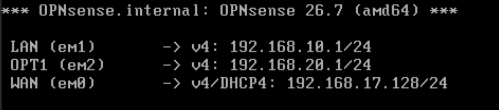

*Les trois interfaces ont leur adresse définitive : LAN en `192.168.10.1/24`, OPT1 en `192.168.20.1/24`, WAN en DHCP.*

### 3.5 Tester l'accès Internet du pare-feu

1. Dans le menu principal, tapez **7** (*Ping host*).
2. Saisissez `8.8.8.8` et validez.

> ✅ **Vérification de la connectivité** : le pare-feu doit recevoir des réponses (`0.0% packet loss`). Cela prouve que le WAN obtient bien son accès Internet par le NAT de VMware. Si le ping échoue, n'allez pas plus loin : sans accès Internet sur le pare-feu, aucune machine du lab n'en aura. Vérifiez que la première carte réseau de la VM est bien connectée à **VMnet8**, puis, sur votre machine hôte, redémarrez les services **VMware NAT Service** et **VMware DHCP Service** (**Windows + R**, puis `services.msc`).

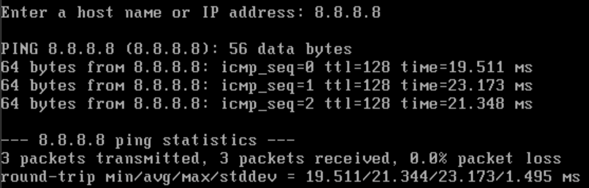

*3 paquets envoyés, 3 reçus, 0.0 % de perte : le pare-feu accède bien à Internet.*

> 💡 **Astuce** : c'est le moment de prendre un premier **snapshot** de la VM : **VM > Snapshot > Take Snapshot...**, nommez-le `Phase3-OPNsense-configure`. Vous pourrez revenir à ce pare-feu propre et fonctionnel à tout moment.

**🔗 Pour aller plus loin :**

- [OPNsense — Installation initiale](https://docs.opnsense.org/manual/install.html)

---

## 💻 Phase 4 : Déploiement du client Windows 10 et accès à la WebGUI

> 🎯 **Objectif** : installer le poste client dans le LAN, vérifier qu'il reçoit sa configuration réseau d'OPNsense, puis finaliser la configuration du pare-feu depuis son interface Web.

### 4.1 Installer Windows 10

1. Sélectionnez la VM `Client-Windows10` et cliquez sur **Power on this virtual machine**.
2. Cliquez immédiatement dans la console de la VM et appuyez sur une touche dès que le message **Press any key to boot from CD or DVD** apparaît.

> ⚠️ **Attention** : ce message ne reste affiché que quelques secondes. Si vous le ratez, la VM ne trouve aucun système à démarrer et affiche un écran d'erreur. Redémarrez-la (**VM > Power > Restart Guest**) et soyez prêt à appuyer sur une touche dès l'allumage.

3. Suivez l'assistant d'installation :
   - choisissez la langue, le format horaire et le clavier, puis **Installer maintenant** ;
   - choisissez **Je n'ai pas de clé de produit** ;
   - sélectionnez **Windows 10 Professionnel** ;
   - acceptez les termes du contrat de licence ;
   - choisissez **Personnalisé : installer uniquement Windows (avancé)** ;
   - sélectionnez le **Lecteur 0 Espace non alloué** de 60 Go, puis **Suivant**.
4. Laissez l'installation se dérouler : la VM redémarre plusieurs fois.

> 📖 **Définition** : l'installation **Personnalisée** installe une copie neuve de Windows sur un disque choisi. L'option **Mise à niveau** sert uniquement à mettre à jour un Windows déjà présent, ce qui n'est pas le cas sur un disque vierge.

5. Lors de la configuration initiale :
   - choisissez **Configurer pour une utilisation personnelle** ;
   - à l'écran de connexion au compte Microsoft, cliquez sur **Compte hors connexion** en bas à gauche, puis sur **Expérience limitée** ;
   - saisissez un nom d'utilisateur et un mot de passe propres au lab ;
   - refusez les options facultatives (historique d'activités, Cortana, publicité ciblée).

> 💡 **Astuce** : le LAN a déjà accès à Internet via OPNsense, c'est pour ça que Windows propose d'abord un compte Microsoft. Un compte local suffit largement pour un poste de lab, et évite de lier votre compte personnel à une VM de test.

> 💡 **Astuce** : une fois sur le bureau, installez les **VMware Tools** (**VM > Install VMware Tools...**, puis lancez `setup64.exe` depuis le lecteur DVD de la VM et redémarrez). Ils apportent les pilotes d'affichage et de souris de VMware : résolution adaptée à votre fenêtre et copier-coller entre votre machine hôte et la VM.

### 4.2 Vérifier l'adressage IP

1. Faites un clic droit sur le bouton **Démarrer > Windows PowerShell**.
2. Affichez la configuration réseau :

```powershell
ipconfig /all
```

3. Contrôlez les informations de la carte Ethernet :

| Champ | Valeur attendue |
|-------|-----------------|
| **Suffixe DNS propre à la connexion** | `internal` |
| **DHCP activé** | `Oui` |
| **Adresse IPv4** | Entre `192.168.10.100` et `192.168.10.150` |
| **Masque de sous-réseau** | `255.255.255.0` |
| **Passerelle par défaut** | `192.168.10.1` |
| **Serveur DHCP** | `192.168.10.1` |
| **Serveurs DNS** | `192.168.10.1` |

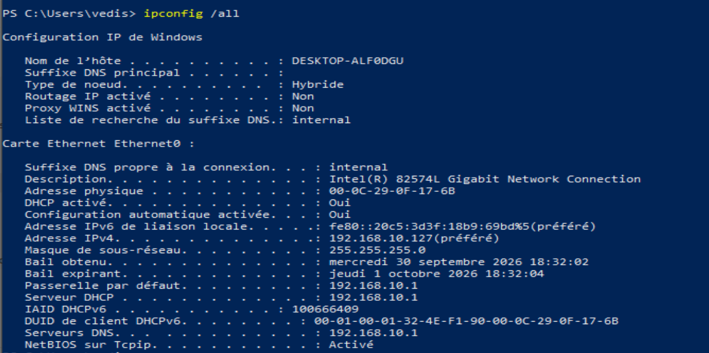

*Le client a reçu d'OPNsense une adresse de la plage DHCP (`192.168.10.127`), la passerelle `192.168.10.1`, le serveur DNS `192.168.10.1` et le suffixe DNS `internal`.*

4. Testez l'accès à Internet à travers OPNsense :

```powershell
ping 8.8.8.8
```

> ✅ **Vérification** : l'adresse IPv4 est dans la plage DHCP et le `ping` reçoit des réponses. Si l'adresse commence par `169.254`, le client n'a pas obtenu de bail DHCP : vérifiez que sa carte réseau est bien sur **VMnet10** et que le DHCP de VMware est désactivé sur ce réseau (Phase 1).

> 📖 **Définition** : une adresse en `169.254.x.x` est une **adresse APIPA** (*Automatic Private IP Addressing*). Windows se l'attribue lui-même quand aucun serveur DHCP ne lui répond. Elle ne permet de communiquer qu'avec les machines du même segment qui sont dans le même cas : c'est le signe d'un problème de DHCP.

### 4.3 Accéder à l'interface Web d'OPNsense

1. Ouvrez **Microsoft Edge** sur le client.
2. Saisissez l'adresse `https://192.168.10.1` et validez.
3. La page **Votre connexion n'est pas privée** s'affiche : cliquez sur **Avancé**, puis sur **Continuer vers 192.168.10.1 (non sécurisé)**.
4. Connectez-vous :
   - **Utilisateur** : `root`
   - **Mot de passe** : `opnsense`

> 📖 **Définition** : l'avertissement apparaît car OPNsense utilise un **certificat auto-signé**, généré par lui-même et non par une autorité de certification reconnue. Le chiffrement fonctionne, mais le navigateur ne peut pas vérifier l'identité du serveur. C'est normal en lab. En entreprise, on installe un certificat délivré par une autorité interne ou publique.

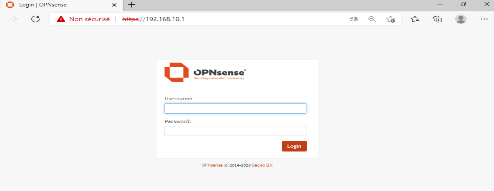

*La page de connexion d'OPNsense, atteinte en HTTPS depuis le client du LAN.*

### 4.4 Suivre l'assistant de configuration initiale

À la première connexion, un assistant (*Wizard*) se lance automatiquement. Cliquez sur **Next** pour parcourir les étapes.

**General Information**

| Paramètre | Valeur |
|-----------|--------|
| **Hostname** | `OPNsense` |
| **Domain** | `internal` (valeur par défaut) |
| **Primary DNS Server** | `8.8.8.8` |
| **Override DNS** | ✅ Coché |
| **Enable Resolver** (section *DNS [Unbound]*) | ✅ Coché |
| **Enable DNSSEC Support** | ❌ Décoché |
| **Harden DNSSEC data** | ❌ Décoché |

> 📖 **Définition** : **`.internal`** est un domaine de premier niveau réservé par l'ICANN aux réseaux privés. Il ne sera jamais attribué sur Internet, ce qui évite tout conflit avec un vrai nom de domaine public. Le nom complet du pare-feu est donc `OPNsense.internal`.

> 📖 **Définition** : **Unbound** est le résolveur DNS intégré à OPNsense. Quand il est activé, OPNsense répond lui-même aux requêtes DNS des clients du LAN : c'est pour ça que le client Windows reçoit `192.168.10.1` comme serveur DNS. L'option **Override DNS** autorise OPNsense à utiliser en plus les serveurs DNS fournis par le DHCP du WAN.

> 📖 **Définition** : **DNSSEC** ajoute une signature cryptographique aux réponses DNS pour garantir qu'elles n'ont pas été falsifiées. Il reste désactivé dans ce lab pour éviter des échecs de résolution à travers le NAT de VMware. En production, il est recommandé de l'activer.

**Time Server**

| Paramètre | Valeur |
|-----------|--------|
| **Timezone** | `Europe/Paris` |

**Network [WAN]**

| Paramètre | Valeur |
|-----------|--------|
| **IPv4 Configuration Type** | DHCP |
| **Block RFC1918 Private Networks** | ❌ Décoché |
| **Block bogon networks** | ❌ Décoché |

> ⚠️ **Attention** : l'interface WAN est reliée au NAT de VMware, qui utilise un adressage privé. Si **Block RFC1918 Private Networks** reste coché, OPNsense rejette tout le trafic provenant de votre machine hôte, et la redirection de port de la Phase 6 ne pourra pas être testée. **Block bogon networks** est décoché pour la même raison.

> 📖 **Définition** : la **RFC 1918** définit les plages d'adresses IPv4 privées (`10.0.0.0/8`, `172.16.0.0/12`, `192.168.0.0/16`). Sur un vrai WAN relié à Internet, aucun paquet ne devrait venir de ces adresses : les bloquer protège contre l'usurpation d'adresse. Dans ce lab, le « faux Internet » de VMware utilise justement une plage privée.

Ces deux options restent modifiables à tout moment dans **Interfaces > [WAN]**, section **Generic configuration**, sous les noms **Block private networks** et **Block bogon networks** :

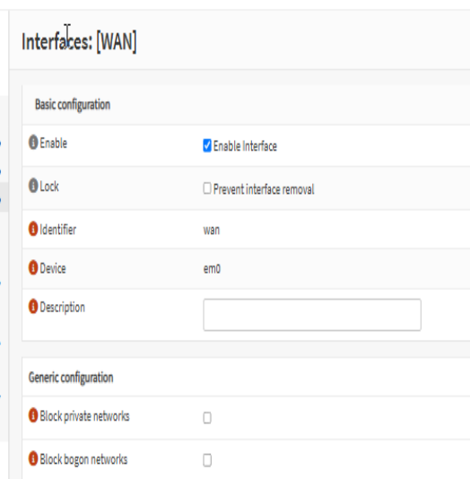

*Dans **Interfaces > [WAN]**, les deux options de blocage sont décochées, indispensable pour tester le NAT depuis la machine hôte.*

**Network [LAN]**

| Paramètre | Valeur |
|-----------|--------|
| **LAN IP Address** | `192.168.10.1` / `24` |
| **Configure DHCP server** | ✅ Coché |

> 📖 **Définition** : le DHCP de VMware a été désactivé sur VMnet10 en Phase 1. C'est OPNsense qui distribue les adresses IP, le masque, la passerelle et le serveur DNS au client Windows. Si cette case est décochée, le client perd son bail et n'a plus accès au réseau.

**Deployment type** *(si la page apparaît)*

| Paramètre | Valeur | Raison |
|-----------|--------|--------|
| **Optimize for Multiwan** | ❌ Décoché | Un seul lien WAN dans cette infrastructure |
| **Automatic DHCP/DNS registration** | ✅ Coché | Unbound résout automatiquement les noms des clients du LAN |
| **Optimize for IPsec** | ❌ Décoché | Aucun tunnel VPN IPsec dans ce lab |

**Set Root Password**

Définissez un nouveau mot de passe administrateur, propre au lab, et conservez-le précieusement.

**Reload Configuration**

Cliquez sur **Reload** pour appliquer l'ensemble des paramètres.

> ✅ **Vérification** : le tableau de bord d'OPNsense s'affiche avec la version `26.7`. Dans **Interfaces > Overview**, le WAN possède une adresse du sous-réseau VMnet8 avec la passerelle NAT de VMware (en `.2`), le LAN `192.168.10.1/24` et OPT1 `192.168.20.1/24`.


*Le tableau de bord confirme la version d'OPNsense (26.7, sur FreeBSD 15.1), la passerelle WAN et l'état des trois interfaces.*

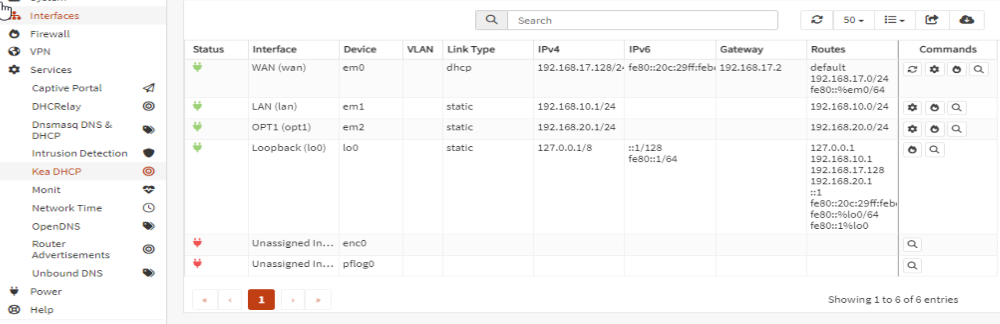

*Les trois interfaces sont actives : WAN en DHCP avec la passerelle NAT de VMware, LAN en `192.168.10.1/24` et OPT1 en `192.168.20.1/24`.*

### 4.5 Vérifier le service DHCP

OPNsense 26.7 propose deux services capables de distribuer des adresses IP, tous deux visibles dans le menu **Services** :

| Service | Rôle | Utilisation dans ce lab |
|---------|------|-------------------------|
| **Dnsmasq DNS & DHCP** | Serveur DHCP léger et simple à configurer, adapté aux petits et moyens réseaux. C'est le serveur DHCP par défaut des installations récentes d'OPNsense. | ✅ Actif, uniquement sur le LAN |
| **Kea DHCP** | Serveur DHCP plus avancé, conçu pour les réseaux importants (haute disponibilité, grand nombre de sous-réseaux). | ❌ Désactivé |

> 📖 **Définition** : **Dnsmasq** et **Kea** remplacent l'ancien serveur **ISC DHCP**, que beaucoup de tutoriels citent encore. ISC, l'organisme qui le développait, a arrêté sa maintenance fin 2022 au profit de Kea, son successeur. OPNsense l'a donc retiré progressivement : c'est pour ça qu'il n'apparaît plus dans le menu **Services**.

> ⚠️ **Attention** : un seul serveur DHCP doit être actif sur un même réseau. Deux serveurs DHCP entreraient en concurrence : chaque client accepterait la première offre reçue, avec des paramètres potentiellement incohérents. C'est le même problème que celui évité en Phase 1 en désactivant le DHCP de VMware.

**Vérifier Dnsmasq, le serveur DHCP utilisé**

1. Cliquez sur **Services > Dnsmasq DNS & DHCP**.
2. Ouvrez l'onglet **DHCP ranges** (les autres onglets sont *General*, *Domains*, *Hosts*, *DHCP options*, *DHCP boot* et *DHCP tags*).
3. Vérifiez qu'il existe **une seule plage** : interface **LAN**, de `192.168.10.100` à `192.168.10.150`.
4. Si une plage existe aussi pour l'interface **OPT1**, supprimez-la avec l'icône de corbeille, puis cliquez sur **Apply**.

> 💡 **Astuce** : une plage sur OPT1 peut apparaître si la question *Do you want to enable the DHCP server on OPT1?* a reçu la réponse `y` par erreur en Phase 3. Même corrigée ensuite en console, elle peut subsister dans la configuration : cette vérification permet de s'en assurer.

**Vérifier que Kea est désactivé**

1. Cliquez sur **Services > Kea DHCP > Kea DHCPv4**.
2. Dans les réglages généraux, vérifiez que la case **Enabled** est **décochée**.

> ✅ **Vérification** : seul Dnsmasq distribue des adresses, et uniquement sur le LAN. La DMZ n'a pas de DHCP : son serveur Web recevra une adresse statique en Phase 5.

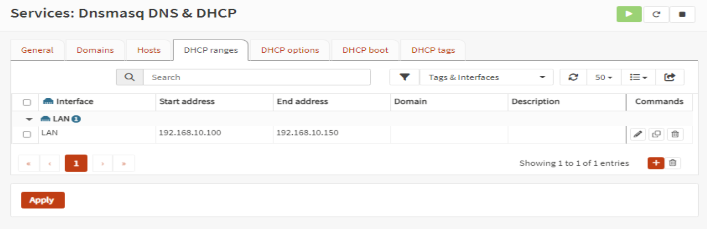

*Une seule plage DHCP, sur l'interface LAN, de `192.168.10.100` à `192.168.10.150`.*

> 💡 **Astuce** : prenez un **snapshot** des VM `OPNsense-Firewall` et `Client-Windows10` : **VM > Snapshot > Take Snapshot...**, nommez-les `Phase4-WebGUI-configuree`.

**🔗 Pour aller plus loin :**

- [OPNsense — Dnsmasq DNS & DHCP](https://docs.opnsense.org/manual/dnsmasq.html)
- [OPNsense — Kea DHCP](https://docs.opnsense.org/manual/kea.html)
- [OPNsense — Unbound DNS](https://docs.opnsense.org/manual/unbound.html)
- [OPNsense — Interfaces](https://docs.opnsense.org/manual/interfaces.html)

---

## 🌐 Phase 5 : Déploiement du serveur Web Debian 13

> 🎯 **Objectif** : autoriser la DMZ à sortir sur Internet, installer Debian en adresse IP statique, puis installer le serveur Web Nginx.

### 5.1 Autoriser l'accès Internet de la DMZ

Le serveur Debian a besoin d'Internet pour télécharger ses paquets pendant l'installation. Cette règle doit donc être créée **avant** de l'installer.

1. Depuis le client Windows 10, ouvrez l'interface Web d'OPNsense.
2. Allez dans **Firewall > Rules** et sélectionnez l'interface **OPT1** dans la liste déroulante en haut à gauche.
3. Cliquez sur le bouton **+** (*Add*) et renseignez la règle :

| Champ | Valeur |
|-------|--------|
| **Description** | `Accès Internet DMZ` |
| **Interface** | OPT1 |
| **Quick** | ✅ Coché (valeur par défaut) |
| **Action** | Pass |
| **Direction** | In |
| **Version** | IPv4 |
| **Protocol** | any |
| **Source** | OPT1 network |
| **Destination** | any |
| **Destination Port** | any |
| **Log** | ❌ Décoché |

4. Cliquez sur **Save**, puis sur **Apply**.

> 📖 **Définition** : sur OPNsense, tout trafic qui ne correspond à aucune règle est bloqué (*deny by default*). À l'installation, seul le LAN reçoit une règle qui autorise tout ; les interfaces optionnelles comme OPT1 n'en ont aucune. Sans cette règle, la DMZ ne peut rien joindre.

> 📖 **Définition** : **OPT1 network** désigne l'ensemble du réseau de l'interface OPT1, soit `192.168.20.0/24`. OPNsense calcule ces alias automatiquement : si l'adressage de l'interface change, la règle suit sans modification. L'option **Quick** est expliquée en détail à l'étape 6.1.

> 💡 **Astuce** : cette règle reste en place. En Phase 6, des règles de blocage placées au-dessus d'elle empêcheront la DMZ d'atteindre le LAN et le pare-feu, tout en lui laissant l'accès à Internet pour ses mises à jour.

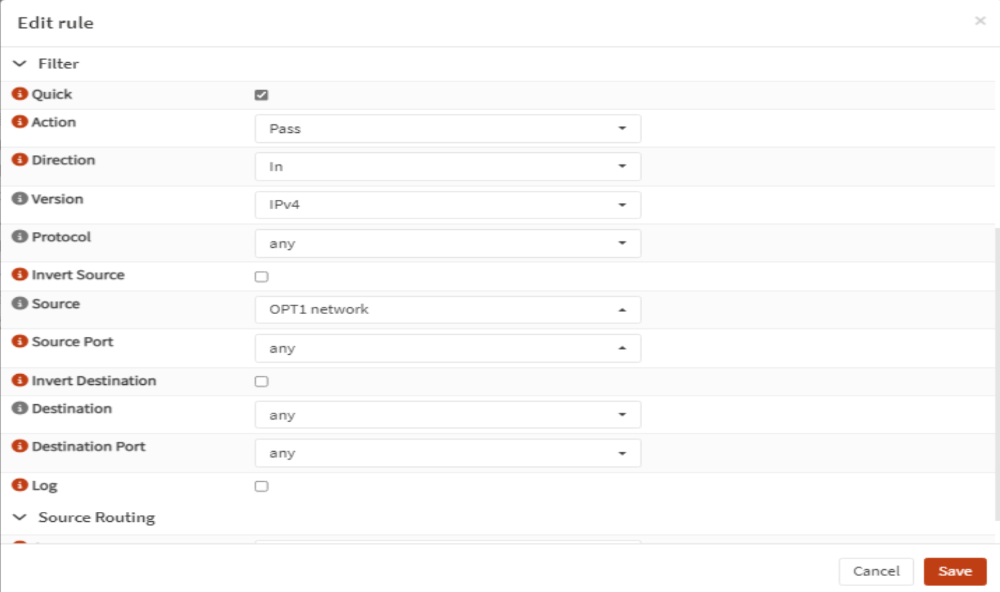

*La règle autorise le réseau OPT1 (source **OPT1 network**) à joindre toutes les destinations, avec l'action **Pass**.*

### 5.2 Installer Debian 13

1. Sélectionnez la VM `Serveur-Web-Debian` et cliquez sur **Power on this virtual machine**.
2. Dans le menu de démarrage, choisissez **Install** : l'installation en mode texte, légère et recommandée pour un serveur.

> 📖 **Définition** : l'image **netinst** (*network install*) ne contient que le strict nécessaire pour démarrer l'installation. Le reste des paquets est téléchargé depuis Internet pendant l'installation : c'est pour ça que la règle de l'étape 5.1 est indispensable.

3. Choisissez la langue **French - Français**, le pays **France** et la disposition de clavier **Français**.
4. **Configuration du réseau** : l'installateur tente d'obtenir une adresse par DHCP. **Cette tentative échoue**, et c'est normal : aucun serveur DHCP n'existe dans la DMZ. Cliquez sur **Continuer**, choisissez **Configurer vous-même le réseau**, puis saisissez :

| Paramètre | Valeur |
|-----------|--------|
| **Adresse IP** | `192.168.20.10` |
| **Masque de sous-réseau** | `255.255.255.0` |
| **Passerelle** | `192.168.20.1` |
| **Adresses des serveurs de noms** | `8.8.8.8` |
| **Nom de machine** | `serveur-web` |
| **Domaine** | Laissez vide |

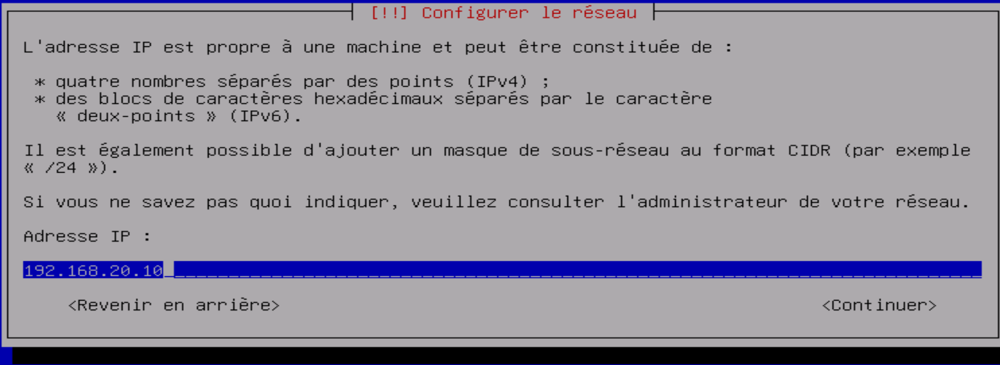

*L'adresse statique `192.168.20.10` saisie à la main, faute de DHCP dans la DMZ. L'installateur accepte aussi la notation CIDR (`192.168.20.10/24`).*

> 💡 **Astuce** : le serveur de noms `8.8.8.8` (le DNS public de Google) est joignable grâce à la règle de l'étape 5.1. Gardez cette valeur : la Phase 6 bloque l'accès de la DMZ aux services du pare-feu, y compris son résolveur DNS.

5. **Utilisateurs et mots de passe** :
   - définissez un mot de passe pour le compte **root**, propre au lab ;
   - créez ensuite le compte utilisateur standard (nom complet, identifiant, mot de passe).

> ⚠️ **Attention** : si vous laissez le mot de passe root vide, Debian désactive le compte root et donne les droits d'administration à l'utilisateur standard via `sudo`. Ce guide utilise le compte root : définissez bien son mot de passe.

6. **Partitionnement** :
   - choisissez **Assisté - utiliser un disque entier** ;
   - sélectionnez le disque de 25 Go (`sda`) ;
   - choisissez **Tout dans une seule partition** ;
   - sélectionnez **Terminer le partitionnement et appliquer les changements**, puis répondez **Oui** pour appliquer les changements sur le disque.
7. **Gestionnaire de paquets** :
   - pays du miroir : **France**, miroir : **deb.debian.org** ;
   - mandataire HTTP : laissez vide ;
   - enquête de popularité des paquets : **Non**.

> 📖 **Définition** : un **miroir** est un serveur qui héberge une copie des paquets Debian. `deb.debian.org` redirige automatiquement vers le miroir le plus proche et le plus disponible.

8. **Sélection des logiciels** : utilisez la **barre d'espace** pour cocher ou décocher, puis **Tab** et **Entrée** pour continuer :
   - ❌ **Environnement de bureau Debian** et **GNOME** : décochés ;
   - ✅ **Serveur SSH** et **Utilitaires usuels du système** : cochés.

> 💡 **Astuce** : un serveur n'a pas besoin d'interface graphique. Sans elle, il consomme moins de mémoire et de processeur, et présente moins de logiciels donc moins de failles potentielles.

9. **Programme de démarrage GRUB** *(si l'écran apparaît)* : répondez **Oui** et sélectionnez le disque principal `/dev/sda`.

> 📖 **Définition** : l'écran GRUB n'apparaît que si la VM démarre en mode **BIOS**. Si VMware l'a configurée en **UEFI**, l'installateur place automatiquement le programme de démarrage dans la partition EFI, sans poser de question.

10. À l'écran **Installation terminée**, cliquez sur **Continuer** : la VM redémarre sur le disque.

> ⚠️ **Attention** : si l'installateur de Debian réapparaît après le redémarrage, l'ISO est encore connectée. Déconnectez-la comme pour OPNsense : **Settings > CD/DVD (SATA)**, décochez **Connected** et **Connect at power on**, puis redémarrez la VM.

### 5.3 Vérifier le réseau du serveur

Après le redémarrage, connectez-vous en **root** à l'invite `login:`. Les commandes suivantes s'exécutent en root.

1. Vérifiez l'adresse IP et la passerelle :

```bash
ip -4 addr show
ip route
```

2. Vérifiez l'accès à Internet, puis la résolution des noms de domaine :

```bash
ping -c 4 8.8.8.8
ping -c 4 deb.debian.org
```

3. Affichez la configuration réseau enregistrée par l'installateur :

```bash
cat /etc/network/interfaces
```

> ✅ **Vérification** :
> - `ip -4 addr show` affiche `192.168.20.10/24` sur la carte `ens33` ;
> - `ip route` affiche `default via 192.168.20.1` ;
> - les deux `ping` reçoivent 4 réponses : le premier prouve l'accès à Internet, le second prouve que la résolution DNS fonctionne ;
> - le fichier `/etc/network/interfaces` contient une section `iface ens33 inet static` avec l'adresse et la passerelle saisies.

> 📖 **Définition** : sur Debian, le fichier **`/etc/network/interfaces`** décrit la configuration réseau appliquée au démarrage. Le mot-clé `static` indique une adresse fixe, par opposition à `dhcp`. C'est ce fichier qu'on modifie pour changer l'adresse d'un serveur après son installation.

> 💡 **Astuce** : le nom de la carte réseau (`ens33`) peut varier selon la configuration de la VM. Utilisez celui affiché par `ip -4 addr show`.

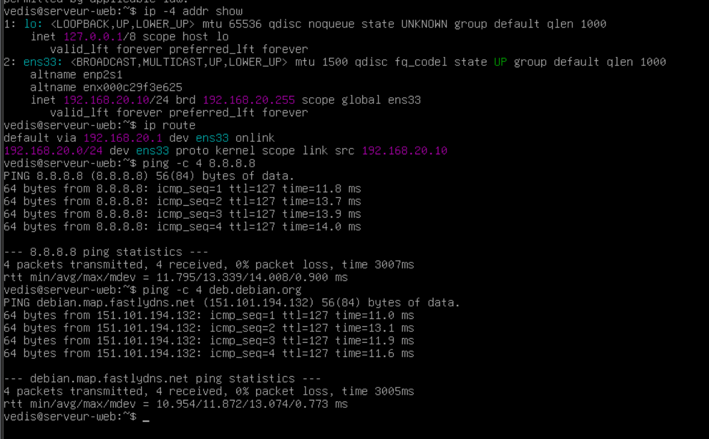

*Adresse `192.168.20.10/24` sur `ens33`, passerelle `192.168.20.1`, accès Internet et résolution DNS fonctionnels.*

### 5.4 Installer le serveur Web Nginx

Les commandes suivantes s'exécutent en root.

1. Mettez à jour la liste des paquets et installez Nginx :

```bash
apt update && apt install -y nginx
```

> 📖 **Définition** : **Nginx** est un serveur Web léger et performant, très utilisé en production pour héberger des sites ou servir de reverse proxy. `apt update` met à jour la liste des paquets disponibles, puis `apt install -y` installe le paquet en répondant automatiquement « oui » aux confirmations.

2. Remplacez la page d'accueil par défaut par une page de test personnalisée :

```bash
echo "<h1>Bienvenue sur la DMZ - Serveur Web (192.168.20.10)</h1>" > /var/www/html/index.html
```

3. Vérifiez que le service est actif et qu'il démarrera automatiquement avec le serveur :

```bash
systemctl status nginx --no-pager
systemctl is-enabled nginx
```

4. Testez le site directement depuis le serveur :

```bash
wget -qO- http://localhost
```

> ✅ **Vérification** :
> - `systemctl status nginx` indique `active (running)` ;
> - `systemctl is-enabled nginx` répond `enabled` ;
> - `wget` affiche le code HTML de votre page : `<h1>Bienvenue sur la DMZ - Serveur Web (192.168.20.10)</h1>`.

> 📖 **Définition** : **`systemctl`** pilote les services de Debian (démarrer, arrêter, redémarrer, consulter l'état). Un service **enabled** démarre automatiquement à chaque allumage du serveur ; un service **active (running)** est en cours d'exécution.

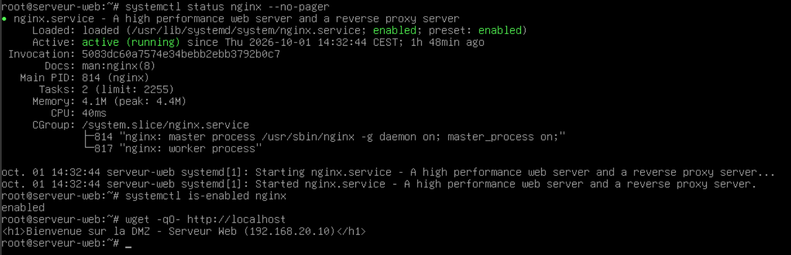

*Nginx est actif, démarre avec le serveur, et sert bien la page personnalisée.*

> 💡 **Astuce** : le LAN a le droit de joindre la DMZ. Depuis le client Windows 10, vous pouvez donc administrer le serveur en **SSH**, bien plus confortable que la console VMware (copier-coller, fenêtre redimensionnable). Ouvrez **Windows PowerShell** et tapez `ssh <utilisateur>@192.168.20.10`, avec le compte standard créé à l'installation. Par sécurité, Debian interdit par défaut la connexion SSH directe en root avec un mot de passe : connectez-vous avec l'utilisateur standard, puis passez root avec `su -`.

> 💡 **Astuce** : prenez un **snapshot** de la VM `Serveur-Web-Debian` : **VM > Snapshot > Take Snapshot...**, nommez-le `Phase5-Nginx-installe`.

**🔗 Pour aller plus loin :**

- [Debian — Manuel d'installation](https://www.debian.org/releases/stable/installmanual)
- [Debian — Configuration du réseau (wiki)](https://wiki.debian.org/NetworkConfiguration)
- [Nginx — Documentation officielle](https://nginx.org/en/docs/)
- [OPNsense — Règles de pare-feu](https://docs.opnsense.org/manual/firewall.html)

---

## 🧱 Phase 6 : Règles de pare-feu et redirection de port (NAT)

> 🎯 **Objectif** : empêcher la DMZ d'initier des connexions vers le LAN et vers le pare-feu lui-même, puis publier le serveur Web sur l'interface WAN grâce à une redirection de port.

### 6.1 Comprendre le fonctionnement des règles

Avant de modifier les règles, quatre notions sont indispensables :

> 📖 **Définition** : une règle placée sur une interface avec la direction **In** s'applique au trafic qui **entre** dans le pare-feu par cette interface. Les règles de l'interface **OPT1** contrôlent donc tout ce que la DMZ envoie, quelle que soit la destination.

> 📖 **Définition** : OPNsense évalue les règles d'une interface **de haut en bas** et applique la **première qui correspond** au paquet (*first match*). Les règles suivantes sont ignorées. L'ordre des règles est donc aussi important que leur contenu : les règles de blocage précises doivent toujours être placées au-dessus des règles d'autorisation générales.

> 📖 **Définition** : ce comportement *first match* est assuré par l'option **Quick**, cochée par défaut sur chaque règle. Quand elle est cochée, une règle qui correspond au paquet est appliquée immédiatement et l'évaluation s'arrête. Si elle était décochée, OPNsense continuerait l'évaluation et appliquerait la **dernière** règle correspondante : une règle *Pass* placée en dessous pourrait alors annuler un blocage. Laissez toujours **Quick** coché, sauf cas très particulier.

> 📖 **Définition** : OPNsense est un pare-feu **à états** (*stateful*). Quand le client du LAN ouvre une connexion vers le serveur Web, OPNsense mémorise cette connexion et autorise automatiquement la réponse du serveur. Les règles de blocage de la DMZ n'empêchent donc que les connexions **initiées** depuis la DMZ : le serveur peut toujours répondre à ceux qui le sollicitent.

À la fin de cette phase, les règles de l'interface OPT1 seront, dans cet ordre :

| Ordre | Action | Source | Destination | Description | Rôle |
|:-----:|:------:|--------|-------------|-------------|------|
| 1 | Block | OPT1 network | LAN network | `Isoler la DMZ du LAN` | Empêche la DMZ de joindre le réseau interne |
| 2 | Block | OPT1 network | This Firewall | `Protéger le pare-feu depuis la DMZ` | Empêche la DMZ de joindre les services du pare-feu, dont son interface d'administration |
| 3 | Pass | OPT1 network | any | `Accès Internet DMZ` | Autorise tout le reste, c'est-à-dire l'accès à Internet |

### 6.2 Isoler la DMZ du LAN et protéger le pare-feu

Une DMZ peut répondre aux requêtes qu'elle reçoit et accéder à Internet, mais elle ne doit **jamais initier une connexion vers le réseau interne ni vers le pare-feu**.

1. Depuis le client Windows 10, allez dans **Firewall > Rules** et sélectionnez l'interface **OPT1**.
2. Cliquez sur le bouton **+** (*Add*) et créez la première règle de blocage :

| Champ | Valeur |
|-------|--------|
| **Description** | `Isoler la DMZ du LAN` |
| **Interface** | OPT1 |
| **Quick** | ✅ Coché |
| **Action** | Block |
| **Direction** | In |
| **Version** | IPv4 |
| **Protocol** | any |
| **Source** | OPT1 network |
| **Destination** | LAN network |
| **Destination Port** | any |
| **Log** | ✅ Coché |

3. Cliquez sur **Save**.
4. Cliquez à nouveau sur **+** (*Add*) et créez la seconde règle de blocage :

| Champ | Valeur |
|-------|--------|
| **Description** | `Protéger le pare-feu depuis la DMZ` |
| **Interface** | OPT1 |
| **Quick** | ✅ Coché |
| **Action** | Block |
| **Direction** | In |
| **Version** | IPv4 |
| **Protocol** | any |
| **Source** | OPT1 network |
| **Destination** | This Firewall |
| **Destination Port** | any |
| **Log** | ✅ Coché |

5. Cliquez sur **Save**.
6. Dans la section **Interface rules** de la liste, vérifiez que les deux règles de blocage sont placées **au-dessus** de la règle `Accès Internet DMZ`, dans l'ordre du tableau de l'étape 6.1. Si ce n'est pas le cas, utilisez le bouton en forme de flèche (**←**) de la colonne **Commands** pour déplacer une règle sélectionnée avant une autre.
7. Cliquez sur **Apply**.

> 📖 **Définition** : **This Firewall** désigne toutes les adresses IP du pare-feu, sur toutes ses interfaces (`192.168.10.1`, `192.168.20.1`, l'adresse WAN...). Sans cette règle, la règle `Accès Internet DMZ` et sa destination `any` autoriseraient la DMZ à contacter l'interface d'administration d'OPNsense : un serveur Web compromis deviendrait un point d'attaque direct contre le pare-feu.

> 📖 **Définition** : la case **Log** enregistre chaque paquet traité par la règle dans le journal du pare-feu. Elle permet de vérifier qu'une règle de blocage fonctionne réellement, et en production, de détecter une machine compromise qui tenterait de sortir de sa zone.

> ⚠️ **Attention** : si vous avez configuré le serveur Debian avec `192.168.20.1` comme serveur DNS (au lieu de `8.8.8.8`), la règle `Protéger le pare-feu depuis la DMZ` bloquera ses requêtes DNS. Dans ce cas, ajoutez au-dessus d'elle une règle **Pass** de `OPT1 network` vers `This Firewall`, protocole **TCP/UDP**, port de destination **DNS (53)**, avec la description `Autoriser le DNS du pare-feu`.

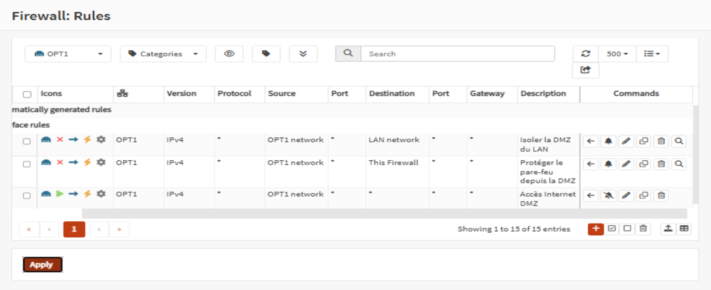

*Les deux règles de blocage (croix rouge) sont placées au-dessus de la règle d'accès Internet (flèche verte) : elles sont évaluées en premier.*

### 6.3 Libérer le port 80 du pare-feu

Par défaut, OPNsense écoute sur le port 80 pour rediriger automatiquement les visiteurs vers son interface d'administration sécurisée en HTTPS (port 443). Tant que cette redirection est active, OPNsense intercepte le trafic HTTP qui lui arrive et le port 80 ne peut pas être redirigé vers le serveur Web.

1. Allez dans **System > Settings > Administration**.
2. Dans la section **Web GUI**, cochez **Disable web GUI redirect rule**.
3. Cliquez sur **Save** en bas de la page.

> 💡 **Astuce** : si cette option reste décochée, le test de la redirection de port depuis la machine hôte affichera la page de connexion d'OPNsense au lieu du site Web : c'est le signe que le pare-feu intercepte encore le port 80.

### 6.4 Créer la redirection de port

Cette étape simule la publication d'un site sur Internet : tout le trafic HTTP qui arrive sur l'adresse WAN du pare-feu est redirigé vers le serveur Debian de la DMZ.

> 📖 **Définition** : la **redirection de port** (*port forwarding*, ou **NAT de destination**, *DNAT*) réécrit l'adresse de destination des paquets entrants. Un visiteur se connecte à l'adresse WAN du pare-feu sur le port 80, et OPNsense transmet la connexion au serveur `192.168.20.10`, sans que le visiteur connaisse son adresse réelle.

> 📖 **Définition** : le **NAT sortant** (*outbound NAT*, ou **NAT source**, *SNAT*) fait l'inverse : il remplace l'adresse source des machines internes par l'adresse WAN du pare-feu quand elles sortent sur Internet. OPNsense le configure automatiquement pour le LAN et la DMZ : c'est pour ça que le client Windows et le serveur Debian ont accès à Internet sans aucune règle de NAT de votre part.

Les menus NAT d'OPNsense ont été renommés dans les versions récentes. Beaucoup de tutoriels utilisent encore les anciens noms :

| Ancien nom | Nom dans OPNsense 26.7 | Rôle |
|------------|------------------------|------|
| Port Forward | **Destination NAT** | Rediriger le trafic entrant vers une machine interne (ce qu'on fait ici) |
| Outbound | **Source NAT** | Remplacer l'adresse source des machines internes pour sortir sur Internet |
| One-to-One | **One-to-One NAT** | Associer une adresse publique entière à une adresse interne |
| NPTv6 | **NPTv6** | Traduire des préfixes IPv6 |

1. Allez dans **Firewall > NAT > Destination NAT**.
2. Cliquez sur le bouton **+** (*Add*) et renseignez la règle :

| Champ | Valeur |
|-------|--------|
| **Interface** | WAN |
| **Version** | IPv4 |
| **Protocol** | TCP |
| **Destination Address** | WAN address |
| **Destination Port** | HTTP (80) |
| **Redirect Target IP** | **Single host or Network**, puis `192.168.20.10` |
| **Redirect Target Port** | HTTP (80) |
| **Pool Options** | Default |
| **NAT Reflection** | Use system default |
| **Description** | `NAT HTTP vers Serveur Web DMZ` |
| **Firewall rule** | Register rule |

3. Cliquez sur **Save**, puis sur **Apply**.

> 💡 **Astuce** : `HTTP` et `80` sont équivalents. OPNsense connaît les ports des services courants par leur nom : `HTTP` = 80, `HTTPS` = 443, `SSH` = 22, `DNS` = 53. Le champ **Destination Port** accepte aussi une plage, sous la forme `8080-8090`.

Le NAT réécrit les paquets, mais c'est une **règle de filtrage** qui les autorise à entrer. Le champ **Firewall rule** détermine comment cette règle est gérée :

| Option | Effet | Choix |
|--------|-------|:-----:|
| **Manual** | Aucune règle de filtrage n'est créée : le trafic redirigé est bloqué par le WAN tant que vous n'écrivez pas vous-même la règle | ❌ |
| **Pass** | Le trafic redirigé est autorisé directement par le NAT, sans règle de filtrage visible : ça fonctionne, mais l'audit des règles devient plus difficile | ❌ |
| **Register rule** | OPNsense **enregistre automatiquement** la règle de filtrage correspondante, liée à la redirection : elle se met à jour et se supprime avec elle | ✅ |

> ⚠️ **Attention** : **Manual** est la valeur par défaut du champ **Firewall rule**. Si vous validez sans la changer, la redirection ne fonctionnera pas : le blocage par défaut du WAN rejettera le trafic.

> 💡 **Alternative : créer la règle de filtrage manuellement**
>
> Si le champ **Firewall rule** a été laissé sur **Manual**, créez la règle vous-même :
>
> 1. Allez dans **Firewall > Rules**, sélectionnez l'interface **WAN** et cliquez sur **+** (*Add*).
> 2. Renseignez : **Action** `Pass`, **Direction** `In`, **Version** `IPv4`, **Protocol** `TCP`, **Source** `any`, **Destination** `192.168.20.10`, **Destination Port** `HTTP (80)`, **Description** `Autoriser HTTP entrant vers DMZ`.
> 3. Cliquez sur **Save**, puis sur **Apply**.

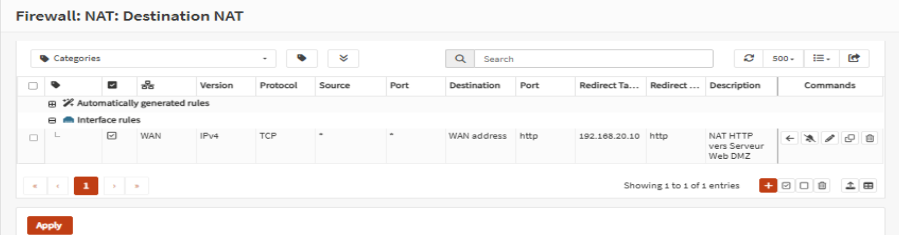

*Le trafic TCP reçu sur le port 80 de l'adresse WAN est redirigé vers `192.168.20.10`, port 80.*

> ✅ **Vérification** : allez dans **Firewall > Rules** et sélectionnez l'interface **WAN**. La règle enregistrée par le NAT apparaît dans la section **Automatically generated rules** : elle autorise le trafic TCP vers `192.168.20.10` sur le port `http`, avec la description de la redirection.

> 📖 **Définition** : sur la page des règles du WAN, OPNsense affiche le bandeau *No WAN rules have been defined*. C'est normal : il signifie qu'aucune règle n'a été créée **à la main** sur le WAN. Les règles générées automatiquement, comme celle du NAT, sont rangées à part et s'appliquent bien.

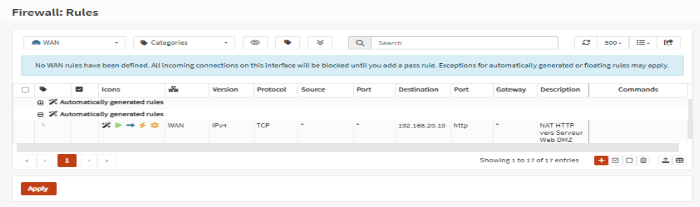

*La règle de filtrage a été créée automatiquement dans **Automatically generated rules** et reste liée à la redirection de port.*

> 💡 **Astuce** : prenez un **snapshot** de la VM `OPNsense-Firewall` : **VM > Snapshot > Take Snapshot...**, nommez-le `Phase6-Regles-NAT`.

**🔗 Pour aller plus loin :**

- [OPNsense — Règles de pare-feu](https://docs.opnsense.org/manual/firewall.html)
- [OPNsense — NAT](https://docs.opnsense.org/manual/nat.html)

---

## ✅ Phase 7 : Tests de validation finale

> 🎯 **Objectif** : prouver que chaque flux de la [matrice des flux](#matrice-des-flux) se comporte comme prévu, qu'il soit autorisé ou bloqué.

> 📖 **Définition** : un test de sécurité ne se limite pas à vérifier que ce qui doit fonctionner fonctionne. Il faut aussi prouver que **ce qui doit être bloqué est bien bloqué**, et que le blocage vient bien de la règle prévue. C'est pour ça que plusieurs tests de cette phase doivent **échouer**, et que leur échec est contrôlé dans les journaux du pare-feu.

Avant de commencer, relevez l'**adresse WAN** d'OPNsense : elle est affichée dans **Interfaces > Overview** et dans l'en-tête de la console (par exemple `192.168.17.128`). Elle sert aux tests 7 et 8.

> 💡 **Astuce** : ouvrez dès maintenant **Firewall > Log Files > Live View** sur le client Windows et laissez la page ouverte. Les blocages des tests 4 et 5 y apparaîtront en direct, ce qui servira au test 6.

### 7.1 Tests depuis le client Windows 10

**Test 1 : accès Internet du LAN**

Dans **Windows PowerShell** :

```powershell
ping 8.8.8.8
Resolve-DnsName debian.org
```

> ✅ **Résultat attendu** : le `ping` reçoit des réponses (`perte 0%`) et `Resolve-DnsName` affiche les adresses IP de `debian.org`. Le client sort sur Internet et la résolution DNS par Unbound fonctionne.

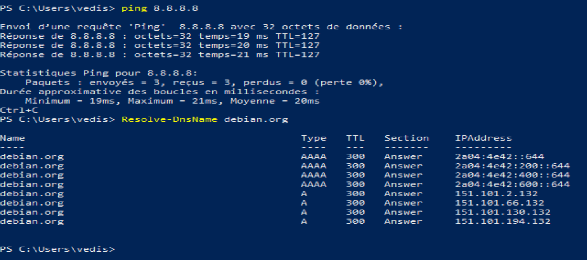

*Le client du LAN joint Internet et résout les noms de domaine grâce au résolveur Unbound d'OPNsense.*

**Test 2 : accès du LAN vers la DMZ**

Ouvrez **Microsoft Edge** et saisissez l'adresse `http://192.168.20.10`.

> ✅ **Résultat attendu** : la page **Bienvenue sur la DMZ - Serveur Web (192.168.20.10)** s'affiche. Le LAN peut consulter le service publié dans la DMZ, et la réponse du serveur est autorisée par le pare-feu à états.

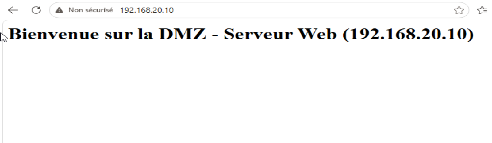

*Le client du LAN consulte le serveur Web de la DMZ directement par son adresse.*

### 7.2 Tests depuis le serveur Debian

Connectez-vous au serveur en **root**, par la console VMware ou en SSH depuis le client Windows.

**Test 3 : accès Internet de la DMZ**

```bash
ping -c 4 8.8.8.8
```

> ✅ **Résultat attendu** : `4 packets transmitted, 4 received, 0% packet loss`. La règle `Accès Internet DMZ` autorise bien la sortie vers Internet.

**Test 4 : isolation de la DMZ vis-à-vis du LAN**

```bash
ping -c 4 192.168.10.1
```

> ✅ **Résultat attendu** : `4 packets transmitted, 0 received, 100% packet loss`. Le serveur ne peut pas joindre le LAN.

> ⚠️ **Attention** : ne ciblez pas le client Windows pour ce test. Son pare-feu bloque le `ping` par défaut : le test échouerait même sans la règle d'OPNsense et ne prouverait rien. L'adresse `192.168.10.1` appartient au LAN et répond toujours au `ping` depuis le LAN : si elle ne répond pas depuis la DMZ, c'est bien la règle d'isolation qui bloque. Le test 6 le confirme.

**Test 5 : protection du pare-feu depuis la DMZ**

```bash
wget -T 5 -t 1 --no-check-certificate -O /dev/null https://192.168.20.1
```

> ✅ **Résultat attendu** : après 5 secondes, `wget` abandonne avec le message `Connexion à 192.168.20.1:443… échec : Connexion terminée par expiration du délai d'attente. Abandon.` Le serveur de la DMZ ne peut pas atteindre l'interface d'administration d'OPNsense, alors qu'elle écoute pourtant sur cette adresse.

> 📖 **Définition** : les options de `wget` limitent la durée du test : `-T 5` fixe un délai d'attente de 5 secondes, `-t 1` n'autorise qu'une seule tentative, `--no-check-certificate` ignore le certificat auto-signé d'OPNsense, et `-O /dev/null` jette la page téléchargée, inutile ici.

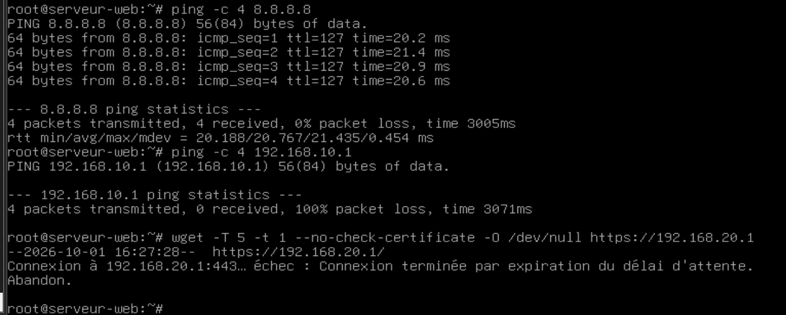

*Internet est joignable, mais le LAN et l'interface d'administration du pare-feu restent inaccessibles depuis la DMZ.*

### 7.3 Test dans l'interface Web d'OPNsense

**Test 6 : journalisation des blocages**

Sur le client Windows 10, dans la WebGUI, allez dans **Firewall > Log Files > Live View**. Si la page n'était pas ouverte pendant les tests 4 et 5, relancez-les depuis le serveur Debian.

> ✅ **Résultat attendu** : des lignes rouges apparaissent avec l'action `block` sur l'interface `OPT1` :
> - le trafic **ICMP** de `192.168.20.10` vers `192.168.10.1` (test 4), avec le label `Isoler la DMZ du LAN` ;
> - le trafic **TCP** de `192.168.20.10` vers `192.168.20.1:443` (test 5), avec le label `Protéger le pare-feu depuis la DMZ`.

> 📖 **Définition** : la vue **Live View** affiche en temps réel les paquets traités par les règles dont la case **Log** est cochée. Chaque ligne indique l'interface, le sens, l'heure, le protocole, la source, la destination, l'action (`pass` ou `block`) et le **Label**, qui reprend la description de la règle responsable. C'est l'outil de diagnostic principal d'un administrateur de pare-feu.

> 💡 **Astuce** : les lignes vertes `let out anything from firewall host itself` correspondent au trafic sortant du pare-feu lui-même, par exemple sa synchronisation horaire (port `123`, NTP). Il est autorisé par une règle automatique d'OPNsense.

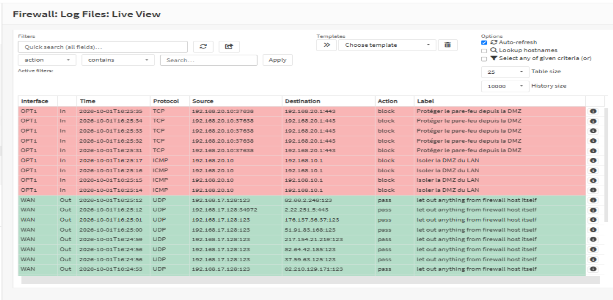

*Chaque tentative de la DMZ vers le LAN ou vers le pare-feu est bloquée et journalisée avec le nom de la règle responsable.*

### 7.4 Tests depuis la machine hôte

Ces tests simulent un visiteur venu d'Internet : votre machine hôte se trouve côté WAN, sur le réseau NAT de VMware.

**Test 7 : publication du site via le NAT**

Sur votre machine hôte, ouvrez un navigateur et saisissez `http://<IP_WAN_OPNSENSE>` (par exemple `http://192.168.17.128`).

> ✅ **Résultat attendu** : la page **Bienvenue sur la DMZ - Serveur Web (192.168.20.10)** s'affiche, alors que vous avez saisi l'adresse du pare-feu. La redirection de port transmet bien le trafic vers le serveur de la DMZ.


*L'adresse saisie est celle du WAN du pare-feu, mais c'est le serveur de la DMZ qui répond.*

**Test 8 : interface d'administration inaccessible depuis le WAN**

Toujours sur la machine hôte, saisissez `https://<IP_WAN_OPNSENSE>` (par exemple `https://192.168.17.128`).

> ✅ **Résultat attendu** : la page ne se charge pas et le navigateur affiche une erreur de délai d'attente (*Le délai d'attente est dépassé*). Seul le port 80 est publié : l'interface d'administration, en HTTPS sur le port 443, reste bloquée par la politique par défaut du WAN.

Par défaut, l'interface d'administration d'OPNsense écoute sur **toutes** les adresses du pare-feu. C'est la politique de filtrage de chaque interface qui décide qui peut l'atteindre :

| Adresse | Interface | Accès à la WebGUI | Raison |
|---------|-----------|:-----------------:|--------|
| `192.168.10.1` | LAN | ✅ Autorisé | Règle anti-verrouillage du LAN : c'est l'adresse d'administration |
| `192.168.20.1` | OPT1 (DMZ) | ❌ Bloqué | Règle `Protéger le pare-feu depuis la DMZ` (test 5) |
| Adresse WAN | WAN | ❌ Bloqué | Politique par défaut du WAN : seul le port 80 est publié (test 8) |

> 💡 **Astuce** : ne testez pas `https://192.168.10.1` depuis la machine hôte. La connexion échouerait aussi, mais pour une autre raison : l'hôte n'a aucune route vers le LAN, puisque son adaptateur VMnet10 est déconnecté. Seule l'adresse WAN est réellement joignable depuis l'hôte : c'est donc la seule qui teste vraiment la règle.

> 📖 **Définition** : exposer l'interface d'administration d'un pare-feu sur Internet est l'une des erreurs les plus graves en sécurité réseau : elle devient une cible directe pour les tentatives de connexion et l'exploitation de failles. En entreprise, l'administration se fait uniquement depuis un réseau interne dédié ou à travers un VPN.

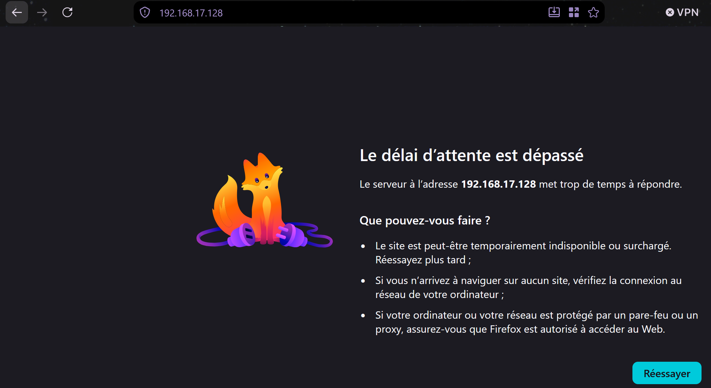

*Depuis l'hôte, l'interface d'administration ne répond pas sur l'adresse WAN : elle n'est pas exposée.*

### 7.5 Synthèse des tests

| # | Test | Depuis | Résultat attendu | Validé |
|:-:|------|--------|------------------|:------:|
| 1 | Accès Internet du LAN | `Client-Windows10` | Réponses au `ping` et résolution DNS | ☐ |
| 2 | Accès du LAN vers la DMZ | `Client-Windows10` | Page du serveur Web affichée | ☐ |
| 3 | Accès Internet de la DMZ | `Serveur-Web-Debian` | `0% packet loss` | ☐ |
| 4 | Isolation de la DMZ | `Serveur-Web-Debian` | `100% packet loss` vers `192.168.10.1` | ☐ |
| 5 | Protection du pare-feu | `Serveur-Web-Debian` | Délai d'attente dépassé vers `https://192.168.20.1` | ☐ |
| 6 | Journalisation des blocages | WebGUI | Blocages des tests 4 et 5 visibles dans **Live View** | ☐ |
| 7 | Publication via NAT | Machine hôte | Page du serveur Web via l'adresse WAN | ☐ |
| 8 | WebGUI fermée côté WAN | Machine hôte | Délai d'attente dépassé en HTTPS | ☐ |

> ✅ **Validation finale** : si les huit tests donnent le résultat attendu, l'infrastructure est conforme à sa politique de sécurité. Le LAN et la DMZ sont isolés, le pare-feu est protégé, et seul le service Web est exposé.

> 💡 **Astuce** : prenez un dernier **snapshot** des trois VM, nommé `Lab-valide`. Vous disposez ainsi d'une infrastructure complète et fonctionnelle à laquelle revenir pour vous entraîner ou tester de nouvelles règles.

**🔗 Pour aller plus loin :**

- [OPNsense — Journaux du pare-feu (Live View)](https://docs.opnsense.org/manual/logging_firewall.html)

---

## 🔭 Limites et pistes d'amélioration

Ce lab privilégie la clarté pédagogique : certains choix sont volontairement simplifiés pour se concentrer sur la segmentation et le filtrage. Voici ce qu'il faudrait renforcer avant de transposer cette architecture en production.

| Limite du lab | Risque | Ce qu'on ferait en production |
|---------------|--------|-------------------------------|
| La règle `Accès Internet DMZ` autorise **toutes** les destinations et tous les protocoles | Un serveur compromis peut joindre n'importe quel service sur Internet (exfiltration de données, communication avec un serveur de commande) | Appliquer le **principe du moindre privilège** : n'autoriser que HTTP/HTTPS (mises à jour), DNS et NTP, vers des destinations identifiées |
| Le site est publié en **HTTP** | Les échanges entre les visiteurs et le serveur circulent en clair | Publier le site en **HTTPS**, avec un certificat délivré par une autorité reconnue (Let's Encrypt, par exemple) |
| **Block private networks** et **Block bogon networks** sont décochés sur le WAN | Le pare-feu accepte des paquets provenant d'adresses qui ne devraient jamais arriver d'Internet | Laisser ces deux options **cochées** sur un vrai WAN relié à Internet |
| L'interface d'administration est utilisée avec le compte **root** | Un compte générique ne permet pas de savoir qui a fait quoi, et sa compromission donne un accès total | Créer des **comptes nominatifs** pour chaque administrateur, activer l'**authentification à deux facteurs** et réserver root aux situations d'urgence |
| Tout le LAN peut joindre le serveur en **SSH** et l'interface d'administration du pare-feu | Un poste utilisateur compromis peut tenter de se connecter aux outils d'administration | Restreindre l'administration à un **réseau ou un poste d'administration dédié** |
| Aucune **sauvegarde** de la configuration d'OPNsense | Une erreur de manipulation ou une panne oblige à tout reconfigurer à la main | Exporter la configuration après chaque modification (**System > Configuration > Backups**) et la conserver hors du pare-feu |
| Aucune **détection d'intrusion** | Une attaque contre le serveur Web publié passe inaperçue | Activer le module de détection et de prévention d'intrusion d'OPNsense (**Services > Intrusion Detection**, basé sur Suricata) |
| Le client utilise **Windows 10**, qui n'est plus maintenu | Les failles découvertes ne sont plus corrigées | Utiliser un système d'exploitation maintenu, comme Windows 11 |

> 💡 **Astuce** : chacune de ces pistes peut faire l'objet d'un lab à part entière, en repartant du snapshot `Lab-valide` de cette infrastructure.

---

## 📖 Glossaire

| Terme | Définition |
|-------|------------|
| **APIPA** | Adresse en `169.254.x.x` que Windows s'attribue lui-même quand aucun serveur DHCP ne répond. |
| **Bogon** | Plage d'adresses IP réservée ou non attribuée, qui ne devrait jamais apparaître sur Internet. |
| **Certificat auto-signé** | Certificat généré par le serveur lui-même, sans autorité de certification reconnue. Il chiffre les échanges mais ne prouve pas l'identité du serveur. |
| **CIDR** | Notation qui indique la taille du masque de sous-réseau par un nombre de bits : `/24` équivaut à `255.255.255.0`. |
| **Destination NAT** | Nom de la redirection de port dans OPNsense 26.7 : réécriture de l'adresse de destination des paquets entrants. |
| **DHCP** | Protocole qui attribue automatiquement une adresse IP, un masque, une passerelle et des serveurs DNS aux machines d'un réseau. |
| **DMZ** | Zone démilitarisée : réseau intermédiaire qui héberge les services exposés à l'extérieur, isolé du réseau interne. |
| **DNS** | Système qui traduit les noms de domaine en adresses IP. |
| **DNSSEC** | Extension du DNS qui signe les réponses pour garantir qu'elles n'ont pas été falsifiées. |
| **Dnsmasq** | Serveur DNS et DHCP léger, serveur DHCP par défaut des installations récentes d'OPNsense. |
| **Empreinte (hash)** | Suite de caractères calculée à partir d'un fichier, qui permet de vérifier qu'il n'a pas été modifié. |
| **First match** | Mode d'évaluation des règles où la première règle qui correspond au paquet est appliquée. |
| **Host-only** | Type de réseau VMware privé, sans accès direct à l'extérieur. |
| **Kea** | Serveur DHCP avancé, successeur d'ISC DHCP. |
| **LAN** | Réseau local interne de l'entreprise. |
| **Live View** | Vue en temps réel des paquets journalisés par le pare-feu. |
| **Mode Live** | Mode de démarrage d'OPNsense depuis l'ISO, entièrement en mémoire, sans installation. |
| **NAT** | Traduction d'adresses réseau : réécriture des adresses IP des paquets qui traversent un routeur. |
| **OPT1** | Nom donné par OPNsense à la première interface optionnelle, au-delà du WAN et du LAN. |
| **Pare-feu à états** | Pare-feu qui mémorise les connexions établies et autorise automatiquement le trafic de réponse. |
| **Passerelle par défaut** | Adresse du routeur vers lequel une machine envoie tout le trafic destiné à un autre réseau. |
| **Quick** | Option d'une règle OPNsense qui applique la règle dès qu'elle correspond, sans évaluer les suivantes. |
| **Redirection de port** | Règle de NAT qui transmet le trafic reçu sur un port de l'adresse publique vers une machine interne. |
| **Règle anti-verrouillage** | Règle automatique d'OPNsense qui garantit l'accès à l'interface d'administration depuis le LAN. |
| **RFC 1918** | Norme qui définit les plages d'adresses IPv4 privées : `10.0.0.0/8`, `172.16.0.0/12` et `192.168.0.0/16`. |
| **Snapshot** | Instantané de l'état complet d'une VM, auquel on peut revenir à tout moment. |
| **Source NAT** | Nom du NAT sortant dans OPNsense 26.7 : remplacement de l'adresse source des machines internes par l'adresse WAN. |
| **This Firewall** | Alias d'OPNsense qui désigne toutes les adresses IP du pare-feu, sur toutes ses interfaces. |
| **UFS / ZFS** | Systèmes de fichiers proposés à l'installation d'OPNsense : UFS est léger, ZFS plus avancé et plus gourmand. |
| **Unbound** | Résolveur DNS intégré à OPNsense. |
| **VMnet** | Commutateur virtuel de VMware Workstation. |
| **WAN** | Réseau étendu : interface du pare-feu tournée vers l'extérieur et Internet. |
| **WebGUI** | Interface d'administration Web d'OPNsense. |

---

[⬅️ Présentation de l'infrastructure](./README.md) · [🏠 Retour au dépôt](../../README.md)
