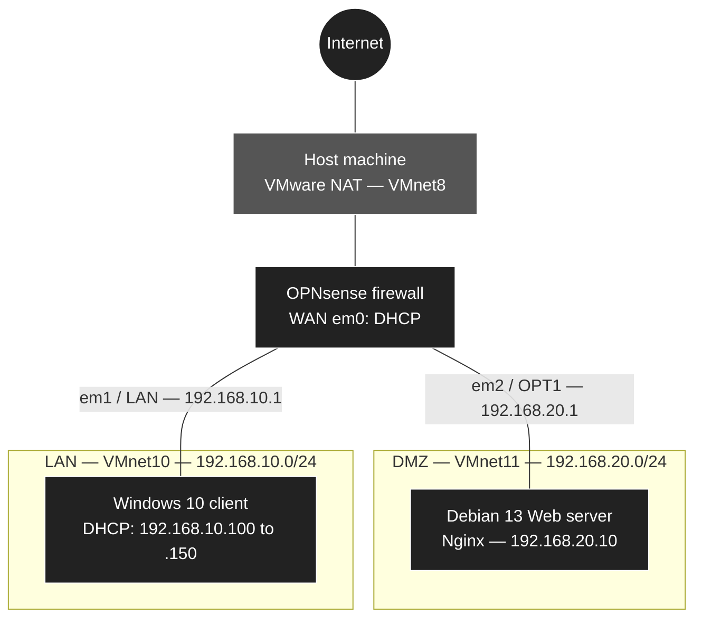

<p align="right">
  🇫🇷 <a href="./GUIDE_DEPLOIEMENT.md">Français</a> · 🇬🇧 <b>English</b>
</p>

# 🛡️ LAN / DMZ Network Segmentation with OPNsense — Deployment Guide

> Step-by-step guide to deploying a segmented infrastructure on VMware Workstation: an OPNsense firewall, an internal network (LAN) with a Windows 10 client, and a demilitarized zone (DMZ) hosting a Debian Web server published through NAT.

**⏱️ Estimated time:** 2 to 3 hours · **📶 Level:** intermediate · **🧪 Environment:** VMware Workstation Pro

[⬅️ Infrastructure overview](./README_EN.md) · [🏠 Back to repository](../../README_EN.md)

> 💡 **Note**: this lab was built on French-language systems, so the screenshots show French interfaces for Windows and Debian. This guide gives the English labels you will see on an English system.

---

## 🎯 Purpose of the Infrastructure

Every company that publishes a service on the Internet (website, mail, extranet) faces the same risk: if that service is compromised, the attacker must not be able to pivot to the internal network, where workstations and sensitive data are located.

This infrastructure addresses that need by splitting the network into three trust zones, all controlled by a central firewall:

| Zone | Role | Trust level |
|------|------|-------------|
| **WAN** | Internet access, simulated by VMware NAT | None |
| **DMZ** | Hosts the exposed Web server | Low |
| **LAN** | Internal network for users and administration | High |

> 📖 **Definition**: the term **DMZ** (*demilitarized zone*) comes from military vocabulary, where it refers to a neutral strip of land between two sides. In networking, it is a buffer zone between the Internet and the internal network. It is considered exposed, even expendable: we assume that a DMZ server may be compromised, and the architecture must ensure that the compromise stays contained within the DMZ.

### From lab to enterprise

Each element of this lab simulates equipment you will find in production:

| In this lab | In a company |
|-------------|--------------|
| VMware NAT (`VMnet8`) | ISP router or box, with a public IP address |
| Virtual switches `VMnet10` and `VMnet11` | Physical switches or VLANs dedicated to each zone |
| OPNsense VM | Hardware (appliance) or virtual firewall |
| Nginx Web server in the DMZ | Website, mail relay, reverse proxy, VPN gateway |
| Windows 10 client | Employee workstations |

### What you will learn

By the end of this guide, you will be able to:

- isolate virtual networks in VMware Workstation;
- install OPNsense and configure it from the console, then through its Web interface;
- distribute IP addresses with DHCP and resolve names with Unbound;
- write firewall rules and control their evaluation order;
- publish an internal service with port forwarding (NAT);
- prove through testing that the segmentation works.

**🔗 Further reading:**

- [ANSSI — Recommendations for connecting an information system to the Internet (French)](https://messervices.cyber.gouv.fr/guides/recommandations-relatives-linterconnexion-dun-si-internet)
- [CNIL — Security: protecting the computer network (French)](https://www.cnil.fr/fr/securite-proteger-le-reseau-informatique)
- [Official OPNsense documentation](https://docs.opnsense.org/)

---

## 📐 Architecture Diagram



### Traffic matrix

This table summarizes the security policy enforced by the firewall. Each flow is proven by the test or tests listed in the last column, performed in Phase 7.

| Source | Destination | Allowed | Implementation | Test |
|--------|-------------|:-------:|----------------|:----:|
| LAN | Internet | ✅ | OPNsense default LAN rule | 1 |
| LAN | DMZ | ✅ | OPNsense default LAN rule | 2 |
| DMZ | Internet | ✅ | *Pass* rule on OPT1 (Phase 5) | 3 |
| DMZ | LAN | ❌ | *Block* rule on OPT1 (Phase 6) | 4 and 6 |
| DMZ | Firewall (WebGUI and services) | ❌ | *Block* rule on OPT1 (Phase 6) | 5 and 6 |
| WAN | Web server (port 80) | ✅ | Port forwarding, *Destination NAT* (Phase 6) | 7 |
| WAN | Any other destination, including the OPNsense WebGUI | ❌ | OPNsense default block | 8 |

### Final result preview

Once the infrastructure is complete, the DMZ Web server is reachable from the host machine through the firewall's WAN address:


And the firewall is managed from the LAN client:


---

## 🧭 Deployment Plan

The phases follow this order: each one builds on the previous one. Durations are indicative.

1. **Phase 1 — Virtual network preparation** *(≈ 10 min)*: check the WAN network (VMnet8) and create isolated switches for the LAN (VMnet10) and the DMZ (VMnet11), without VMware DHCP.
2. **Phase 2 — Virtual machine creation** *(≈ 15 min)*: create the three VMs and connect their network adapters to the right switches.
3. **Phase 3 — OPNsense installation and initial configuration** *(≈ 20 min)*: install the system, assign interfaces, address the LAN and the DMZ, enable DHCP on the LAN.
4. **Phase 4 — Windows 10 client deployment and WebGUI access** *(≈ 45 min)*: install the workstation, check DHCP, run the OPNsense initial setup wizard.
5. **Phase 5 — Debian 13 Web server deployment** *(≈ 30 min)*: open Internet access for the DMZ, install Debian with a static IP, install Nginx.
6. **Phase 6 — Firewall rules and port forwarding** *(≈ 20 min)*: isolate the DMZ from the LAN and the firewall, release port 80, publish the Web server through NAT.
7. **Phase 7 — Final validation tests** *(≈ 15 min)*: verify every flow in the traffic matrix.

> 💡 **Tip**: take a **snapshot** of the VMs at the end of phases 3 to 7 (**VM > Snapshot > Take Snapshot...**). If an error occurs later, you go back to a working state in seconds instead of reinstalling everything.

> 📖 **Definition**: a **snapshot** records the complete state of a VM at a given moment: disk, memory and configuration. It lets you return to that state at any time. It is not a backup: it depends on the original disk and disappears with it.

---

## 📑 Table of Contents

1. [Purpose of the Infrastructure](#-purpose-of-the-infrastructure)
2. [Architecture Diagram](#-architecture-diagram)
3. [Deployment Plan](#-deployment-plan)
4. [Prerequisites](#-prerequisites)
5. [Addressing Plan and Sizing](#-addressing-plan-and-sizing)
6. [Phase 1: Virtual Network Preparation](#-phase-1-virtual-network-preparation)
7. [Phase 2: Virtual Machine Creation](#-phase-2-virtual-machine-creation)
8. [Phase 3: OPNsense Installation and Initial Configuration](#-phase-3-opnsense-installation-and-initial-configuration)
9. [Phase 4: Windows 10 Client Deployment and WebGUI Access](#-phase-4-windows-10-client-deployment-and-webgui-access)
10. [Phase 5: Debian 13 Web Server Deployment](#-phase-5-debian-13-web-server-deployment)
11. [Phase 6: Firewall Rules and Port Forwarding (NAT)](#-phase-6-firewall-rules-and-port-forwarding-nat)
12. [Phase 7: Final Validation Tests](#-phase-7-final-validation-tests)
13. [Glossary](#-glossary)

---

## 🧰 Prerequisites

### Build environment

This lab was built and validated in the following environment:

| Item | Value |
|------|-------|
| **Host machine** | PC 1 |
| **Host operating system** | Windows 11 Pro `26H2` (build 26300.9550) |
| **Hypervisor** | VMware Workstation Pro (version listed in the software table below) |
| **Hyper-V** | Disabled |
| **Processor** | Intel Core i7-13650HX (13th generation, 2.60 GHz) |
| **Memory** | 32 GB |

> 📖 **Definition**: when **Hyper-V** is enabled on Windows, or a feature that relies on it (WSL 2, Windows Sandbox, Memory integrity), Windows itself runs on top of Microsoft's hypervisor. VMware Workstation must then go through the **Windows Hypervisor Platform** instead of directly using the processor's virtualization features: VMs work, but more slowly, and some features such as nested virtualization are limited. With Hyper-V disabled, VMware uses the processor directly.

> ✅ **Check**: to find your Windows version, press **Windows + R** and run `winver`. To find out whether a Microsoft hypervisor is active, run in **Windows PowerShell**:
>
> ```powershell
> (Get-CimInstance Win32_ComputerSystem).HypervisorPresent
> ```
>
> The command returns `False` when Hyper-V is disabled, `True` when it is active.

### Host machine: minimum configuration

| Resource | Recommended minimum | Reason |
|----------|---------------------|--------|
| **Processor** | 64-bit, 4 cores, hardware virtualization (Intel VT-x or AMD-V) enabled in the BIOS | 6 cores allocated in total |
| **Memory** | 16 GB | 10 GB allocated to the VMs, the rest for the host system |
| **Disk space** | 110 GB free | 20 + 25 + 60 GB of virtual disks |
| **Operating system** | Windows 10 or 11, 64-bit | Host system for VMware Workstation |

> ✅ **Check**: to find out whether hardware virtualization is enabled, open **Task Manager** (**Ctrl + Shift + Esc**), **Performance > CPU** tab. The **Virtualization** line must show **Enabled**. Otherwise, enable **Intel VT-x** or **AMD-V / SVM** in your machine's BIOS.


*The **Virtualization: Enabled** line confirms that the processor can run virtual machines.*

### Software and ISO images

| Item | Version used | Download |
|------|--------------|----------|
| VMware Workstation Pro | `17.6.1` (build 24319023) | [VMware website (Broadcom)](https://www.vmware.com/products/desktop-hypervisor/workstation-and-fusion) |
| OPNsense, DVD image amd64 | `26.7` (based on FreeBSD 15.1) | [opnsense.org](https://opnsense.org/download/) |
| Debian 13, netinst image amd64 | `13.6.0` | [debian.org](https://www.debian.org/download) |
| Windows 10 Pro | `22H2` (build 19045) | [microsoft.com](https://www.microsoft.com/en-us/software-download/windows10) |

> ⚠️ **Warning**: the menus and labels described in this guide match the versions listed above. With another version, some screens may differ slightly. This is especially true of OPNsense, whose interface changes often: several menus were renamed in recent versions, and the guide points this out each time.

> ⚠️ **Warning**: Windows 10 has no longer been supported by Microsoft since October 14, 2025, and no longer receives security updates. It is used here only in an isolated lab. In production, use a supported system such as Windows 11.

### Check ISO image integrity

Before using a downloaded image, make sure it was neither corrupted during the download nor modified by a third party.

1. Open **Windows PowerShell** on your host machine.
2. Compute the SHA-256 hash of the downloaded file:

```powershell
Get-FileHash -Algorithm SHA256 "<PATH_TO_THE_FILE>"
```

3. Compare the result with the hash published by the vendor:
   - **OPNsense**: on the download page, next to the selected mirror;
   - **Debian**: in the `SHA256SUMS` file, located in the same folder as the image;
   - **Windows 10**: on the Microsoft download page, in the download verification section.

> 📖 **Definition**: a **hash** is a string of characters computed from the content of a file. The slightest change to the file produces a completely different hash. If your hash matches the one published by the vendor, the file is authentic and intact.

> ⚠️ **Warning**: the OPNsense image is downloaded compressed, in `.iso.bz2` format. Check the hash of this `.bz2` file, then decompress it (with [7-Zip](https://www.7-zip.org/) for example) to get the `.iso` file usable by VMware.

### Knowledge

- IPv4 addressing: address, mask, gateway, CIDR notation (`/24`).
- Basic use of VMware Workstation.
- Basic Linux commands (logging in, typing commands, reading output).

---

## 📊 Addressing Plan and Sizing

### Virtual machines

| VM name | Role | System | Processors | RAM | Disk |
|---------|------|--------|:----------:|:---:|:----:|
| `OPNsense-Firewall` | Firewall and router | OPNsense 26.7 | 1 × 1 core | 2 GB | 20 GB |
| `Serveur-Web-Debian` | Web server | Debian 13 | 1 × 1 core | 2 GB | 25 GB |
| `Client-Windows10` | Client and administration workstation | Windows 10 Pro | 1 × 4 cores | 6 GB | 60 GB |

### Virtual networks

| VMware network | Type | Zone | Subnet | VMware DHCP | Host adapter |
|----------------|------|------|--------|:-----------:|:------------:|
| `VMnet8` | NAT | WAN | Set by VMware | Enabled | Connected |
| `VMnet10` | Host-only | LAN | `192.168.10.0/24` | Disabled | Disconnected |
| `VMnet11` | Host-only | DMZ | `192.168.20.0/24` | Disabled | Disconnected |

### IP addressing

| Machine | Interface | Network | IP address | Gateway | DNS |
|---------|-----------|---------|------------|---------|-----|
| `OPNsense-Firewall` | `em0` (WAN) | VMnet8 | DHCP (VMware) | DHCP (VMware) | DHCP (VMware) |
| `OPNsense-Firewall` | `em1` (LAN) | VMnet10 | `192.168.10.1/24` | — | — |
| `OPNsense-Firewall` | `em2` (OPT1 / DMZ) | VMnet11 | `192.168.20.1/24` | — | — |
| `Serveur-Web-Debian` | `ens33` | VMnet11 | `192.168.20.10/24` (static) | `192.168.20.1` | `8.8.8.8` |
| `Client-Windows10` | `Ethernet0` | VMnet10 | DHCP: `192.168.10.100` to `.150` | `192.168.10.1` | `192.168.10.1` |

> 💡 **Addressing plan logic**:
> - the third octet carries the zone number (`10` for the LAN, `20` for the DMZ): an address alone tells you which zone a machine belongs to;
> - each zone's gateway is always `.1`, the most common convention;
> - the LAN DHCP range starts at `.100`: addresses `.2` to `.99` remain free for future fixed-address devices (printer, server...).

### Accounts used

| Machine | Account | Use | Password |
|---------|---------|-----|----------|
| `OPNsense-Firewall` | `installer` | Installation from the ISO | `opnsense` (default) |
| `OPNsense-Firewall` | `root` | Console and WebGUI | `opnsense` by default, then changed in Phase 4 |
| `Serveur-Web-Debian` | `root` | Server administration | Set in Phase 5 |
| `Serveur-Web-Debian` | Standard user | Day-to-day use and SSH login | Set in Phase 5 |
| `Client-Windows10` | Local account | User session | Set in Phase 4 |

> ⚠️ **Warning**: never publish your real passwords in documentation. Use lab-specific passwords that you do not reuse anywhere else.

---

## 🔌 Phase 1: Virtual Network Preparation

> 🎯 **Goal**: build the virtual cabling of the infrastructure before creating the machines. Each zone has its own virtual switch: no machine can talk to another zone without going through the firewall.

### 1.1 Open the Virtual Network Editor

1. Launch **VMware Workstation**.
2. In the menu, click **Edit > Virtual Network Editor...**.
3. If the settings are grayed out, click **Change Settings** at the bottom right (shield icon) and accept the User Account Control prompt. Only an administrator can change VMware's network configuration.

> 📖 **Definition**: the **Virtual Network Editor** manages VMware's virtual switches, called **VMnets**. Each VMnet behaves like a physical switch: VMs plugged into the same VMnet can talk to each other and are isolated from other VMnets. On Windows, VMware Workstation provides 20 VMnets, numbered `VMnet0` to `VMnet19`.

VMware offers three network types. This lab uses two of them:

| Type | How it works | Internet access | Use in this lab |
|------|--------------|:---------------:|-----------------|
| **Bridged** | The VM is plugged directly into the host's physical network, like one more PC on your router | ✅ | Not used |
| **NAT** | The VM is in a private network and reaches the Internet by sharing the host's IP address | ✅ | OPNsense WAN (`VMnet8`) |
| **Host-only** | Private network entirely contained within the host, with no outside access | ❌ | LAN (`VMnet10`) and DMZ (`VMnet11`) |

> ⚠️ **Warning**: never click **Restore Defaults** in the Virtual Network Editor. This button deletes all custom networks (including `VMnet10` and `VMnet11`) and disconnects the VMs that use them.

### 1.2 Check the WAN network (VMnet8)

VMnet8 exists by default. It will give the firewall Internet access through your host machine's connection.

1. Find **VMnet8** in the list of networks.
2. Check that the **Type** column shows **NAT**.
3. Check that **Connect a host virtual adapter to this network** and **Use local DHCP service to distribute IP address to VMs** are **checked**.
4. Keep the default **Subnet IP**: it varies between installations and has no impact on the lab.

> 💡 **Tip**: write down the VMnet8 subnet (for example `192.168.17.0`). The VMware NAT gateway uses the `.2` address in it (here `192.168.17.2`): it will help you diagnose an Internet access problem.

### 1.3 Create the LAN network (VMnet10)

1. Click **Add Network...**.
2. In the drop-down list, choose **VMnet10**, then click **OK**.
3. Select **VMnet10** in the list and configure it:

| Setting | Value |
|---------|-------|
| **Type** | Host-only |
| **Connect a host virtual adapter to this network** | ❌ Unchecked |
| **Use local DHCP service to distribute IP address to VMs** | ❌ Unchecked |
| **Subnet IP** | `192.168.10.0` |
| **Subnet mask** | `255.255.255.0` |

> 📖 **Definition**: VMware DHCP is disabled because OPNsense will hand out the LAN IP addresses. Two DHCP servers on the same network compete with each other: each client accepts the first offer it receives, and may therefore end up with a wrong gateway or DNS server.

> ⚠️ **Warning**: if the host adapter stays connected, VMware gives your physical machine the address `192.168.10.1`, which is also OPNsense's LAN address: a guaranteed IP conflict. Your PC would also be plugged directly into the LAN without going through the firewall, bypassing the segmentation.

### 1.4 Create the DMZ network (VMnet11)

1. Click **Add Network...** again.
2. Choose **VMnet11**, then click **OK**.
3. Select **VMnet11** and configure it:

| Setting | Value |
|---------|-------|
| **Type** | Host-only |
| **Connect a host virtual adapter to this network** | ❌ Unchecked |
| **Use local DHCP service to distribute IP address to VMs** | ❌ Unchecked |
| **Subnet IP** | `192.168.20.0` |
| **Subnet mask** | `255.255.255.0` |

> 💡 **Tip**: the LAN and the DMZ use two consecutive VMnets, `VMnet10` and `VMnet11`, easy to remember and to tell apart from the networks VMware creates by default (`VMnet0`, `VMnet1` and `VMnet8`).

> 💡 **Tip**: no DHCP server is planned in the DMZ. Exposed servers get a static address so that it never changes and the NAT rules that target them remain valid.

### 1.5 Apply the configuration

1. Click **Apply**: VMware restarts its network services, which takes a few seconds.
2. Click **OK** to close the window.

> ✅ **Check in VMware**: reopen the Virtual Network Editor. The list must contain these three networks:
>
> | Network | Type | Host Connection | DHCP | Subnet Address |
> |---------|------|:---------------:|:----:|----------------|
> | VMnet8 | NAT | Connected | Enabled | Subnet set by VMware |
> | VMnet10 | Custom | - | - | `192.168.10.0` |
> | VMnet11 | Custom | - | - | `192.168.20.0` |

> 📖 **Definition**: VMware displays the **Custom** type for a host-only network whose host adapter is disconnected and whose DHCP is disabled. This is exactly the expected result: a fully isolated switch that only VMs can plug into.


*VMnet10 and VMnet11 appear as Custom, with no host connection and no DHCP, with their subnets `192.168.10.0` and `192.168.20.0`.*

> ✅ **Check on the host**: in **Windows PowerShell**, list the VMware virtual network adapters present on your machine:
>
> ```powershell
> Get-NetAdapter | Where-Object Name -like "*VMnet*" | Format-Table Name, Status
> ```
>
> You should see **VMware Network Adapter VMnet1** and **VMware Network Adapter VMnet8**, but **no VMnet10 or VMnet11 adapter**: proof that your PC is not connected to the LAN or the DMZ. VMnet1 is the host-only network created by default by VMware; it is not used in this lab.


*Only the VMnet1 and VMnet8 adapters exist on the host: there is no adapter for the LAN or the DMZ.*

**🔗 Further reading:**

- [VMware Workstation Pro — Configuring Network Connections](https://techdocs.broadcom.com/us/en/vmware-cis/desktop-hypervisors/workstation-pro/17-0/using-vmware-workstation-pro/configuring-network-connections.html)
- [VMware Workstation Pro — Understanding Common Networking Configurations](https://techdocs.broadcom.com/us/en/vmware-cis/desktop-hypervisors/workstation-pro/17-0/using-vmware-workstation-pro/configuring-network-connections/understanding-common-networking-configurations.html)
- [VMware Workstation Pro — Add a Host-Only Virtual Network](https://techdocs.broadcom.com/us/en/vmware-cis/desktop-hypervisors/workstation-pro/17-0/using-vmware-workstation-pro/using-the-virtual-network-editor/add-a-host-only-virtual-network.html)

---

## 💽 Phase 2: Virtual Machine Creation

> 🎯 **Goal**: create the three virtual machines and connect their network adapters to the right switches, without installing the systems yet.

> ⚠️ **Warning**: at the end of each wizard, **do not power on the VM**. Hardware and network adapters must be adjusted first.

Resources are sized according to each machine's role:

| VM | Processors | Cores per processor | RAM | Reason |
|----|:----------:|:-------------------:|:---:|--------|
| `OPNsense-Firewall` | 1 | 1 | 2 GB | A lab firewall handles little traffic: 2 GB is enough for the system and its services (DHCP, DNS, filtering) |
| `Serveur-Web-Debian` | 1 | 1 | 2 GB | Debian without a graphical interface and Nginx are very lightweight |
| `Client-Windows10` | 1 | 4 | 6 GB | Windows 10 and its browser are much more demanding, especially during installation and updates |

> 📖 **Definition**: in VMware, **Number of processors** is the number of physical processors (sockets) seen by the VM, and **Number of cores per processor** is the number of cores in each. The total number of cores is the product of the two. Windows 10 Pro supports a maximum of 2 sockets: it must therefore be given 1 processor with 4 cores, not 4 processors with 1 core, otherwise Windows uses only 2 of the 4 allocated cores.

> 💡 **Tip**: each VM's hardware is set in the same window, available in two ways: through the **Customize Hardware...** button on the wizard's **Ready to Create** screen, or after creation through **right-click on the VM > Settings...**.

> 💡 **Tip**: store the three VMs in a single folder dedicated to the lab (for example `Documents\Virtual Machines\Lab-Segmentation-DMZ\`) by changing the **Location** field in each wizard. You will find and back up your lab more easily.

### 2.1 Create the OPNsense-Firewall VM

1. Click **File > New Virtual Machine... > Typical (recommended)**.
2. Choose **Installer disc image file (iso)** and select the OPNsense ISO. VMware must display under the field: **FreeBSD version 10 and earlier 64-bit detected**.
3. **Name**: `OPNsense-Firewall`.
4. **Disk**: **20 GB**, with **Store virtual disk as a single file**.
5. On the **Ready to Create** screen, uncheck **Power on this virtual machine after creation**, then click **Finish**.

> ⚠️ **Warning**: for OPNsense, you must use **Installer disc image file (iso)** and let VMware detect the system. With **I will install the operating system later**, the VM may end up incorrectly sized and booting the ISO fails: black screen, or `was killed: failed to reclaim memory` messages in the console.

> 📖 **Definition**: the detected system type determines the network adapter model emulated by VMware. For FreeBSD, VMware emulates an Intel e1000 adapter, which OPNsense names `em0`, `em1`, `em2`. Phase 3 relies on this naming.

> 📖 **Definition**: **Store virtual disk as a single file** stores the virtual disk in a single `.vmdk` file, which performs better. **Split into multiple files** cuts it into 2 GB chunks, only useful to copy the VM to media with a file size limit (FAT32 USB drive).

> 📖 **Definition**: by default, VMware creates **dynamically allocated** disks: the `.vmdk` file grows as the VM writes data, up to the specified maximum size. A 60 GB disk therefore takes only a few GB on your PC right after creation.

Then adjust the hardware: right-click the VM **> Settings...**

| Component | Setting |
|-----------|---------|
| **Memory** | `2048` MB |
| **Processors** | **Number of processors**: `1`, **Number of cores per processor**: `1` |
| **Network Adapter** (1st adapter, WAN) | Existing adapter: check that it is set to **NAT: Used to share the host's IP address** (VMnet8) |
| **Network Adapter 2** (LAN) | **Add... > Network Adapter > Finish**, then **Custom: Specific virtual network** > `VMnet10` |
| **Network Adapter 3** (DMZ) | **Add... > Network Adapter > Finish**, then **Custom: Specific virtual network** > `VMnet11` |

Click **OK**.


*The three network adapters in order: VMnet8 (WAN), VMnet10 (LAN), VMnet11 (DMZ).*

> ⚠️ **Warning**: follow this order. OPNsense names the adapters `em0`, `em1` and `em2` in the order they were added: this is what lets you map `em0` to the WAN, `em1` to the LAN and `em2` to the DMZ without error in Phase 3.

> ⚠️ **Warning**: memory must be at least `2048` MB. In Live mode, the OPNsense ISO runs entirely in memory: with less, the system kills processes at boot (`was killed: failed to reclaim memory`). If this message appears despite 2 GB, raise the VM to `4096` MB for the installation.

### 2.2 Create the Serveur-Web-Debian VM

The VMware wizard does not always recognize the Debian 13 ISO: the VM is therefore created empty, and the ISO is attached afterwards.

1. Click **File > New Virtual Machine... > Typical (recommended)**.
2. Choose **I will install the operating system later**, then **Next**.
3. **Guest Operating System**: **Linux**, version **Debian 13.x 64-bit** (or **Debian 12.x 64-bit** if version 13 is not in the list).
4. **Name**: `Serveur-Web-Debian`.
5. **Disk**: **25 GB**, with **Store virtual disk as a single file**. Click **Next**, then **Finish**.

Then adjust the hardware: right-click the VM **> Settings...**

| Component | Setting |
|-----------|---------|
| **Memory** | `2048` MB |
| **Processors** | **Number of processors**: `1`, **Number of cores per processor**: `1` |
| **Network Adapter** (DMZ) | **Custom: Specific virtual network** > `VMnet11` |
| **CD/DVD (SATA)** | **Use ISO image file** > **Browse...** > Debian 13 ISO |

Click **OK**.


*A single network adapter, connected to VMnet11 (DMZ), and the Debian ISO attached to the CD/DVD drive.*

### 2.3 Create the Client-Windows10 VM

The Windows VM is also created empty. If the Windows ISO is provided directly to the wizard, VMware may launch an automatic installation (*Easy Install*) that bypasses the manual installation described in Phase 4.

1. Click **File > New Virtual Machine... > Typical (recommended)**.
2. Choose **I will install the operating system later**, then **Next**.
3. **Guest Operating System**: **Microsoft Windows**, version **Windows 10 x64**.
4. **Name**: `Client-Windows10`.
5. **Disk**: **60 GB**, with **Store virtual disk as a single file**. Click **Next**, then **Finish**.

Then adjust the hardware: right-click the VM **> Settings...**

| Component | Setting |
|-----------|---------|
| **Memory** | `6144` MB |
| **Processors** | **Number of processors**: `1`, **Number of cores per processor**: `4` |
| **Network Adapter** (LAN) | **Custom: Specific virtual network** > `VMnet10` |
| **CD/DVD (SATA)** | **Use ISO image file** > **Browse...** > Windows 10 ISO |

Click **OK**.


*6 GB of memory, 4 cores, a network adapter on VMnet10 (LAN) and the Windows 10 ISO attached.*

> 💡 **Tip**: on the two servers (`OPNsense-Firewall` and `Serveur-Web-Debian`), you can remove unnecessary components in **Settings**: **Sound Card**, **Printer** and **USB Controller** (select them, then click **Remove**). A server does not need them, and every component removed is one less thing to manage and secure.

> ✅ **Check**: the three VMs appear in the VMware library. Open each one's settings and check:
>
> | VM | Memory | Processors | Disk | Network adapters | CD/DVD |
> |----|:------:|:----------:|:----:|------------------|--------|
> | `OPNsense-Firewall` | 2 GB | 1 × 1 core | 20 GB (SCSI) | VMnet8, VMnet10, VMnet11, in that order | OPNsense ISO (IDE) |
> | `Serveur-Web-Debian` | 2 GB | 1 × 1 core | 25 GB (SCSI) | VMnet11 | Debian 13 ISO (SATA) |
> | `Client-Windows10` | 6 GB | 1 × 4 cores | 60 GB (NVMe) | VMnet10 | Windows 10 ISO (SATA) |


*The three lab VMs are created and powered off, ready for the system installations.*

**🔗 Further reading:**

- [OPNsense — Hardware requirements](https://docs.opnsense.org/manual/hardware.html)
- [Debian — Installation guide](https://www.debian.org/releases/stable/installmanual)

---

## 🔥 Phase 3: OPNsense Installation and Initial Configuration

> 🎯 **Goal**: install OPNsense, map its network adapters to the WAN, LAN and DMZ zones, then apply the addressing plan from the console.

### 3.1 Install OPNsense

1. Select the `OPNsense-Firewall` VM and click **Power on this virtual machine**.
2. Let the system boot until the `login:` prompt appears.

> 💡 **Tip**: when you click inside a VM console, VMware captures your mouse and keyboard. To release them and return to Windows, press **Ctrl + Alt**.

> 📖 **Definition**: the OPNsense ISO boots in **Live mode**: a complete, working system loaded into memory, without writing anything to disk. Two accounts are available: `root` to try OPNsense without installing it, and `installer` to start the installation to disk directly.

3. Log in with the installation account:
   - **Login**: `installer`
   - **Password**: `opnsense`

> 💡 **Tip**: the console uses a QWERTY layout. If your keyboard uses another layout (such as French AZERTY), some keys will not match: on AZERTY, `opnsense` types normally, but the `a` in `installer` is on the **Q** key.

4. The installer opens on the **Keymap Selection** screen. Navigate with the arrow keys, **Tab** and **Enter**:
   - **Keymap Selection**: keep **Continue with default keymap** and confirm with **Select**.
   - **Task**: choose **Install (UFS)**.
   - **UFS Configuration**: the *Please select a disk to continue* screen lists two devices. Select **`da0`**, the 20 GB virtual disk, confirm with **OK** and accept the wipe.
   - Let the installation finish (2 to 3 minutes).

> 💡 **Tip**: the **Keymap Selection** screen also offers other layouts. If you choose yours, the console keyboard will match your physical keyboard. This guide keeps the default layout so that it applies whatever the reader's keyboard.

> 📖 **Definition**: **UFS** and **ZFS** are two file systems offered by the installer. **ZFS** provides advanced features (snapshots, integrity checking, redundancy across several disks) but uses more memory. **UFS** is simpler and lighter: it is the right choice for a lab VM with a single disk and 2 GB of RAM.


*Choose `da0`, the 20 GB virtual disk. `cd0` is the CD drive holding the installation ISO.*

> ⚠️ **Warning**: do not select `cd0`. This device is the virtual CD drive on which the ISO is mounted, not an installation disk.

5. The wizard then offers to reboot. **Before confirming**, disconnect the ISO: right-click the VM tab **> Settings... > CD/DVD**, uncheck **Connected** and **Connect at power on**, then click **OK**.
6. Then confirm the reboot in the console.


*Both **Connected** and **Connect at power on** are unchecked: the VM will boot from its disk.*

> ⚠️ **Warning**: if the ISO stays connected, the VM boots from the installation media instead of the disk, and the installation starts over. Unchecking only **Connect at power on** is not enough for a reboot: **Connected** must be unchecked as well.

### 3.2 Assign the network adapters

After the reboot, OPNsense displays its console menu and the current interface assignment.

1. Log in:
   - **Login**: `root`
   - **Password**: `opnsense`

The console menu groups the basic administration tasks. The most useful ones:

| Option | Function | Use |
|:------:|----------|-----|
| **1** | Assign interfaces | Map the network adapters to the WAN, LAN and OPT roles |
| **2** | Set interface IP address | Configure an interface's addressing |
| **5** | Power off system | Shut the firewall down cleanly |
| **6** | Reboot system | Restart the firewall |
| **7** | Ping host | Test connectivity from the firewall |
| **8** | Shell | Open a terminal for advanced commands |

2. Type **1** (*Assign interfaces*), press **Enter**, then answer the questions:

| Question | Answer |
|----------|--------|
| Do you want to configure LAGGs now? | `N` |
| Do you want to configure VLANs now? | `N` |
| Enter the WAN interface name | `em0` |
| Enter the LAN interface name | `em1` |
| Enter the Optional interface 1 name | `em2` |
| Enter the Optional interface 2 name *(if asked)* | Leave empty, press **Enter** |
| Do you want to proceed? | `y` |

> 📖 **Definition**: OPNsense is based on **FreeBSD** (FreeBSD 15.1 for version 26.7), which names network adapters after their driver: `em` is the Intel e1000 driver emulated by VMware. Beyond the WAN and LAN, additional interfaces are called **OPT1**, **OPT2**, and so on. Here, **OPT1** is the DMZ.

> ✅ **Assignment check**: the console menu header must now show the three interfaces with their adapter:
> - **WAN** (`em0`): an address in the VMnet8 subnet, assigned by VMware DHCP;
> - **LAN** (`em1`): `192.168.1.1/24`, the OPNsense default address, replaced in the next step;
> - **OPT1** (`em2`): no address yet, which is expected.


*The WAN received an address from VMware, the LAN keeps the default address `192.168.1.1` and OPT1 has no address yet.*

### 3.3 Configure the LAN IP address

> 📖 **Definition**: in console questions, the possible answers are shown in brackets. The **uppercase** letter is the default answer, applied if you simply press **Enter**: `[y/N]` means "No by default", `[Y/n]` means "Yes by default". Always type your answer explicitly to avoid surprises.

In the main menu, type **2** (*Set interface IP address*), select the **LAN** interface (usually `2`), then answer:

| Question | Answer |
|----------|--------|
| Configure IPv4 address LAN interface via DHCP? `[y/N]` | `n` |
| Enter the new LAN IPv4 address. Press `<ENTER>` for none: | `192.168.10.1` |
| Enter the new LAN IPv4 subnet bit count (1 to 32): | `24` |
| For a WAN, enter the new LAN IPv4 upstream gateway address. For a LAN, press `<ENTER>` for none: | Leave empty, press **Enter** |
| Configure IPv6 address LAN interface via WAN tracking? `[Y/n]` | `n` |
| Configure IPv6 address LAN interface via DHCP6? `[y/N]` | `n` |
| Enter the new LAN IPv6 address. Press `<ENTER>` for none: | Leave empty, press **Enter** |
| Do you want to enable the DHCP server on LAN? `[y/N]` | `y` |
| Enter the start address of the IPv4 client address range: | `192.168.10.100` |
| Enter the end address of the IPv4 client address range: | `192.168.10.150` |
| Do you want to change the web GUI protocol from HTTPS to HTTP? `[y/N]` | `n` |
| Do you want to generate a new self-signed web GUI certificate? `[y/N]` | `n` |
| Restore web GUI access defaults? `[y/N]` | `n` |

> ⚠️ **Warning**: for the *via WAN tracking* question, the default answer is **Yes** (`[Y/n]`). If you press **Enter** without typing `n`, OPNsense will try to configure the LAN IPv6 from the WAN.

> 💡 **Tip**: the gateway is left empty because an internal interface has no gateway: OPNsense itself acts as the gateway for LAN machines.

> 📖 **Definition**: this lab runs on **IPv4** only. All IPv6-related questions therefore get a negative or empty answer.

The last three questions concern the Web administration interface (WebGUI):

| Question | Why answer `n` |
|----------|----------------|
| **Change the web GUI protocol from HTTPS to HTTP** | HTTPS encrypts exchanges with the administration interface, including credentials. Switching to HTTP would send them in clear text over the network. |
| **Generate a new self-signed web GUI certificate** | OPNsense already generated a certificate during installation. Creating a new one is only useful if the old one has expired or if the firewall's name has changed. |
| **Restore web GUI access defaults** | This option resets the WebGUI access settings (protocol, port, anti-lockout rule). It is a recovery option, useful when an administrator has locked themselves out of the Web interface. Nothing has been changed here. |

> 📖 **Definition**: the **anti-lockout rule** is a firewall rule created automatically by OPNsense on the LAN. It guarantees that the administration interface always remains reachable from the LAN, even if another rule mistakenly blocks all traffic.

### 3.4 Configure the DMZ IP address (OPT1)

Type **2** again, select the **OPT1** interface (usually `3`), then answer:

| Question | Answer |
|----------|--------|
| Configure IPv4 address OPT1 interface via DHCP? `[y/N]` | `n` |
| Enter the new OPT1 IPv4 address. Press `<ENTER>` for none: | `192.168.20.1` |
| Enter the new OPT1 IPv4 subnet bit count (1 to 32): | `24` |
| For a WAN, enter the new OPT1 IPv4 upstream gateway address. For a LAN, press `<ENTER>` for none: | Leave empty, press **Enter** |
| Configure IPv6 address OPT1 interface via WAN tracking? `[Y/n]` | `n` |
| Configure IPv6 address OPT1 interface via DHCP6? `[y/N]` | `n` |
| Enter the new OPT1 IPv6 address. Press `<ENTER>` for none: | Leave empty, press **Enter** |
| Do you want to enable the DHCP server on OPT1? `[y/N]` | `n` |
| Do you want to change the web GUI protocol from HTTPS to HTTP? `[y/N]` | `n` |
| Do you want to generate a new self-signed web GUI certificate? `[y/N]` | `n` |
| Restore web GUI access defaults? `[y/N]` | `n` |

> 📖 **Definition**: the three WebGUI questions are asked again after configuring each interface. The answers and their reasons are the same as for the LAN (see step 3.3).

> ⚠️ **Warning**: make sure the console shows `OPT1` in its questions, and answer `n` to the DHCP server. The DMZ has no DHCP: its Web server will have a static address. If you answered `y` by mistake, run option **2** on OPT1 again and answer `n`, then check step 4.5.

> ✅ **Addressing check**: once the settings are applied, the console menu header must show:
> - **WAN** (`em0`): an address in the VMnet8 subnet, assigned by VMware DHCP;
> - **LAN** (`em1`): `192.168.10.1/24`;
> - **OPT1** (`em2`): `192.168.20.1/24`.


*The three interfaces have their final address: LAN `192.168.10.1/24`, OPT1 `192.168.20.1/24`, WAN via DHCP.*

### 3.5 Test the firewall's Internet access

1. In the main menu, type **7** (*Ping host*).
2. Enter `8.8.8.8` and press **Enter**.

> ✅ **Connectivity check**: the firewall must receive replies (`0.0% packet loss`). This proves that the WAN gets its Internet access through VMware NAT. If the ping fails, do not go further: without Internet access on the firewall, no machine in the lab will have it. Check that the VM's first network adapter is connected to **VMnet8**, then, on your host machine, restart the **VMware NAT Service** and **VMware DHCP Service** services (**Windows + R**, then `services.msc`).


*3 packets transmitted, 3 received, 0.0% packet loss: the firewall reaches the Internet.*

> 💡 **Tip**: now is the time to take a first **snapshot** of the VM: **VM > Snapshot > Take Snapshot...**, name it `Phase3-OPNsense-configured`. You can return to this clean, working firewall at any time.

**🔗 Further reading:**

- [OPNsense — Initial installation](https://docs.opnsense.org/manual/install.html)

---

## 💻 Phase 4: Windows 10 Client Deployment and WebGUI Access

> 🎯 **Goal**: install the client workstation in the LAN, check that it receives its network configuration from OPNsense, then finish configuring the firewall from its Web interface.

### 4.1 Install Windows 10

1. Select the `Client-Windows10` VM and click **Power on this virtual machine**.
2. Click inside the VM console immediately and press a key as soon as the message **Press any key to boot from CD or DVD** appears.

> ⚠️ **Warning**: this message is displayed for only a few seconds. If you miss it, the VM finds no system to boot and displays an error screen. Restart it (**VM > Power > Restart Guest**) and be ready to press a key as soon as it powers on.

3. Follow the installation wizard:
   - choose the language, time format and keyboard, then **Install now**;
   - choose **I don't have a product key**;
   - select **Windows 10 Pro**;
   - accept the license terms;
   - choose **Custom: Install Windows only (advanced)**;
   - select **Drive 0 Unallocated Space** (60 GB), then **Next**.
4. Let the installation run: the VM restarts several times.

> 📖 **Definition**: the **Custom** installation installs a fresh copy of Windows on a chosen disk. The **Upgrade** option only updates an existing Windows installation, which is not the case on a blank disk.

5. During initial setup:
   - choose **Set up for personal use**;
   - on the Microsoft account sign-in screen, click **Offline account** at the bottom left, then **Limited experience**;
   - enter a lab-specific user name and password;
   - decline the optional features (activity history, Cortana, tailored advertising).

> 💡 **Tip**: the LAN already has Internet access through OPNsense, which is why Windows first offers a Microsoft account. A local account is more than enough for a lab workstation, and avoids linking your personal account to a test VM.

> 💡 **Tip**: once on the desktop, install **VMware Tools** (**VM > Install VMware Tools...**, then run `setup64.exe` from the VM's DVD drive and restart). They provide VMware's display and mouse drivers: resolution adapted to your window, and copy-paste between your host machine and the VM.

### 4.2 Check IP addressing

1. Right-click the **Start** button **> Windows PowerShell**.
2. Display the network configuration:

```powershell
ipconfig /all
```

3. Check the Ethernet adapter information:

| Field | Expected value |
|-------|----------------|
| **Connection-specific DNS Suffix** | `internal` |
| **DHCP Enabled** | `Yes` |
| **IPv4 Address** | Between `192.168.10.100` and `192.168.10.150` |
| **Subnet Mask** | `255.255.255.0` |
| **Default Gateway** | `192.168.10.1` |
| **DHCP Server** | `192.168.10.1` |
| **DNS Servers** | `192.168.10.1` |


*The client received from OPNsense an address in the DHCP range (`192.168.10.127`), the gateway `192.168.10.1`, the DNS server `192.168.10.1` and the DNS suffix `internal`.*

4. Test Internet access through OPNsense:

```powershell
ping 8.8.8.8
```

> ✅ **Check**: the IPv4 address is within the DHCP range and the `ping` receives replies. If the address starts with `169.254`, the client did not get a DHCP lease: check that its network adapter is on **VMnet10** and that VMware DHCP is disabled on that network (Phase 1).

> 📖 **Definition**: an address in `169.254.x.x` is an **APIPA address** (*Automatic Private IP Addressing*). Windows assigns it to itself when no DHCP server answers. It only allows communication with machines on the same segment in the same situation: it is the sign of a DHCP problem.

### 4.3 Access the OPNsense Web interface

1. Open **Microsoft Edge** on the client.
2. Enter `https://192.168.10.1` and press **Enter**.
3. The **Your connection isn't private** page appears: click **Advanced**, then **Continue to 192.168.10.1 (unsafe)**.
4. Log in:
   - **Username**: `root`
   - **Password**: `opnsense`

> 📖 **Definition**: the warning appears because OPNsense uses a **self-signed certificate**, generated by itself rather than by a trusted certificate authority. Encryption works, but the browser cannot verify the server's identity. This is expected in a lab. In a company, a certificate issued by an internal or public authority is installed.


*The OPNsense login page, reached over HTTPS from the LAN client.*

### 4.4 Run the initial setup wizard

On the first login, a setup *Wizard* starts automatically. Click **Next** to go through the steps.

**General Information**

| Setting | Value |
|---------|-------|
| **Hostname** | `OPNsense` |
| **Domain** | `internal` (default value) |
| **Primary DNS Server** | `8.8.8.8` |
| **Override DNS** | ✅ Checked |
| **Enable Resolver** (*DNS [Unbound]* section) | ✅ Checked |
| **Enable DNSSEC Support** | ❌ Unchecked |
| **Harden DNSSEC data** | ❌ Unchecked |

> 📖 **Definition**: **`.internal`** is a top-level domain reserved by ICANN for private networks. It will never be assigned on the Internet, which avoids any conflict with a real public domain name. The firewall's full name is therefore `OPNsense.internal`.

> 📖 **Definition**: **Unbound** is the DNS resolver built into OPNsense. When enabled, OPNsense itself answers the DNS queries of LAN clients: this is why the Windows client receives `192.168.10.1` as its DNS server. The **Override DNS** option allows OPNsense to also use the DNS servers provided by the WAN DHCP.

> 📖 **Definition**: **DNSSEC** adds a cryptographic signature to DNS answers to guarantee they have not been forged. It stays disabled in this lab to avoid resolution failures through VMware NAT. In production, enabling it is recommended.

**Time Server**

| Setting | Value |
|---------|-------|
| **Timezone** | `Europe/Paris` (or your own time zone) |

**Network [WAN]**

| Setting | Value |
|---------|-------|
| **IPv4 Configuration Type** | DHCP |
| **Block RFC1918 Private Networks** | ❌ Unchecked |
| **Block bogon networks** | ❌ Unchecked |

> ⚠️ **Warning**: the WAN interface is connected to VMware NAT, which uses private addressing. If **Block RFC1918 Private Networks** stays checked, OPNsense drops all traffic coming from your host machine, and the Phase 6 port forwarding cannot be tested. **Block bogon networks** is unchecked for the same reason.

> 📖 **Definition**: **RFC 1918** defines the private IPv4 address ranges (`10.0.0.0/8`, `172.16.0.0/12`, `192.168.0.0/16`). On a real WAN connected to the Internet, no packet should come from these addresses: blocking them protects against address spoofing. In this lab, VMware's "fake Internet" uses a private range.

These two options can be changed at any time in **Interfaces > [WAN]**, **Generic configuration** section, under the names **Block private networks** and **Block bogon networks**:


*In **Interfaces > [WAN]**, both blocking options are unchecked, which is required to test NAT from the host machine.*

**Network [LAN]**

| Setting | Value |
|---------|-------|
| **LAN IP Address** | `192.168.10.1` / `24` |
| **Configure DHCP server** | ✅ Checked |

> 📖 **Definition**: VMware DHCP was disabled on VMnet10 in Phase 1. OPNsense hands out the IP address, mask, gateway and DNS server to the Windows client. If this box is unchecked, the client loses its lease and its network access.

**Deployment type** *(if the page appears)*

| Setting | Value | Reason |
|---------|-------|--------|
| **Optimize for Multiwan** | ❌ Unchecked | Only one WAN link in this infrastructure |
| **Automatic DHCP/DNS registration** | ✅ Checked | Unbound automatically resolves LAN client names |
| **Optimize for IPsec** | ❌ Unchecked | No IPsec VPN tunnel in this lab |

**Set Root Password**

Set a new lab-specific administrator password and keep it safe.

**Reload Configuration**

Click **Reload** to apply all settings.

> ✅ **Check**: the OPNsense dashboard appears with version `26.7`. In **Interfaces > Overview**, the WAN has an address in the VMnet8 subnet with the VMware NAT gateway (`.2`), the LAN `192.168.10.1/24` and OPT1 `192.168.20.1/24`.


*The dashboard confirms the OPNsense version (26.7, on FreeBSD 15.1), the WAN gateway and the state of the three interfaces.*


*The three interfaces are up: WAN via DHCP with the VMware NAT gateway, LAN `192.168.10.1/24` and OPT1 `192.168.20.1/24`.*

### 4.5 Check the DHCP service

OPNsense 26.7 provides two services able to hand out IP addresses, both visible in the **Services** menu:

| Service | Role | Use in this lab |
|---------|------|-----------------|
| **Dnsmasq DNS & DHCP** | Lightweight, easy-to-configure DHCP server suited to small and medium networks. It is the default DHCP server of recent OPNsense installations. | ✅ Active, on the LAN only |
| **Kea DHCP** | More advanced DHCP server, designed for large networks (high availability, many subnets). | ❌ Disabled |

> 📖 **Definition**: **Dnsmasq** and **Kea** replace the former **ISC DHCP** server that many tutorials still mention. ISC, the organization that developed it, ended its maintenance at the end of 2022 in favor of Kea, its successor. OPNsense has therefore phased it out: this is why it no longer appears in the **Services** menu.

> ⚠️ **Warning**: only one DHCP server must be active on a given network. Two DHCP servers would compete: each client would accept the first offer received, with potentially inconsistent settings. It is the same problem avoided in Phase 1 by disabling VMware DHCP.

**Check Dnsmasq, the DHCP server in use**

1. Click **Services > Dnsmasq DNS & DHCP**.
2. Open the **DHCP ranges** tab (the other tabs are *General*, *Domains*, *Hosts*, *DHCP options*, *DHCP boot* and *DHCP tags*).
3. Check that there is **a single range**: interface **LAN**, from `192.168.10.100` to `192.168.10.150`.
4. If a range also exists for the **OPT1** interface, delete it with the trash icon, then click **Apply**.

> 💡 **Tip**: a range on OPT1 can appear if the question *Do you want to enable the DHCP server on OPT1?* was answered `y` by mistake in Phase 3. Even if corrected later in the console, it may remain in the configuration: this check makes sure it does not.

**Check that Kea is disabled**

1. Click **Services > Kea DHCP > Kea DHCPv4**.
2. In the general settings, check that **Enabled** is **unchecked**.

> ✅ **Check**: only Dnsmasq hands out addresses, and only on the LAN. The DMZ has no DHCP: its Web server will get a static address in Phase 5.


*A single DHCP range, on the LAN interface, from `192.168.10.100` to `192.168.10.150`.*

> 💡 **Tip**: take a **snapshot** of the `OPNsense-Firewall` and `Client-Windows10` VMs: **VM > Snapshot > Take Snapshot...**, name them `Phase4-WebGUI-configured`.

**🔗 Further reading:**

- [OPNsense — Dnsmasq DNS & DHCP](https://docs.opnsense.org/manual/dnsmasq.html)
- [OPNsense — Kea DHCP](https://docs.opnsense.org/manual/kea.html)
- [OPNsense — Unbound DNS](https://docs.opnsense.org/manual/unbound.html)
- [OPNsense — Interfaces](https://docs.opnsense.org/manual/interfaces.html)

---

## 🌐 Phase 5: Debian 13 Web Server Deployment

> 🎯 **Goal**: allow the DMZ to reach the Internet, install Debian with a static IP address, then install the Nginx Web server.

### 5.1 Allow Internet access for the DMZ

The Debian server needs the Internet to download its packages during installation. This rule must therefore be created **before** installing it.

1. From the Windows 10 client, open the OPNsense Web interface.
2. Go to **Firewall > Rules** and select the **OPT1** interface in the drop-down list at the top left.
3. Click the **+** (*Add*) button and fill in the rule:

| Field | Value |
|-------|-------|
| **Description** | `Accès Internet DMZ` (DMZ Internet access) |
| **Interface** | OPT1 |
| **Quick** | ✅ Checked (default value) |
| **Action** | Pass |
| **Direction** | In |
| **Version** | IPv4 |
| **Protocol** | any |
| **Source** | OPT1 network |
| **Destination** | any |
| **Destination Port** | any |
| **Log** | ❌ Unchecked |

4. Click **Save**, then **Apply**.

> 💡 **Tip**: the rule descriptions in this guide are kept in French, exactly as they appear in the screenshots and in the firewall logs. You can of course translate them in your own lab.

> 📖 **Definition**: on OPNsense, any traffic that matches no rule is blocked (*deny by default*). At installation, only the LAN receives an allow-all rule; optional interfaces such as OPT1 have none. Without this rule, the DMZ cannot reach anything.

> 📖 **Definition**: **OPT1 network** refers to the whole network of the OPT1 interface, that is `192.168.20.0/24`. OPNsense computes these aliases automatically: if the interface addressing changes, the rule follows without modification. The **Quick** option is explained in detail in step 6.1.

> 💡 **Tip**: this rule stays in place. In Phase 6, block rules placed above it will prevent the DMZ from reaching the LAN and the firewall, while keeping Internet access for its updates.


*The rule allows the OPT1 network (source **OPT1 network**) to reach any destination, with the **Pass** action.*

### 5.2 Install Debian 13

1. Select the `Serveur-Web-Debian` VM and click **Power on this virtual machine**.
2. In the boot menu, choose **Install**: the text-mode installation, lightweight and recommended for a server.

> 📖 **Definition**: the **netinst** image (*network install*) contains only what is strictly needed to start the installation. The other packages are downloaded from the Internet during installation: this is why the step 5.1 rule is essential.

3. Choose your language, country and keyboard layout.
4. **Network configuration**: the installer tries to get an address through DHCP. **This attempt fails**, which is expected: there is no DHCP server in the DMZ. Click **Continue**, choose **Configure network manually**, then enter:

| Setting | Value |
|---------|-------|
| **IP address** | `192.168.20.10` |
| **Netmask** | `255.255.255.0` |
| **Gateway** | `192.168.20.1` |
| **Name server addresses** | `8.8.8.8` |
| **Hostname** | `serveur-web` |
| **Domain name** | Leave empty |


*The static address `192.168.20.10` entered manually, since there is no DHCP in the DMZ. The installer also accepts CIDR notation (`192.168.20.10/24`).*

> 💡 **Tip**: the `8.8.8.8` name server (Google's public DNS) is reachable thanks to the step 5.1 rule. Keep this value: Phase 6 blocks the DMZ's access to the firewall's services, including its DNS resolver.

5. **Users and passwords**:
   - set a lab-specific password for the **root** account;
   - then create the standard user account (full name, username, password).

> ⚠️ **Warning**: if you leave the root password empty, Debian disables the root account and gives administration rights to the standard user through `sudo`. This guide uses the root account: make sure to set its password.

6. **Partitioning**:
   - choose **Guided - use entire disk**;
   - select the 25 GB disk (`sda`);
   - choose **All files in one partition**;
   - select **Finish partitioning and write changes to disk**, then answer **Yes** to write the changes to disk.
7. **Package manager**:
   - Debian archive mirror country: yours, mirror: **deb.debian.org**;
   - HTTP proxy: leave empty;
   - package usage survey (popularity-contest): **No**.

> 📖 **Definition**: a **mirror** is a server hosting a copy of the Debian packages. `deb.debian.org` automatically redirects to the nearest and most available mirror.

8. **Software selection**: use the **space bar** to check or uncheck, then **Tab** and **Enter** to continue:
   - ❌ **Debian desktop environment** and **GNOME**: unchecked;
   - ✅ **SSH server** and **standard system utilities**: checked.

> 💡 **Tip**: a server does not need a graphical interface. Without it, it uses less memory and CPU, and runs less software, which means fewer potential vulnerabilities.

9. **GRUB boot loader** *(if the screen appears)*: answer **Yes** and select the primary disk `/dev/sda`.

> 📖 **Definition**: the GRUB screen only appears if the VM boots in **BIOS** mode. If VMware configured it in **UEFI** mode, the installer automatically places the boot loader in the EFI partition, without asking.

10. On the **Installation complete** screen, click **Continue**: the VM reboots from the disk.

> ⚠️ **Warning**: if the Debian installer reappears after the reboot, the ISO is still connected. Disconnect it as for OPNsense: **Settings > CD/DVD (SATA)**, uncheck **Connected** and **Connect at power on**, then restart the VM.

### 5.3 Check the server network

After the reboot, log in as **root** at the `login:` prompt. The following commands run as root.

1. Check the IP address and the gateway:

```bash
ip -4 addr show
ip route
```

2. Check Internet access, then domain name resolution:

```bash
ping -c 4 8.8.8.8
ping -c 4 deb.debian.org
```

3. Display the network configuration saved by the installer:

```bash
cat /etc/network/interfaces
```

> ✅ **Check**:
> - `ip -4 addr show` displays `192.168.20.10/24` on the `ens33` adapter;
> - `ip route` displays `default via 192.168.20.1`;
> - both `ping` commands receive 4 replies: the first proves Internet access, the second proves that DNS resolution works;
> - the `/etc/network/interfaces` file contains an `iface ens33 inet static` section with the address and gateway entered.

> 📖 **Definition**: on Debian, the **`/etc/network/interfaces`** file describes the network configuration applied at boot. The `static` keyword indicates a fixed address, as opposed to `dhcp`. This is the file you edit to change a server's address after installation.

> 💡 **Tip**: the network adapter name (`ens33`) may vary depending on the VM configuration. Use the one displayed by `ip -4 addr show`.


*Address `192.168.20.10/24` on `ens33`, gateway `192.168.20.1`, working Internet access and DNS resolution.*

### 5.4 Install the Nginx Web server

The following commands run as root.

1. Update the package list and install Nginx:

```bash
apt update && apt install -y nginx
```

> 📖 **Definition**: **Nginx** is a lightweight, high-performance Web server, widely used in production to host websites or act as a reverse proxy. `apt update` refreshes the list of available packages, then `apt install -y` installs the package, automatically answering "yes" to confirmations.

2. Replace the default homepage with a custom test page:

```bash
echo "<h1>Bienvenue sur la DMZ - Serveur Web (192.168.20.10)</h1>" > /var/www/html/index.html
```

3. Check that the service is running and will start automatically with the server:

```bash
systemctl status nginx --no-pager
systemctl is-enabled nginx
```

4. Test the website directly from the server:

```bash
wget -qO- http://localhost
```

> ✅ **Check**:
> - `systemctl status nginx` shows `active (running)`;
> - `systemctl is-enabled nginx` answers `enabled`;
> - `wget` displays your page's HTML code: `<h1>Bienvenue sur la DMZ - Serveur Web (192.168.20.10)</h1>`.

> 📖 **Definition**: **`systemctl`** controls Debian services (start, stop, restart, check status). An **enabled** service starts automatically every time the server boots; an **active (running)** service is currently running.


*Nginx is running, starts with the server, and serves the custom page.*

> 💡 **Tip**: the LAN is allowed to reach the DMZ. From the Windows 10 client, you can therefore manage the server over **SSH**, much more convenient than the VMware console (copy-paste, resizable window). Open **Windows PowerShell** and type `ssh <user>@192.168.20.10`, with the standard account created during installation. For security, Debian forbids direct SSH root login with a password by default: log in with the standard user, then switch to root with `su -`.

> 💡 **Tip**: take a **snapshot** of the `Serveur-Web-Debian` VM: **VM > Snapshot > Take Snapshot...**, name it `Phase5-Nginx-installed`.

**🔗 Further reading:**

- [Debian — Installation guide](https://www.debian.org/releases/stable/installmanual)
- [Debian — Network configuration (wiki)](https://wiki.debian.org/NetworkConfiguration)
- [Nginx — Official documentation](https://nginx.org/en/docs/)
- [OPNsense — Firewall rules](https://docs.opnsense.org/manual/firewall.html)

---

## 🧱 Phase 6: Firewall Rules and Port Forwarding (NAT)

> 🎯 **Goal**: prevent the DMZ from initiating connections to the LAN and to the firewall itself, then publish the Web server on the WAN interface through port forwarding.

### 6.1 Understand how rules work

Before changing the rules, four concepts are essential:

> 📖 **Definition**: a rule placed on an interface with the **In** direction applies to traffic **entering** the firewall through that interface. The rules of the **OPT1** interface therefore control everything the DMZ sends, whatever the destination.

> 📖 **Definition**: OPNsense evaluates an interface's rules **from top to bottom** and applies the **first one that matches** the packet (*first match*). The following rules are ignored. The order of the rules is therefore as important as their content: specific block rules must always be placed above general allow rules.

> 📖 **Definition**: this *first match* behavior is provided by the **Quick** option, checked by default on every rule. When checked, a rule that matches the packet is applied immediately and evaluation stops. If it were unchecked, OPNsense would continue evaluating and apply the **last** matching rule: a *Pass* rule placed below could then override a block. Always keep **Quick** checked, except in very specific cases.

> 📖 **Definition**: OPNsense is a **stateful** firewall. When the LAN client opens a connection to the Web server, OPNsense remembers that connection and automatically allows the server's reply. The DMZ block rules therefore only stop connections **initiated** from the DMZ: the server can still answer those who contact it.

At the end of this phase, the rules of the OPT1 interface will be, in this order:

| Order | Action | Source | Destination | Description | Role |
|:-----:|:------:|--------|-------------|-------------|------|
| 1 | Block | OPT1 network | LAN network | `Isoler la DMZ du LAN` (Isolate DMZ from LAN) | Prevents the DMZ from reaching the internal network |
| 2 | Block | OPT1 network | This Firewall | `Protéger le pare-feu depuis la DMZ` (Protect firewall from DMZ) | Prevents the DMZ from reaching the firewall's services, including its administration interface |
| 3 | Pass | OPT1 network | any | `Accès Internet DMZ` (DMZ Internet access) | Allows everything else, that is Internet access |

### 6.2 Isolate the DMZ from the LAN and protect the firewall

A DMZ can answer the requests it receives and access the Internet, but it must **never initiate a connection to the internal network or to the firewall**.

1. From the Windows 10 client, go to **Firewall > Rules** and select the **OPT1** interface.
2. Click the **+** (*Add*) button and create the first block rule:

| Field | Value |
|-------|-------|
| **Description** | `Isoler la DMZ du LAN` |
| **Interface** | OPT1 |
| **Quick** | ✅ Checked |
| **Action** | Block |
| **Direction** | In |
| **Version** | IPv4 |
| **Protocol** | any |
| **Source** | OPT1 network |
| **Destination** | LAN network |
| **Destination Port** | any |
| **Log** | ✅ Checked |

3. Click **Save**.
4. Click **+** (*Add*) again and create the second block rule:

| Field | Value |
|-------|-------|
| **Description** | `Protéger le pare-feu depuis la DMZ` |
| **Interface** | OPT1 |
| **Quick** | ✅ Checked |
| **Action** | Block |
| **Direction** | In |
| **Version** | IPv4 |
| **Protocol** | any |
| **Source** | OPT1 network |
| **Destination** | This Firewall |
| **Destination Port** | any |
| **Log** | ✅ Checked |

5. Click **Save**.
6. In the **Interface rules** section of the list, check that both block rules are placed **above** the `Accès Internet DMZ` rule, in the order of the step 6.1 table. If not, use the arrow button (**←**) in the **Commands** column to move a selected rule before another one.
7. Click **Apply**.

> 📖 **Definition**: **This Firewall** refers to all of the firewall's IP addresses, on all its interfaces (`192.168.10.1`, `192.168.20.1`, the WAN address...). Without this rule, the `Accès Internet DMZ` rule and its `any` destination would allow the DMZ to contact the OPNsense administration interface: a compromised Web server would become a direct attack point against the firewall.

> 📖 **Definition**: the **Log** box records every packet handled by the rule in the firewall log. It lets you check that a block rule actually works, and in production, detect a compromised machine trying to leave its zone.

> ⚠️ **Warning**: if you configured the Debian server with `192.168.20.1` as its DNS server (instead of `8.8.8.8`), the `Protéger le pare-feu depuis la DMZ` rule will block its DNS queries. In that case, add above it a **Pass** rule from `OPT1 network` to `This Firewall`, protocol **TCP/UDP**, destination port **DNS (53)**, with a description such as `Autoriser le DNS du pare-feu` (Allow firewall DNS).


*The two block rules (red cross) are placed above the Internet access rule (green arrow): they are evaluated first.*

### 6.3 Release port 80 on the firewall

By default, OPNsense listens on port 80 to automatically redirect visitors to its secure HTTPS administration interface (port 443). As long as this redirect is active, OPNsense intercepts the HTTP traffic it receives, and port 80 cannot be forwarded to the Web server.

1. Go to **System > Settings > Administration**.
2. In the **Web GUI** section, check **Disable web GUI redirect rule**.
3. Click **Save** at the bottom of the page.

> 💡 **Tip**: if this option stays unchecked, the port forwarding test from the host machine will display the OPNsense login page instead of the website: a sign that the firewall still intercepts port 80.

### 6.4 Create the port forward

This step simulates publishing a website on the Internet: all HTTP traffic arriving on the firewall's WAN address is forwarded to the Debian server in the DMZ.

> 📖 **Definition**: **port forwarding** (or **destination NAT**, *DNAT*) rewrites the destination address of incoming packets. A visitor connects to the firewall's WAN address on port 80, and OPNsense passes the connection to the server `192.168.20.10`, without the visitor knowing its real address.

> 📖 **Definition**: **outbound NAT** (or **source NAT**, *SNAT*) does the opposite: it replaces the source address of internal machines with the firewall's WAN address when they go out to the Internet. OPNsense configures it automatically for the LAN and the DMZ: this is why the Windows client and the Debian server have Internet access without any NAT rule on your part.

OPNsense's NAT menus were renamed in recent versions. Many tutorials still use the old names:

| Old name | Name in OPNsense 26.7 | Role |
|----------|-----------------------|------|
| Port Forward | **Destination NAT** | Forward incoming traffic to an internal machine (what we do here) |
| Outbound | **Source NAT** | Replace the source address of internal machines to reach the Internet |
| One-to-One | **One-to-One NAT** | Map an entire public address to an internal address |
| NPTv6 | **NPTv6** | Translate IPv6 prefixes |

1. Go to **Firewall > NAT > Destination NAT**.
2. Click the **+** (*Add*) button and fill in the rule:

| Field | Value |
|-------|-------|
| **Interface** | WAN |
| **Version** | IPv4 |
| **Protocol** | TCP |
| **Destination Address** | WAN address |
| **Destination Port** | HTTP (80) |
| **Redirect Target IP** | **Single host or Network**, then `192.168.20.10` |
| **Redirect Target Port** | HTTP (80) |
| **Pool Options** | Default |
| **NAT Reflection** | Use system default |
| **Description** | `NAT HTTP vers Serveur Web DMZ` (HTTP NAT to DMZ Web server) |
| **Firewall rule** | Register rule |

3. Click **Save**, then **Apply**.

> 💡 **Tip**: `HTTP` and `80` are equivalent. OPNsense knows the ports of common services by name: `HTTP` = 80, `HTTPS` = 443, `SSH` = 22, `DNS` = 53. The **Destination Port** field also accepts a range, written as `8080-8090`.

NAT rewrites packets, but a **filter rule** is what allows them in. The **Firewall rule** field determines how this rule is managed:

| Option | Effect | Choice |
|--------|--------|:------:|
| **Manual** | No filter rule is created: forwarded traffic is blocked by the WAN until you write the rule yourself | ❌ |
| **Pass** | Forwarded traffic is allowed directly by the NAT, without a visible filter rule: it works, but auditing the rules becomes harder | ❌ |
| **Register rule** | OPNsense **automatically registers** the matching filter rule, linked to the forward: it is updated and deleted along with it | ✅ |

> ⚠️ **Warning**: **Manual** is the default value of the **Firewall rule** field. If you save without changing it, the port forward will not work: the WAN default block will drop the traffic.

> 💡 **Alternative: create the filter rule manually**
>
> If the **Firewall rule** field was left on **Manual**, create the rule yourself:
>
> 1. Go to **Firewall > Rules**, select the **WAN** interface and click **+** (*Add*).
> 2. Fill in: **Action** `Pass`, **Direction** `In`, **Version** `IPv4`, **Protocol** `TCP`, **Source** `any`, **Destination** `192.168.20.10`, **Destination Port** `HTTP (80)`, **Description** `Allow inbound HTTP to DMZ`.
> 3. Click **Save**, then **Apply**.


*TCP traffic received on port 80 of the WAN address is forwarded to `192.168.20.10`, port 80.*

> ✅ **Check**: go to **Firewall > Rules** and select the **WAN** interface. The rule registered by the NAT appears in the **Automatically generated rules** section: it allows TCP traffic to `192.168.20.10` on the `http` port, with the forward's description.

> 📖 **Definition**: on the WAN rules page, OPNsense displays the banner *No WAN rules have been defined*. This is expected: it means no rule has been created **manually** on the WAN. Automatically generated rules, such as the NAT one, are listed separately and do apply.


*The filter rule was created automatically in **Automatically generated rules** and stays linked to the port forward.*

> 💡 **Tip**: take a **snapshot** of the `OPNsense-Firewall` VM: **VM > Snapshot > Take Snapshot...**, name it `Phase6-Rules-NAT`.

**🔗 Further reading:**

- [OPNsense — Firewall rules](https://docs.opnsense.org/manual/firewall.html)
- [OPNsense — NAT](https://docs.opnsense.org/manual/nat.html)

---

## ✅ Phase 7: Final Validation Tests

> 🎯 **Goal**: prove that every flow in the [traffic matrix](#traffic-matrix) behaves as intended, whether allowed or blocked.

> 📖 **Definition**: a security test is not limited to checking that what should work does work. You must also prove that **what should be blocked is blocked**, and that the block comes from the intended rule. This is why several tests in this phase must **fail**, and why their failure is checked in the firewall logs.

Before starting, note the OPNsense **WAN address**: it is displayed in **Interfaces > Overview** and in the console header (for example `192.168.17.128`). It is used for tests 7 and 8.

> 💡 **Tip**: open **Firewall > Log Files > Live View** on the Windows client right away and leave the page open. The blocks from tests 4 and 5 will appear there live, which is used for test 6.

### 7.1 Tests from the Windows 10 client

**Test 1: LAN Internet access**

In **Windows PowerShell**:

```powershell
ping 8.8.8.8
Resolve-DnsName debian.org
```

> ✅ **Expected result**: the `ping` receives replies (`0% loss`) and `Resolve-DnsName` displays the IP addresses of `debian.org`. The client reaches the Internet and DNS resolution through Unbound works.


*The LAN client reaches the Internet and resolves domain names through the OPNsense Unbound resolver.*

**Test 2: LAN to DMZ access**

Open **Microsoft Edge** and enter `http://192.168.20.10`.

> ✅ **Expected result**: the **Bienvenue sur la DMZ - Serveur Web (192.168.20.10)** page appears. The LAN can reach the service published in the DMZ, and the server's reply is allowed by the stateful firewall.


*The LAN client reaches the DMZ Web server directly by its address.*

### 7.2 Tests from the Debian server

Log in to the server as **root**, through the VMware console or over SSH from the Windows client.

**Test 3: DMZ Internet access**

```bash
ping -c 4 8.8.8.8
```

> ✅ **Expected result**: `4 packets transmitted, 4 received, 0% packet loss`. The `Accès Internet DMZ` rule allows outbound Internet access.

**Test 4: DMZ isolation from the LAN**

```bash
ping -c 4 192.168.10.1
```

> ✅ **Expected result**: `4 packets transmitted, 0 received, 100% packet loss`. The server cannot reach the LAN.

> ⚠️ **Warning**: do not target the Windows client for this test. Its firewall blocks `ping` by default: the test would fail even without the OPNsense rule and would prove nothing. The address `192.168.10.1` belongs to the LAN and always answers `ping` from the LAN: if it does not answer from the DMZ, the isolation rule is doing its job. Test 6 confirms it.

**Test 5: Firewall protection from the DMZ**

```bash
wget -T 5 -t 1 --no-check-certificate -O /dev/null https://192.168.20.1
```

> ✅ **Expected result**: after 5 seconds, `wget` gives up with the message `Connecting to 192.168.20.1:443... failed: Connection timed out. Giving up.` The DMZ server cannot reach the OPNsense administration interface, even though it listens on this address.

> 📖 **Definition**: the `wget` options limit the test duration: `-T 5` sets a 5-second timeout, `-t 1` allows a single attempt, `--no-check-certificate` ignores the OPNsense self-signed certificate, and `-O /dev/null` discards the downloaded page, which is not needed here.


*The Internet is reachable, but the LAN and the firewall's administration interface remain inaccessible from the DMZ.*

### 7.3 Test in the OPNsense Web interface

**Test 6: Block logging**

On the Windows 10 client, in the WebGUI, go to **Firewall > Log Files > Live View**. If the page was not open during tests 4 and 5, run them again from the Debian server.

> ✅ **Expected result**: red lines appear with the `block` action on the `OPT1` interface:
> - **ICMP** traffic from `192.168.20.10` to `192.168.10.1` (test 4), with the label `Isoler la DMZ du LAN`;
> - **TCP** traffic from `192.168.20.10` to `192.168.20.1:443` (test 5), with the label `Protéger le pare-feu depuis la DMZ`.

> 📖 **Definition**: the **Live View** displays in real time the packets handled by rules whose **Log** box is checked. Each line shows the interface, direction, time, protocol, source, destination, action (`pass` or `block`) and the **Label**, which repeats the description of the responsible rule. It is a firewall administrator's main diagnostic tool.

> 💡 **Tip**: the green `let out anything from firewall host itself` lines are traffic leaving the firewall itself, for example its time synchronization (port `123`, NTP). It is allowed by an automatic OPNsense rule.


*Every attempt from the DMZ to the LAN or to the firewall is blocked and logged with the name of the responsible rule.*

### 7.4 Tests from the host machine

These tests simulate a visitor coming from the Internet: your host machine sits on the WAN side, on the VMware NAT network.

**Test 7: Website publication through NAT**

On your host machine, open a browser and enter `http://<OPNSENSE_WAN_IP>` (for example `http://192.168.17.128`).

> ✅ **Expected result**: the **Bienvenue sur la DMZ - Serveur Web (192.168.20.10)** page appears, even though you entered the firewall's address. Port forwarding passes the traffic to the DMZ server.


*The address entered is the firewall's WAN address, but the DMZ server is the one answering.*

**Test 8: Administration interface inaccessible from the WAN**

Still on the host machine, enter `https://<OPNSENSE_WAN_IP>` (for example `https://192.168.17.128`).

> ✅ **Expected result**: the page does not load and the browser displays a timeout error (*The connection has timed out*). Only port 80 is published: the administration interface, over HTTPS on port 443, stays blocked by the WAN default policy.

By default, the OPNsense administration interface listens on **all** the firewall's addresses. Each interface's filtering policy decides who can reach it:

| Address | Interface | WebGUI access | Reason |
|---------|-----------|:-------------:|--------|
| `192.168.10.1` | LAN | ✅ Allowed | LAN anti-lockout rule: this is the administration address |
| `192.168.20.1` | OPT1 (DMZ) | ❌ Blocked | `Protéger le pare-feu depuis la DMZ` rule (test 5) |
| WAN address | WAN | ❌ Blocked | WAN default policy: only port 80 is published (test 8) |

> 💡 **Tip**: do not test `https://192.168.10.1` from the host machine. The connection would also fail, but for another reason: the host has no route to the LAN, since its VMnet10 adapter is disconnected. Only the WAN address is actually reachable from the host: it is therefore the only one that truly tests the rule.

> 📖 **Definition**: exposing a firewall's administration interface on the Internet is one of the most serious mistakes in network security: it becomes a direct target for login attempts and vulnerability exploitation. In a company, administration is done only from a dedicated internal network or through a VPN.


*From the host, the administration interface does not answer on the WAN address: it is not exposed.*

### 7.5 Test summary

| # | Test | From | Expected result | Passed |
|:-:|------|------|-----------------|:------:|
| 1 | LAN Internet access | `Client-Windows10` | `ping` replies and DNS resolution | ☐ |
| 2 | LAN to DMZ access | `Client-Windows10` | Web server page displayed | ☐ |
| 3 | DMZ Internet access | `Serveur-Web-Debian` | `0% packet loss` | ☐ |
| 4 | DMZ isolation | `Serveur-Web-Debian` | `100% packet loss` to `192.168.10.1` | ☐ |
| 5 | Firewall protection | `Serveur-Web-Debian` | Timeout to `https://192.168.20.1` | ☐ |
| 6 | Block logging | WebGUI | Blocks from tests 4 and 5 visible in **Live View** | ☐ |
| 7 | Publication through NAT | Host machine | Web server page through the WAN address | ☐ |
| 8 | WebGUI closed on the WAN side | Host machine | Timeout over HTTPS | ☐ |

> ✅ **Final validation**: if all eight tests give the expected result, the infrastructure complies with its security policy. The LAN and the DMZ are isolated, the firewall is protected, and only the Web service is exposed.

> 💡 **Tip**: take a final **snapshot** of the three VMs, named `Lab-validated`. You then have a complete, working infrastructure to come back to for practice or to test new rules.

**🔗 Further reading:**

- [OPNsense — Firewall logs (Live View)](https://docs.opnsense.org/manual/logging_firewall.html)

---

## 📖 Glossary

| Term | Definition |
|------|------------|
| **Anti-lockout rule** | Automatic OPNsense rule that guarantees access to the administration interface from the LAN. |
| **APIPA** | `169.254.x.x` address that Windows assigns to itself when no DHCP server answers. |
| **Bogon** | Reserved or unallocated IP address range that should never appear on the Internet. |
| **CIDR** | Notation that gives the subnet mask size as a number of bits: `/24` is equivalent to `255.255.255.0`. |
| **Default gateway** | Address of the router to which a machine sends all traffic destined for another network. |
| **Destination NAT** | Name of port forwarding in OPNsense 26.7: rewriting the destination address of incoming packets. |
| **DHCP** | Protocol that automatically assigns an IP address, mask, gateway and DNS servers to the machines of a network. |
| **DMZ** | Demilitarized zone: intermediate network that hosts externally exposed services, isolated from the internal network. |
| **DNS** | System that translates domain names into IP addresses. |
| **DNSSEC** | DNS extension that signs answers to guarantee they have not been forged. |
| **Dnsmasq** | Lightweight DNS and DHCP server, the default DHCP server of recent OPNsense installations. |
| **First match** | Rule evaluation mode in which the first rule matching the packet is applied. |
| **Hash** | String of characters computed from a file, used to check that it has not been modified. |
| **Host-only** | Private VMware network type, with no direct access to the outside. |
| **Kea** | Advanced DHCP server, successor to ISC DHCP. |
| **LAN** | The company's internal local network. |
| **Live mode** | OPNsense boot mode from the ISO, running entirely in memory, without installation. |
| **Live View** | Real-time view of the packets logged by the firewall. |
| **NAT** | Network Address Translation: rewriting the IP addresses of packets crossing a router. |
| **OPT1** | Name given by OPNsense to the first optional interface, beyond the WAN and LAN. |
| **Port forwarding** | NAT rule that passes traffic received on a port of the public address to an internal machine. |
| **Quick** | OPNsense rule option that applies the rule as soon as it matches, without evaluating the following ones. |
| **RFC 1918** | Standard defining the private IPv4 address ranges: `10.0.0.0/8`, `172.16.0.0/12` and `192.168.0.0/16`. |
| **Self-signed certificate** | Certificate generated by the server itself, without a trusted certificate authority. It encrypts traffic but does not prove the server's identity. |
| **Snapshot** | Capture of a VM's complete state, which you can return to at any time. |
| **Source NAT** | Name of outbound NAT in OPNsense 26.7: replacing the source address of internal machines with the WAN address. |
| **Stateful firewall** | Firewall that tracks established connections and automatically allows reply traffic. |
| **This Firewall** | OPNsense alias referring to all of the firewall's IP addresses, on all its interfaces. |
| **UFS / ZFS** | File systems offered when installing OPNsense: UFS is lightweight, ZFS more advanced and more demanding. |
| **Unbound** | DNS resolver built into OPNsense. |
| **VMnet** | VMware Workstation virtual switch. |
| **WAN** | Wide Area Network: firewall interface facing the outside and the Internet. |
| **WebGUI** | OPNsense Web administration interface. |

---

[⬅️ Infrastructure overview](./README_EN.md) · [🏠 Back to repository](../../README_EN.md)
