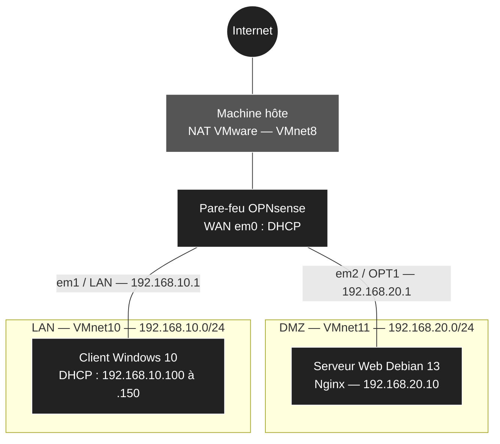

  🇫🇷 <b>Français</b> · 🇬🇧 <a href="./README_EN.md">English</a>

# 🛡️ Segmentation réseau LAN / DMZ avec OPNsense

> Infrastructure virtualisée sous VMware Workstation dans laquelle un pare-feu **OPNsense** sépare un réseau interne (LAN) d'une zone démilitarisée (DMZ) qui publie un serveur Web vers l'extérieur, tout en protégeant le réseau interne et le pare-feu lui-même.

[🏠 Retour au dépôt](../../README.md) · [📘 Guide de déploiement](./GUIDE_DEPLOIEMENT.md)

---

## 🎯 Objectif

Toute entreprise qui publie un service sur Internet fait face au même risque : si ce service est compromis, l'attaquant ne doit pas pouvoir rebondir vers le réseau interne, où se trouvent les postes de travail et les données sensibles.

Ce lab reproduit cette situation. Le réseau est découpé en trois zones de confiance, toutes contrôlées par un pare-feu central :

| Zone | Rôle | Niveau de confiance |
|------|------|---------------------|
| **WAN** | Accès Internet, simulé par le NAT de VMware | Aucun |
| **DMZ** | Héberge le serveur Web exposé | Faible |
| **LAN** | Réseau interne des utilisateurs et de l'administration | Élevé |

*Résultat final : le serveur Web de la DMZ est publié sur l'adresse WAN du pare-feu.*

---

## 📐 Architecture

### Matrice des flux

| Source | Destination | Autorisé | Mise en œuvre |
|--------|-------------|:--------:|---------------|
| LAN | Internet | ✅ | Règle LAN par défaut d'OPNsense |
| LAN | DMZ | ✅ | Règle LAN par défaut d'OPNsense |
| DMZ | Internet | ✅ | Règle *Pass* sur l'interface OPT1 |
| DMZ | LAN | ❌ | Règle *Block* sur l'interface OPT1, journalisée |
| DMZ | Pare-feu (WebGUI et services) | ❌ | Règle *Block* sur l'interface OPT1, journalisée |
| WAN | Serveur Web (port 80) | ✅ | Redirection de port (*Destination NAT*) |
| WAN | Toute autre destination, dont la WebGUI | ❌ | Blocage par défaut d'OPNsense |

---

## 🛠️ Ce que ce lab met en pratique

| Concept | Mise en œuvre |
|---------|---------------|
| **Segmentation réseau** | Un commutateur virtuel isolé par zone (`VMnet10` pour le LAN, `VMnet11` pour la DMZ), sans DHCP VMware ni adaptateur hôte, pour que tout le trafic inter-zones passe par OPNsense. |
| **Isolation de la DMZ** | La DMZ ne peut initier aucune connexion vers le LAN : une compromission du serveur Web ne donne pas accès au réseau interne. |
| **Protection du pare-feu** | La DMZ ne peut pas atteindre les services du pare-feu, dont son interface d'administration. |
| **Filtrage par défaut restrictif** | Tout flux non explicitement autorisé est bloqué (*deny by default*), avec une évaluation des règles en *first match*. |
| **Redirection de port (NAT)** | Le trafic HTTP arrivant sur l'adresse WAN est redirigé vers le serveur Web (`192.168.20.10`), avec une règle de filtrage enregistrée automatiquement. |
| **Services réseau centralisés** | Serveur DHCP Dnsmasq sur le LAN et résolveur DNS Unbound fournis par OPNsense. |
| **Journalisation et validation** | Blocages journalisés et vérifiés dans **Live View**, et 8 tests qui prouvent chaque flux de la matrice. |

---

## 📊 Dimensionnement et adressage

| Machine virtuelle | Système | Processeurs | RAM | Disque | Réseau | Adresse IP |
|-------------------|---------|:-----------:|:---:|:------:|--------|------------|
| **OPNsense-Firewall** | OPNsense 26.7 | 1 × 1 cœur | 2 Go | 20 Go | VMnet8 (WAN) VMnet10 (LAN) VMnet11 (DMZ) | DHCP `192.168.10.1/24` `192.168.20.1/24` |
| **Serveur-Web-Debian** | Debian 13 | 1 × 1 cœur | 2 Go | 25 Go | VMnet11 (DMZ) | `192.168.20.10/24` (statique) |
| **Client-Windows10** | Windows 10 Pro | 1 × 4 cœurs | 6 Go | 60 Go | VMnet10 (LAN) | DHCP (`192.168.10.100` à `.150`) |

---

## 🖥️ Environnement de réalisation

| Élément | Version |
|---------|---------|
| **Machine hôte** | Windows 11 Pro 26H2, Hyper-V désactivé |
| **Hyperviseur** | VMware Workstation Pro 17.6.1 |
| **Pare-feu** | OPNsense 26.7 (FreeBSD 15.1) |
| **Serveur** | Debian 13.6 avec Nginx |
| **Client** | Windows 10 Pro 22H2 |

Les versions exactes et la configuration matérielle requise sont détaillées dans les [prérequis du guide](./GUIDE_DEPLOIEMENT.md#-prérequis).

---

## ✅ Validation

L'infrastructure est validée par 8 tests, chacun associé à un flux de la matrice :

| # | Test | Résultat attendu |
|:-:|------|------------------|
| 1 | Accès Internet du LAN | ✅ Autorisé |
| 2 | Accès du LAN vers la DMZ | ✅ Autorisé |
| 3 | Accès Internet de la DMZ | ✅ Autorisé |
| 4 | DMZ vers LAN | ❌ Bloqué |
| 5 | DMZ vers l'interface d'administration du pare-feu | ❌ Bloqué |
| 6 | Journalisation des blocages dans **Live View** | ✅ Visible |
| 7 | Publication du site via le NAT | ✅ Autorisé |
| 8 | Interface d'administration depuis le WAN | ❌ Bloqué |

---

## 🚀 Déploiement

L'ensemble de la construction est détaillé pas à pas dans le guide, en 7 phases :

1. Préparation des réseaux virtuels
2. Création des machines virtuelles
3. Installation et configuration initiale d'OPNsense
4. Déploiement du client Windows 10 et accès à la WebGUI
5. Déploiement du serveur Web Debian 13
6. Règles de pare-feu et redirection de port (NAT)
7. Tests de validation finale

Chaque étape est accompagnée de captures d'écran, de définitions et de vérifications, avec une phase finale de tests qui prouve chaque flux.

👉 **[Consulter le guide de déploiement complet](./GUIDE_DEPLOIEMENT.md)**

---

[🏠 Retour au dépôt](../../README.md)
