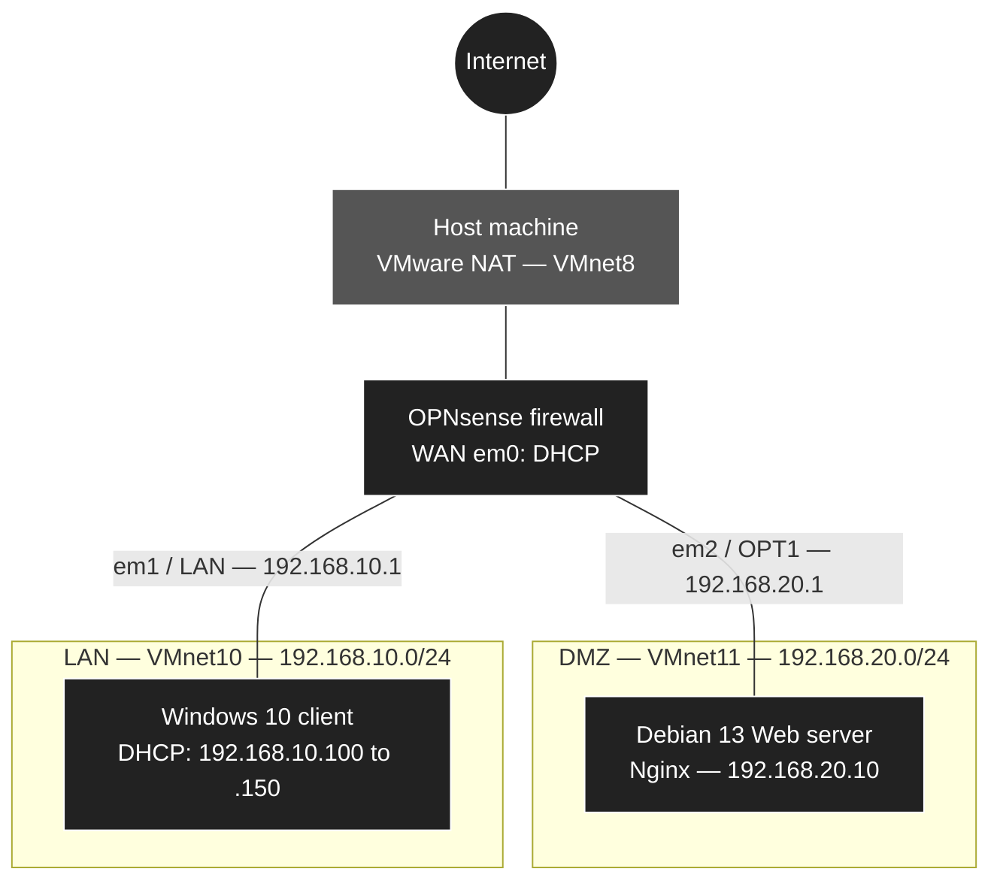

  🇫🇷 <a href="./README.md">Français</a> · 🇬🇧 <b>English</b>

# 🛡️ LAN / DMZ Network Segmentation with OPNsense

> A virtualized infrastructure built on VMware Workstation, in which an **OPNsense** firewall separates an internal network (LAN) from a demilitarized zone (DMZ) that publishes a Web server to the outside, while protecting both the internal network and the firewall itself.

[🏠 Back to repository](../../README_EN.md) · [📘 Deployment guide](./GUIDE_DEPLOIEMENT_EN.md)

---

## 🎯 Purpose

Every company that publishes a service on the Internet faces the same risk: if that service is compromised, the attacker must not be able to pivot to the internal network, where workstations and sensitive data are located.

This lab reproduces that situation. The network is split into three trust zones, all controlled by a central firewall:

| Zone | Role | Trust level |
|------|------|-------------|
| **WAN** | Internet access, simulated by VMware NAT | None |
| **DMZ** | Hosts the exposed Web server | Low |
| **LAN** | Internal network for users and administration | High |

*Final result: the DMZ Web server is published on the firewall's WAN address.*

---

## 📐 Architecture

### Traffic matrix

| Source | Destination | Allowed | Implementation |
|--------|-------------|:-------:|----------------|
| LAN | Internet | ✅ | OPNsense default LAN rule |
| LAN | DMZ | ✅ | OPNsense default LAN rule |
| DMZ | Internet | ✅ | *Pass* rule on the OPT1 interface |
| DMZ | LAN | ❌ | Logged *Block* rule on the OPT1 interface |
| DMZ | Firewall (WebGUI and services) | ❌ | Logged *Block* rule on the OPT1 interface |
| WAN | Web server (port 80) | ✅ | Port forwarding (*Destination NAT*) |
| WAN | Any other destination, including the WebGUI | ❌ | OPNsense default block |

---

## 🛠️ What this lab puts into practice

| Concept | Implementation |
|---------|----------------|
| **Network segmentation** | One isolated virtual switch per zone (`VMnet10` for the LAN, `VMnet11` for the DMZ), with no VMware DHCP and no host adapter, so that all inter-zone traffic goes through OPNsense. |
| **DMZ isolation** | The DMZ cannot initiate any connection to the LAN: a compromised Web server does not give access to the internal network. |
| **Firewall protection** | The DMZ cannot reach the firewall's services, including its administration interface. |
| **Restrictive default filtering** | Any traffic not explicitly allowed is blocked (*deny by default*), with *first match* rule evaluation. |
| **Port forwarding (NAT)** | HTTP traffic arriving on the WAN address is forwarded to the Web server (`192.168.20.10`), with an automatically registered filter rule. |
| **Centralized network services** | Dnsmasq DHCP server on the LAN and Unbound DNS resolver provided by OPNsense. |
| **Logging and validation** | Blocks logged and checked in **Live View**, and 8 tests that prove every flow in the matrix. |

---

## 📊 Sizing and addressing

| Virtual machine | System | Processors | RAM | Disk | Network | IP address |
|-----------------|--------|:----------:|:---:|:----:|---------|------------|
| **OPNsense-Firewall** | OPNsense 26.7 | 1 × 1 core | 2 GB | 20 GB | VMnet8 (WAN) VMnet10 (LAN) VMnet11 (DMZ) | DHCP `192.168.10.1/24` `192.168.20.1/24` |
| **Serveur-Web-Debian** | Debian 13 | 1 × 1 core | 2 GB | 25 GB | VMnet11 (DMZ) | `192.168.20.10/24` (static) |
| **Client-Windows10** | Windows 10 Pro | 1 × 4 cores | 6 GB | 60 GB | VMnet10 (LAN) | DHCP (`192.168.10.100` to `.150`) |

---

## 🖥️ Build environment

| Item | Version |
|------|---------|
| **Host machine** | Windows 11 Pro 26H2, Hyper-V disabled |
| **Hypervisor** | VMware Workstation Pro 17.6.1 |
| **Firewall** | OPNsense 26.7 (FreeBSD 15.1) |
| **Server** | Debian 13.6 with Nginx |
| **Client** | Windows 10 Pro 22H2 |

Exact versions and hardware requirements are detailed in the [guide prerequisites](./GUIDE_DEPLOIEMENT_EN.md#-prerequisites).

---

## ✅ Validation

The infrastructure is validated by 8 tests, each linked to a flow in the matrix:

| # | Test | Expected result |
|:-:|------|-----------------|
| 1 | LAN Internet access | ✅ Allowed |
| 2 | LAN to DMZ access | ✅ Allowed |
| 3 | DMZ Internet access | ✅ Allowed |
| 4 | DMZ to LAN | ❌ Blocked |
| 5 | DMZ to the firewall's administration interface | ❌ Blocked |
| 6 | Block logging in **Live View** | ✅ Visible |
| 7 | Website publication through NAT | ✅ Allowed |
| 8 | Administration interface from the WAN | ❌ Blocked |

---

## 🚀 Deployment

The entire build is detailed step by step in the guide, in 7 phases:

1. Virtual network preparation
2. Virtual machine creation
3. OPNsense installation and initial configuration
4. Windows 10 client deployment and WebGUI access
5. Debian 13 Web server deployment
6. Firewall rules and port forwarding (NAT)
7. Final validation tests

Each step comes with screenshots, definitions and checks, with a final testing phase that proves every flow.

👉 **[Read the complete deployment guide](./GUIDE_DEPLOIEMENT_EN.md)**

---

[🏠 Back to repository](../../README_EN.md)
